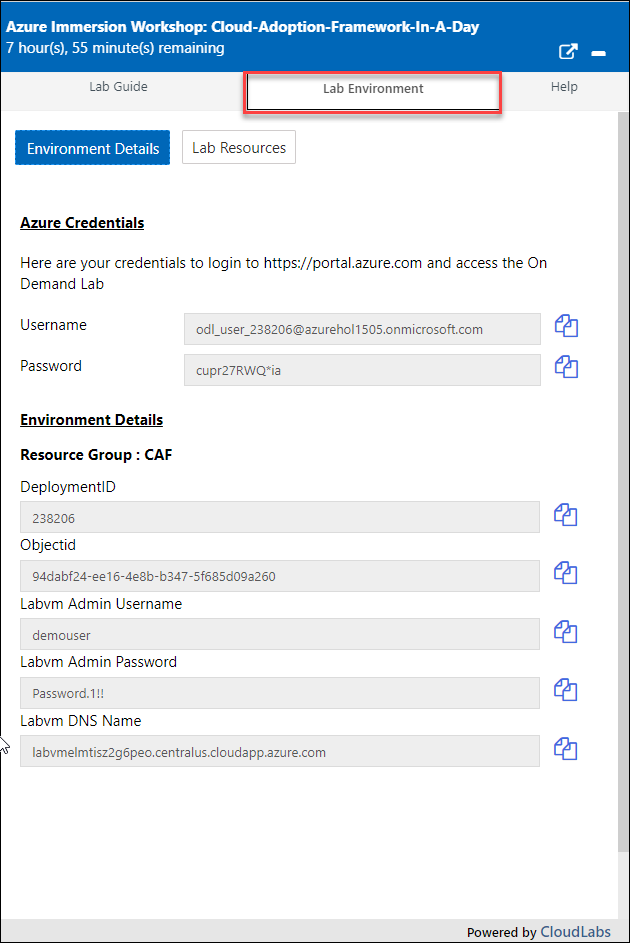
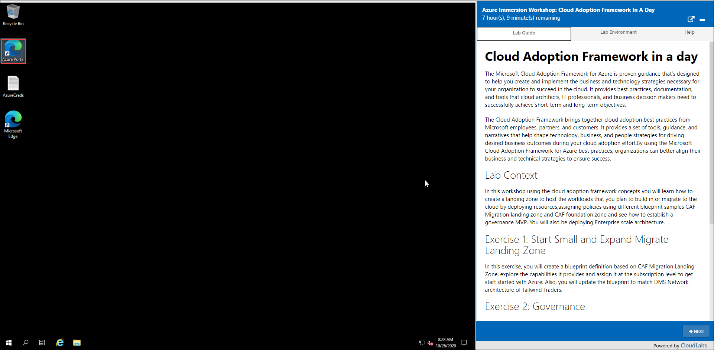

## **Getting Started**

## Instructions

1. Once the environment is provisioned, a virtual machine (JumpVM) on the left and lab guide on the right will get loaded in your browser. Use this virtual machine throughout the workshop to perform the lab.

2. To get the lab environment details, you can select the **Lab Environment** tab, you can locate the **Lab Environment** tab in the upper right corner. Additionally, the credentials will also be emailed to your email address provided during registration.

   
   
  >**Note:** You will see **DeploymentID** value on the **Lab Environment** tab, please use it wherever you see DeploymentID in the lab steps. This is a 6 digit unique ID associated with each lab deployment. 
  
  >And Suffix is the XXXX value of the username , for example if the username is odl_user_238206@azurehol**1505**.onmicrosoft.com, 1505 is the Suffix value.
 
## Log-in to the Azure portal

1. In the virtual machine, double click on the **Azure portal** shortcut on the desktop.
   
   

2. On **Sign in to Microsoft Azure** blade, you will see a login screen, in that enter the following email/username. 
   * Email/Username: <inject key="AzureAdUserEmail"></inject>

3. Now enter the following password and click on **Sign in**.
   * Password: <inject key="AzureAdUserPassword"></inject>

4. If you see the pop-up **Stay Signed in?**, click Yes

5. If you see the pop-up **You have free Azure Advisor recommendations!**, close the window and continue.

6. If a **Welcome to Microsoft Azure** popup window appears, click **Maybe Later** to skip the tour.

7. Click on **Next** from the bottom right corner of the lab guide.
