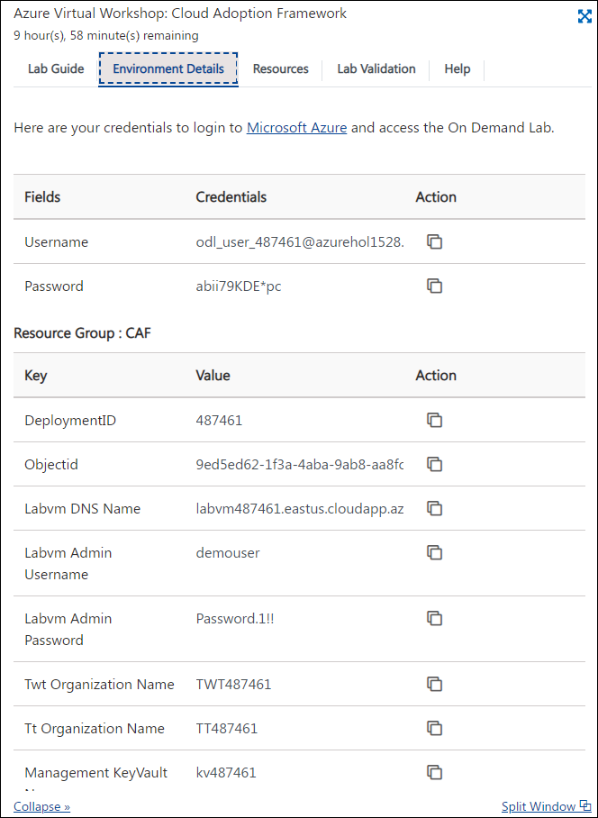
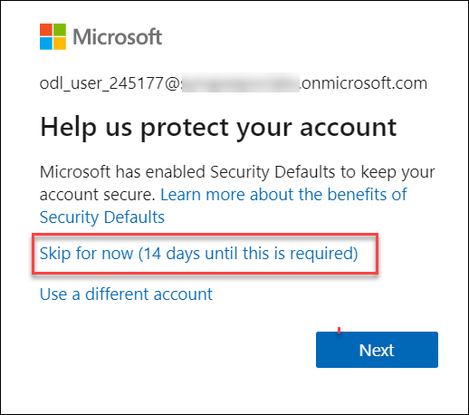

## **Getting Started**

## Instructions

1. Once the environment is provisioned, a virtual machine (JumpVM) on the left and lab guide on the right will get loaded in your browser. Use this virtual machine throughout the workshop to perform the lab.

2. To get the lab environment details, you can select the **Environment details** tab, you can locate the **Environment details** tab in the upper right corner. Additionally, the credentials will also be emailed to your email address provided during registration.

   
   
## Log-in to the Azure portal

1. In the virtual machine, double click on the **Azure portal** shortcut on the desktop.
   
   
   
1. When you click on Azure portal, the edge browser welcome screen will come up, select **Start without your data**.

   
   
1. On the next window, click on **Continue without this data**.

   
   
1. Click on **Confirm and start browsing**.

   
   
1. Now, you will see two tabs in the edge browser, close the first tab named with **Microsoft Edge**.

2. On **Sign in to Microsoft Azure** blade, you will see a login screen, in that enter the following email/username. 
   * Email/Username: <inject key="AzureAdUserEmail"></inject>

    

3. Now enter the following password and click on **Sign in**.
   * Password: <inject key="AzureAdUserPassword"></inject>

    
   
4. If you see the pop-up **Help us protect your account**, click **Skip for now**.
   
   
   
5. If you see the pop-up **Stay Signed in?**, click Yes

6. If you see the pop-up **You have free Azure Advisor recommendations!**, close the window and continue.

7. If a **Welcome to Microsoft Azure** popup window appears, click **Maybe Later** to skip the tour.

8. Click on the **Next** button present in the bottom-right corner of this lab guide.

