# Exercise 1: Implement Azure landing zone accelerator
## Context

The Azure landing zone accelerator architecture is modular by design and allows organizations to start with foundational landing zones that support their application portfolios, regardless of whether the applications are being migrated or are newly developed and deployed to Azure. The architecture enables organizations to start as small as needed and scale alongside their business requirements regardless of scale point.
The AdventureWorks company wants to start with Landing Zones for their workload in Azure, where hybrid connectivity to their on-premise data center is not required from the start. 

### Reference Architecture

The Azure landing zone accelerator architecture is modular by design and allow organizations to start with foundational landing zones that support their application portfolios and add hybrid connectivity with ExpressRoute or VPN when required. Alternatively, organizations can start with an Azure landing zone accelerator architecture based on the traditional hub and spoke network topology if customers require hybrid connectivity to on-premises locations from the beginning.

A hub and spoke network topology allows you to create a central Hub VNet that contains shared networking components (such as Azure Firewall, ExpressRoute and VPN Gateways) that can then be used by spoke VNets, connected to the Hub VNet via VNET Peering, to centralize connectivity in your environment. Gateway transit in VNet peering allows spokes to have connectivity to/from on-premises via ExpressRoute or VPN, and also, [transitive connectivity](https://azure.microsoft.com/en-us/blog/create-a-transit-vnet-using-vnet-peering/) across spokes can be implemented by deploying User Defined Routes (UDR) on the spokes and using Azure Firewall or an NVA in the hub as the transit resource. Hub and spoke network design considerations & recommendations can be found [here](https://docs.microsoft.com/en-us/azure/cloud-adoption-framework/ready/azure-best-practices/traditional-azure-networking-topology).

 

## Customer Profile

This reference implementation is ideal for customers that have started their Azure landing zone accelerator journey with an Azure landing zone accelerator foundation implementation and then there is a need to add connectivity on-premises datacenters and branch offices by using a traditional hub and spoke network architecture. This reference implementation is also well suited for customers who want to start with Landing Zones for their net new
deployment/development in Azure by implementing a network architecture based on the traditional hub and spoke network topology.

## In this section:

- [Task 1: Explore the Azure Landing zone environment](#task-1-deploy-the-Azure-landing-zone-environment)
- [Task 2: Validation post deployment](#task-2-validation-post-deployment)
- [Post deployment activities](#post-deployment-activities)

## Task 1: Explore the Azure Landing Zone environment.

### Overview

In this task, you will be reviewing the pre-deployed resources in the Azure Landing Zone accelerator. Here you will be using 4 dedicated subscriptions while deploying the Azure Landing Zone accelerator. All the resources are deployed in the Central US region, since the region will primarily be used to place the deployment resources in an Azure region but also used as the initial region for some of the resources that are deployed, such as Azure Log Analytics and Azure automation.

 A scalable Management Group hierarchy aligned to core platform capabilities, allowing you to operationalize at scale using centrally managed Azure RBAC and Azure Policy where platform and workloads have clear separation. Azure Policies that will enable autonomy for the platform and the landing zones.

Azure Landing Zone(s) creates the management groups hierarchy under the Tenant Root Group using Dedicated Platform subscriptions. Find the detailed information about the resources of Platform Managemnet group which reside in respective subscriptions below:

- **Management Subscription**:  This subscription enables core platform capabilities at scale using Azure Policy such as:

  - **Log Analytics workspace** : It is a service that helps you collect, search, and analyze data from Azure Monitor and other Azure services, such as Microsoft Sentinel and Microsoft Defender for Cloud to gain insights into your application and business.
  - **Azure Automation** : It delivers a cloud-based automation, operating system updates, and configuration service that supports consistent management across your Azure and non-Azure environments.
  - **Azure Security Center monitoring** : It is a solution that provides unified security management across hybrid cloud workloads. It offers threat protection for data centers within both cloud workloads and on-premises. 
  - **Azure Sentinel** : It delivers intelligent security analytics and threat intelligence across the enterprise. 
  - **Microsoft Defender for Cloud** : It is a Cloud Security Posture Management and workload protection solution that finds weak spots across your cloud configuration, helps strengthen the overall security posture of your environment, and can protect workloads across multi-cloud and hybrid environments from evolving threats.
  - Diagnostics settings for Activity Logs, VMs, and PaaS resources sent to Log Analytics

- **Connectivity Subscription** : This subscription deploys core Azure networking resources such as:

  - **Azure VWAN** : It is a networking service that brings many networking, security, and routing functionalities together to provide a single operational interface. 
  - **Hub virtual network** : The hub virtual network is the central point of connectivity to your on-premises network. It's a place to host services that can be consumed by the different workloads hosted in the spoke virtual networks.
  - **ExpressRoute Gateway** :It is designed to exchange network routes and route network traffic.
  - **VPN Gateway** : It is a type of networking device that connects two or more devices or networks together in a VPN infrastructure.
  - **Azure Firewall** : It is a cloud-native and intelligent network firewall security service that provides the best of breed threat protection for your cloud workloads running in Azure
  - **Firewall Policies** : It defines how an organization's firewalls should handle inbound and outbound network traffic for specific IP addresses and address ranges, protocols, applications, and content types based on the organization's information security policies 
  - **Azure DDoS Network Protection** : It enables to protect your Azure resources from distributed denial of service (DDoS) attacks with always-on monitoring and automatic network attack mitigation.

- **Identity Subscription** : Under this Subscription, Azure Policy will be assigned at the scope to govern your identity resources. Below are the few policies that are assigned to your identity management group.

  - Prevent inbound RDP from the internet
  - Ensure subnets are associated with NSG
  - Prevent usage of public IP
  - Ensure Azure VMs (Windows & Linux) are enabled for Azure Backup

- **Landing Zones Subscription** : You will use this Subscription for Virtual Network Address space. Provided subscription will be bootstrapped as landing zones and governed by Azure Policy. This subscription will be bootstrapped as landing zones with a virtual network deployed and connected to the hub virtual network for corp connectivity. Virtual networks on these subscriptions will be connected to the hub virtual network using VNet peering, and if you deployed and enabled Azure Firewall as a DNS proxy, DNS settings on these VNets will be configured with the Azure Firewall private IP address.

- Landing Zone Management Group for **corp** connected applications that require connectivity to on-premises, to other landing zones or to the internet via shared services provided in the VWAN hub.
  - This is where you will create your subscriptions that will host your corp-connected workloads.

-  Landing zone subscriptions for **corp** connected applications and resources, including a virtual network


1. In the virtual machine, double click on the **Azure portal** shortcut on the desktop. If the credentials window pops up then enter the Azure credentials provided below.

   * Email/Username: <inject key="AzureAdUserEmail"></inject>
   * Password: <inject key="AzureAdUserPassword"></inject>

   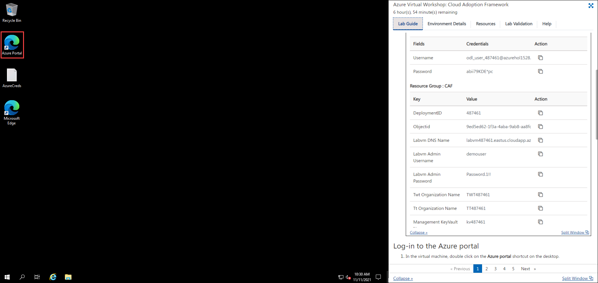
   
1. On the Azure portal search for **Management groups** in the search bar **(1)** and select **Management groups** **(2)** from the suggestions.

   
   
1. In the Management groups page, review and explore the **eslz** management group which will be used thorughout the lab.

   
   
1. On the Azure portal search for **All resources** in the search bar **(1)** and select **All resources** **(2)** from the suggestions.

   
   
1. In the All resources page, review and explore the pre-deployed resources which are essential part Azure landing zone setup.

   
   

## Task 2: Configure AzOps using GitHub

1. Search for **Windows PowerShell (1)** using the search box.

   
   
1. Right click on the **Window PowerShell (1)** and run the application as adiministrator **(2)**.

   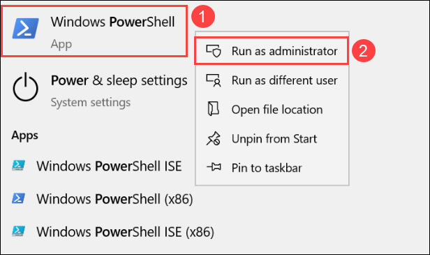   
   
1. Run the below mentioned command to connect to the Azure account. Provide the login credentials to in the pop up box.

   ```bash
   Connect-AzAccount
   ```

     
   
1. Run the below mentioned command which will create a new Azure service principal. Copy and save the **ARM_TENANT_ID**, **ARM_SUBSCRIPTION_ID**, **ARM_CLIENT_ID**, and **ARM_CLIENT_SECRET** in a notepad. You'll be using these values in later steps.

   ```bash
   # Create Service Principal 
   $servicePrincipalDisplayName = "azopssp"
   $servicePrincipal = New-AzADServicePrincipal -DisplayName $servicePrincipalDisplayName

   Write-Host "ARM_TENANT_ID: $((Get-AzContext).Tenant.Id)"
   Write-Host "ARM_SUBSCRIPTION_ID: $((Get-AzContext).Subscription.Id)"
   Write-Host "ARM_CLIENT_ID: $($servicePrincipal.AppId)"
   Write-Host "ARM_CLIENT_SECRET: $($servicePrincipal.PasswordCredentials.SecretText)"
   ```
   
     
   
1. Run the below mentioned commands which will assign required permissions at tenant and management group level.

   ```bash
   # Assign permissions at root scope
   $servicePrincipalDisplayName = 'azopssp'
   $roleToAssign = 'Owner'
   $ErrorActionPreference = 'Stop'
   $servicePrincipal = Get-AzADServicePrincipal -DisplayName $servicePrincipalDisplayName
   New-AzRoleAssignment -ObjectId $servicePrincipal.Id -RoleDefinitionName $roleToAssign -Scope '/'

   # Assign permissions at management group scope
   $servicePrincipalDisplayName = 'azopssp'
   $roleToAssign = 'Owner'
   $managementGroupName = 'eslz'

   $ErrorActionPreference = 'Stop'
   $servicePrincipal = Get-AzADServicePrincipal -DisplayName $servicePrincipalDisplayName
   $managementGroup = Get-AzManagementGroup -GroupId $managementGroupName
   New-AzRoleAssignment -ObjectId $servicePrincipal.Id -RoleDefinitionName $roleToAssign -Scope $managementGroup.Id
   ```
   
1. Run the below mentioned commands to connect to active directory and add the new role.

   ```bash
   Install-Module PowerShellGet -Force
   Install-Module Microsoft.Graph -Scope AllUsers -Force

   Connect-MgGraph -Scopes "Directory.Read.All,RoleManagement.ReadWrite.Directory"
 
   # Get Service Principal from Azure Active Directory
   $servicePrincipalDisplayName = "azopssp"
   $servicePrincipal = Get-MgServicePrincipal -Filter "DisplayName eq '$servicePrincipalDisplayName'"
   if (-not $servicePrincipal) {
      Write-Error "$servicePrincipalDisplayName Service Principal not found"
   }
 
   # Add Azure Active Directory Role Member
   $directoryRoleDisplayName = "Directory Readers"
   $directoryRole = Get-MgDirectoryRole -Filter "DisplayName eq '$directoryRoleDisplayName'" #facing an  error in this step
   if (-not $directoryRole) {
      Write-Warning "$directoryRoleDisplayName role not found"
   } else {
       $body = @{'@odata.id' = "https://graph.microsoft.com/v1.0/directoryObjects/$($servicePrincipal.Id)"}
       New-MgDirectoryRoleMemberByRef -DirectoryRoleId $directoryRole.id -BodyParameter $body
   }
   ```   
  
   >**Note**: If the consent pop up apprears, check the consent box and click on Accept.

   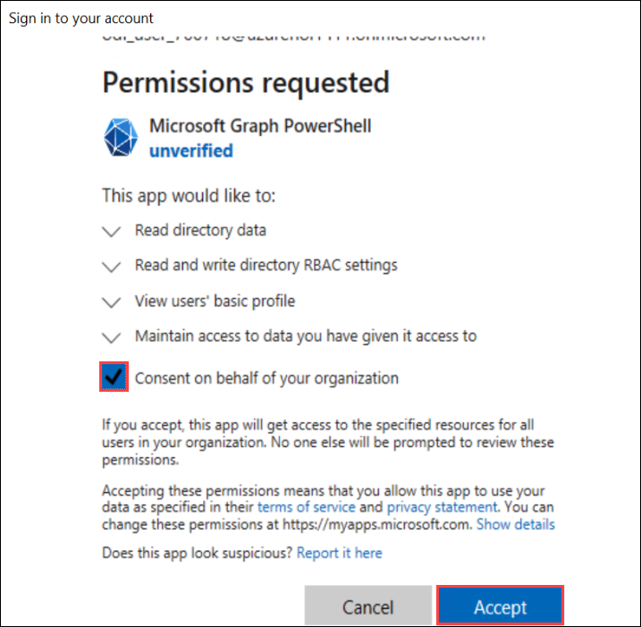
   
1. In a new browser tab open https://www.github.com and Log in with your personal GitHub account.

   >**Note**: You have to use your own GitHub account. If you don't have a GitHub account then navigate to the following link https://github.com/join and create one.

1. In a new browser tab open https://github.com/Azure/AzOps-Accelerator and click on **Use this template**.

   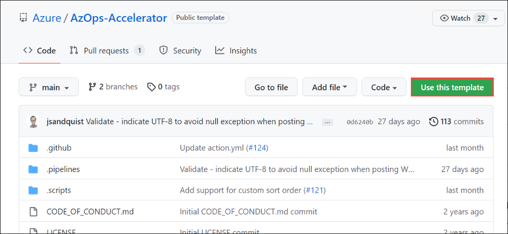   
   
1. Provide the following details and click on **Create repository from template (3)** fork the repository.

   - Reposiotry name: **eslz (1)**
   - Repository visibility: **Private (2)**  

   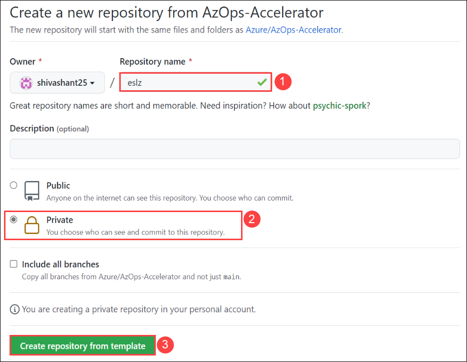   
 
1. In your GitHub lab files repository, select the **Settings** tab from the lab files repository.

   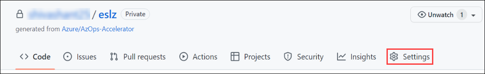
   
1. Under Security, expand **Secrets (1)** by clicking the drop-down and select **Actions (2)** blade from the left navigation bar. Select the **New repository secret (3)** button.  

   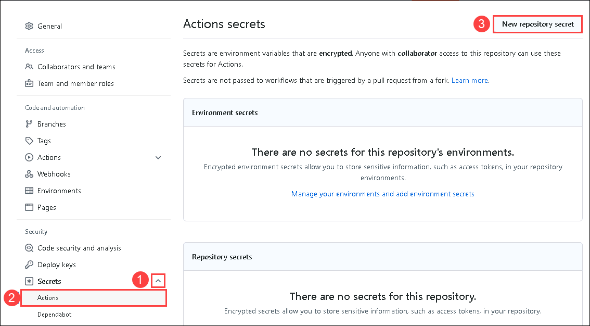
   
1. Create the **ARM_TENANT_ID**, **ARM_SUBSCRIPTION_ID**, **ARM_CLIENT_ID**, and **ARM_CLIENT_SECRET** secrets which had saved in step 4.

   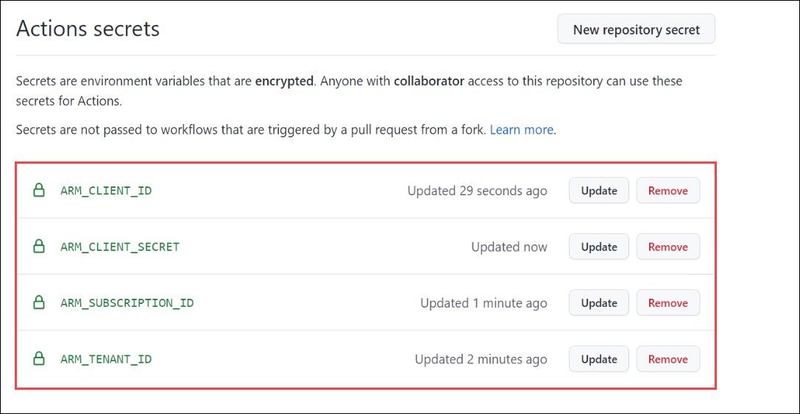
   
1. Untick `Allow merge commits` and `Allow rebase merging` under **Settings** -> **General** -> **Pull Requests**

   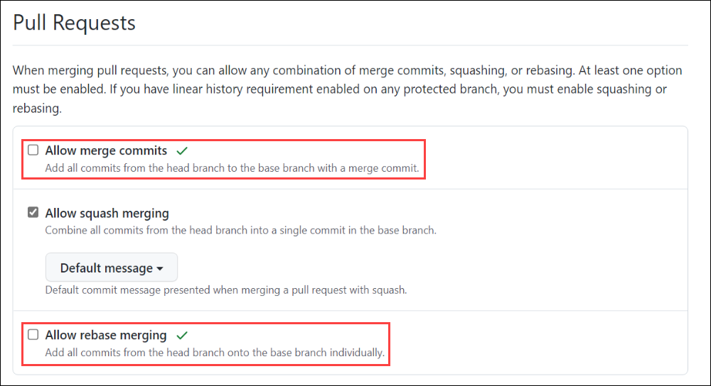  
   
1. Under **Settings** -> **Actions** -> **General** -> **Workflow permissions**, grant the workflow `Read and write permissions` as well as `Allow GitHub Actions to create and approve pull requests`.

   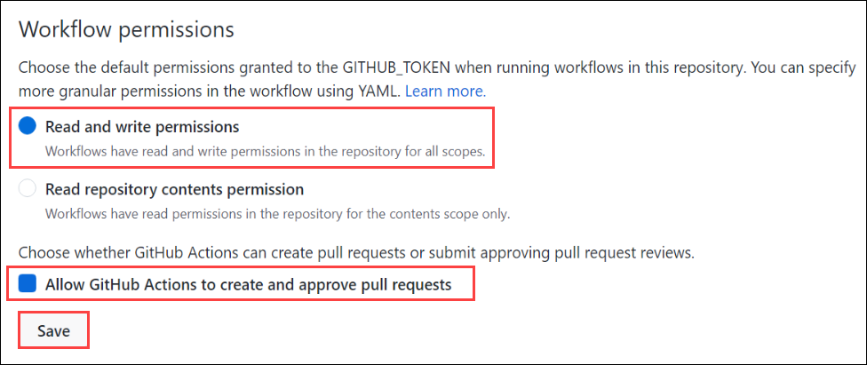  
   
1. Click on **Actions (1)**. Select the **AzOps (2)** workflow, click on the **drop-down (3)** next to Run workflow button, and select **Run workflow (4)**.

   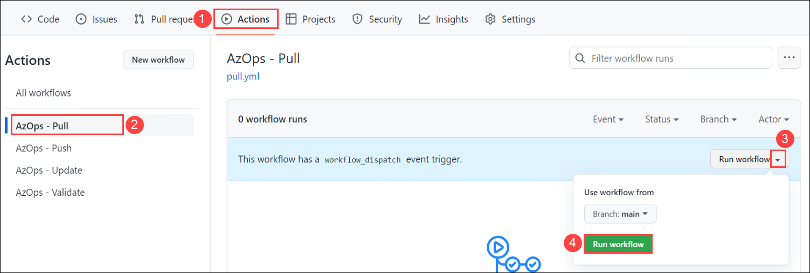
   
1. Please wait untill the workflow execution completes.

   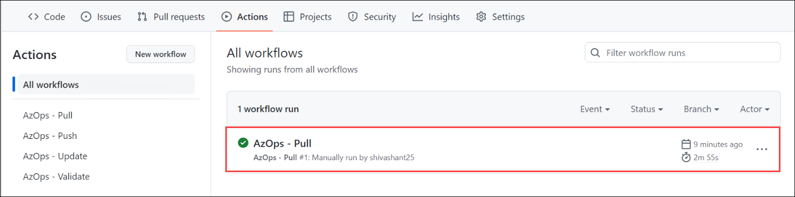
   
1. Under Code, a new directory will be created conatining details about the **eslz** management group and its child groups.

   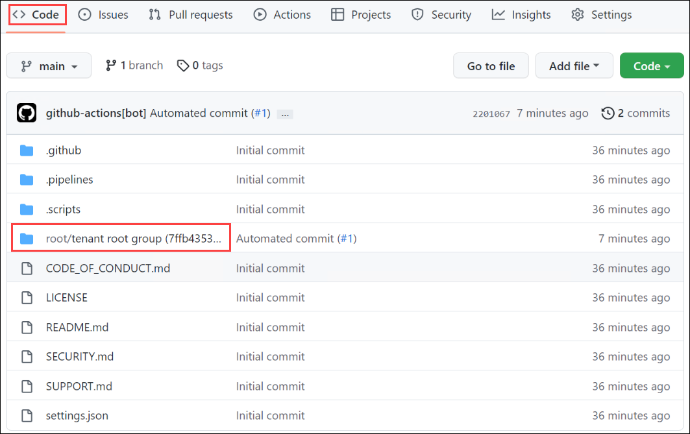
   
1. Click on the **Next** button present in the bottom-right corner of this lab guide.


