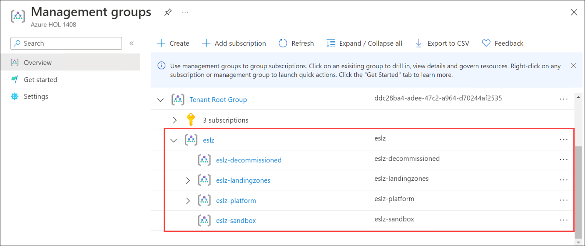
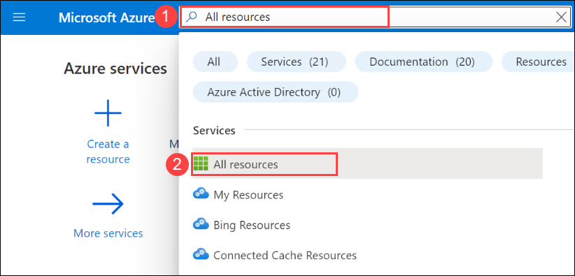
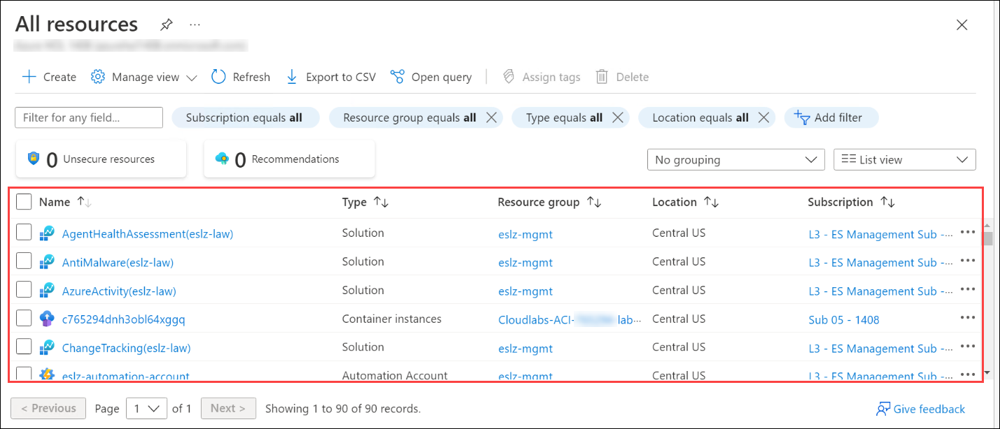
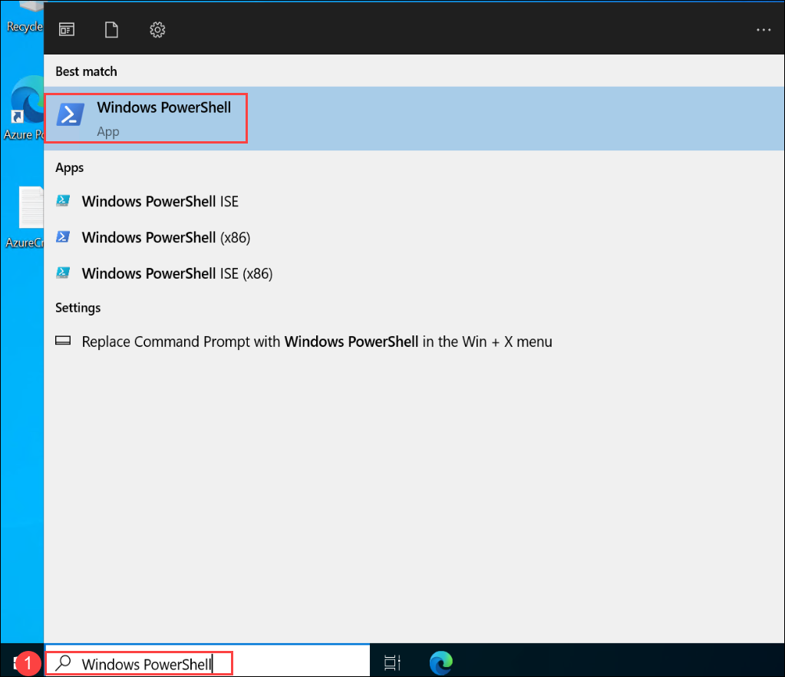
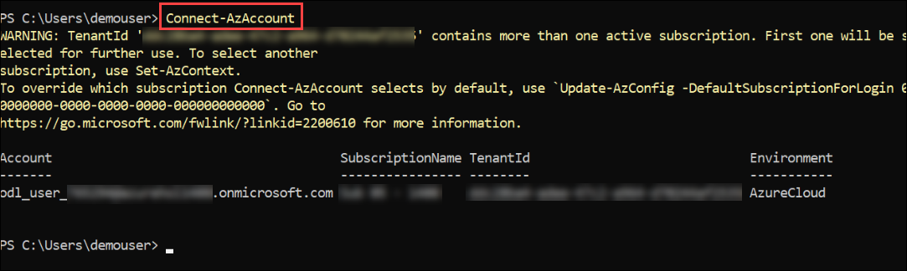
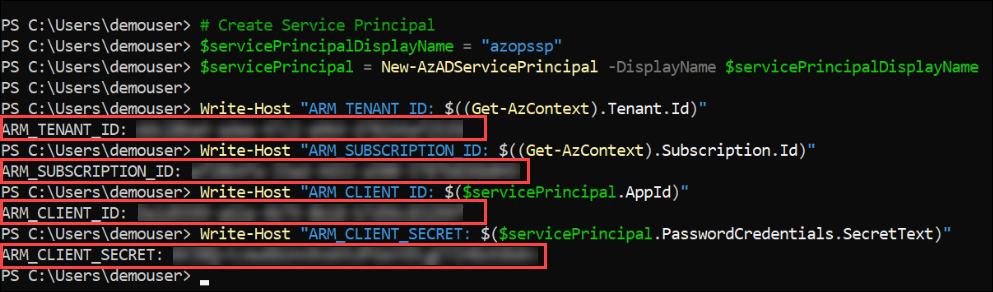

# Exercise 1: Implement Azure landing zone accelerator
## Context

The Azure landing zone accelerator architecture is modular by design and allows organizations to start with foundational landing zones that support their application portfolios, regardless of whether the applications are being migrated or are newly developed and deployed to Azure. The architecture enables organizations to start as small as needed and scale alongside their business requirements regardless of scale point.
The AdventureWorks company wants to start with Landing Zones for their workload in Azure, where hybrid connectivity to their on-premise data center is not required from the start. 

### Reference Architecture

The Azure landing zone accelerator architecture is modular by design and allow organizations to start with foundational landing zones that support their application portfolios and add hybrid connectivity with ExpressRoute or VPN when required. Alternatively, organizations can start with an Azure landing zone accelerator architecture based on the traditional hub and spoke network topology if customers require hybrid connectivity to on-premises locations from the beginning.

A hub and spoke network topology allows you to create a central Hub VNet that contains shared networking components (such as Azure Firewall, ExpressRoute and VPN Gateways) that can then be used by spoke VNets, connected to the Hub VNet via VNET Peering, to centralize connectivity in your environment. Gateway transit in VNet peering allows spokes to have connectivity to/from on-premises via ExpressRoute or VPN, and also, [transitive connectivity](https://azure.microsoft.com/en-us/blog/create-a-transit-vnet-using-vnet-peering/) across spokes can be implemented by deploying User Defined Routes (UDR) on the spokes and using Azure Firewall or an NVA in the hub as the transit resource. Hub and spoke network design considerations & recommendations can be found [here](https://docs.microsoft.com/en-us/azure/cloud-adoption-framework/ready/azure-best-practices/traditional-azure-networking-topology).

 

## Customer Profile

This reference implementation is ideal for customers that have started their Azure landing zone accelerator journey with an Azure landing zone accelerator foundation implementation and then there is a need to add connectivity on-premises datacenters and branch offices by using a traditional hub and spoke network architecture. This reference implementation is also well suited for customers who want to start with Landing Zones for their net new
deployment/development in Azure by implementing a network architecture based on the traditional hub and spoke network topology.

## In this section:

- [Task 1: Deploy the Azure Landing zone accelerator](#task-1-deploy-the-Azure-landing-zone-accelerator)
- [Task 2: Validation post deployment](#task-2-validation-post-deployment)
- [Post deployment activities](#post-deployment-activities)

## Task 1: Explore the ALZ environment.

1. On the Azure portal search for **Management groups** in the search bar **(1)** and select **Management groups** **(2)** from the suggestions.

   
   
1. In the Management groups page, review and explore the **eslz** management group which will be used thorughout the lab.

   
   
1. On the Azure portal search for **All resources** in the search bar **(1)** and select **All resources** **(2)** from the suggestions.

   
   
1. In the All resources page, review and explore the pre-deployed resources which are essential part Azure landing zone setup.

   
   

## Task 2: Configure AzOps using GitHub

1. Search for **Windows PowerShell (1)** using the search box. Double click on **Window PowerShell (2)** and open the application.

   
   
1. Run the below mentioned command to connect to the Azure account. Provide the login credentials to in the pop up box.

   ```bash
   Connect-AzAccount
   ```

     
   
1. Run the below mentioned command which will create a new Azure service principal. Copy and save the **ARM_TENANT_ID**, **ARM_SUBSCRIPTION_ID**, **ARM_CLIENT_ID**, and **ARM_CLIENT_SECRET** in a notepad. You'll be using these values in later steps

   ```bash
   # Create Service Principal 
   $servicePrincipalDisplayName = "azopssp"
   $servicePrincipal = New-AzADServicePrincipal -DisplayName $servicePrincipalDisplayName

   Write-Host "ARM_TENANT_ID: $((Get-AzContext).Tenant.Id)"
   Write-Host "ARM_SUBSCRIPTION_ID: $((Get-AzContext).Subscription.Id)"
   Write-Host "ARM_CLIENT_ID: $($servicePrincipal.AppId)"
   Write-Host "ARM_CLIENT_SECRET: $($servicePrincipal.PasswordCredentials.SecretText)"
   ```
   
     
   
1. Run the below mentioned commands which will assign required permissions at tenant and management group level.

   ```bash
   # Assign permissions at root scope
   $servicePrincipalDisplayName = 'azopssp'
   $roleToAssign = 'Owner'
   $ErrorActionPreference = 'Stop'
   $servicePrincipal = Get-AzADServicePrincipal -DisplayName $servicePrincipalDisplayName
   New-AzRoleAssignment -ObjectId $servicePrincipal.Id -RoleDefinitionName $roleToAssign -Scope '/'

   # Assign permissions at management group scope
   $servicePrincipalDisplayName = 'azopssp'
   $roleToAssign = 'Owner'
   $managementGroupName = 'eslz'

   $ErrorActionPreference = 'Stop'
   $servicePrincipal = Get-AzADServicePrincipal -DisplayName $servicePrincipalDisplayName
   $managementGroup = Get-AzManagementGroup -GroupId $managementGroupName
   New-AzRoleAssignment -ObjectId $servicePrincipal.Id -RoleDefinitionName $roleToAssign -Scope $managementGroup.Id
   ```
   
       

