# Exercise 1: Start

## Context

The Enterprise-Scale architecture is modular by design and allows organizations to start with foundational landing zones that support their application portfolios, regardless of whether the applications are being migrated or are newly developed and deployed to Azure. The architecture enables organizations to start as small as needed and scale alongside their business requirements regardless of scale point.
The Wing Tip company wants to start with Landing Zones for their workload in Azure, where hybrid connectivity to their on-premise data center is not required from the start. 

### Reference architecture

The Enterprise-Scale architecture is modular by design and allow organizations to start with foundational landing zones that support their application portfolios and add hybrid connectivity with ExpressRoute or VPN when required. Alternatively, organizations can start with an Enterprise-Scale architecture based on the traditional hub and spoke network topology if customers require hybrid connectivity to on-premises locations from the beginning.

A hub and spoke network topology allows you to create a central Hub VNet that contains shared networking components (such as Azure Firewall, ExpressRoute and VPN Gateways) that can then be used by spoke VNets, connected to the Hub VNet via VNET Peering, to centralize connectivity in your environment. Gateway transit in VNet peering allows spokes to have connectivity to/from on-premises via ExpressRoute or VPN, and also, [transitive connectivity](https://azure.microsoft.com/en-us/blog/create-a-transit-vnet-using-vnet-peering/) across spokes can be implemented by deploying User Defined Routes (UDR) on the spokes and using Azure Firewall or an NVA in the hub as the transit resource. Hub and spoke network design considerations & recommendations can be found [here](https://docs.microsoft.com/en-us/azure/cloud-adoption-framework/ready/azure-best-practices/traditional-azure-networking-topology).

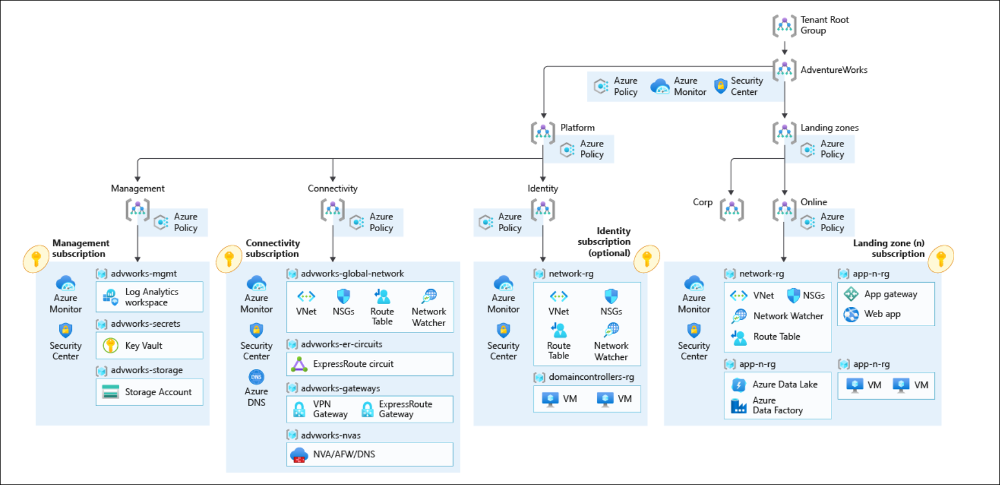 

## Customer profile

This reference implementation is ideal for customers that have started their Enterprise-Scale journey with an Enterprise-Scale foundation implementation and then there is a need to add connectivity on-premises datacenters and branch offices by using a traditional hub and spoke network architecture. This reference implementation is also well suited for customers who want to start with Landing Zones for their net new
deployment/development in Azure by implementing a network architecture based on the traditional hub and spoke network topology.

## In this Section

- [Task 1: Deploy Enterprise-Scale with hub and spoke architecture](#task-1-deploy-enterprise-scale-with-hub-and-spoke-architecture)
- [Validation post deployment (GitHub)](#validation-post-deployment-github)
- [Post deployment activities](#post-deployment-activities)
- [Operating the Azure platform using AzOps (Infrastructure as Code with GitHub Actions)](#operating-the-azure-platform-using-azops-infrastructure-as-code-with-github-actions)

## Task 1: Deploy Enterprise-Scale with hub and spoke architecture

In this task, you are deploying the Enterprise-Scale with hub and spoke architecture. To start with deploying, we will use the AdventureWorks reference implementation ARM template. 
1. Copy the below URL and paste it in a new tab on the edge browser inside your JumpHost where you have already logged in to Azure portal. If the credentials window popup again then enter the Azure credentials provided below.
    * Email/Username: <inject key="AzureAdUserEmail"></inject>
    * Password: <inject key="AzureAdUserPassword"></inject>

      ```
      https://portal.azure.com/#blade/Microsoft_Azure_CreateUIDef/CustomDeploymentBlade/uri/https%3A%2F%2Fraw.githubusercontent.com%2FAzure%2FEnterprise-Scale%2Fmain%2FeslzArm%2FeslzArm.json/uiFormDefinitionUri/https%3A%2F%2Fraw.githubusercontent.com%2FAzure%2FEnterprise-Scale%2Fmain%2FeslzArm%2Feslz-portal.json
      ```

1. On the **Custom deployment** blade, under the `Deployment location` section, choose the **Region** as `Central US` and click on **Next: Azure core setup.** This region will primarily be used to place the deployment resources in an Azure region, but also used as the initial region for some of the resources that are deployed, such as Azure Log Analytics and Azure automation.

   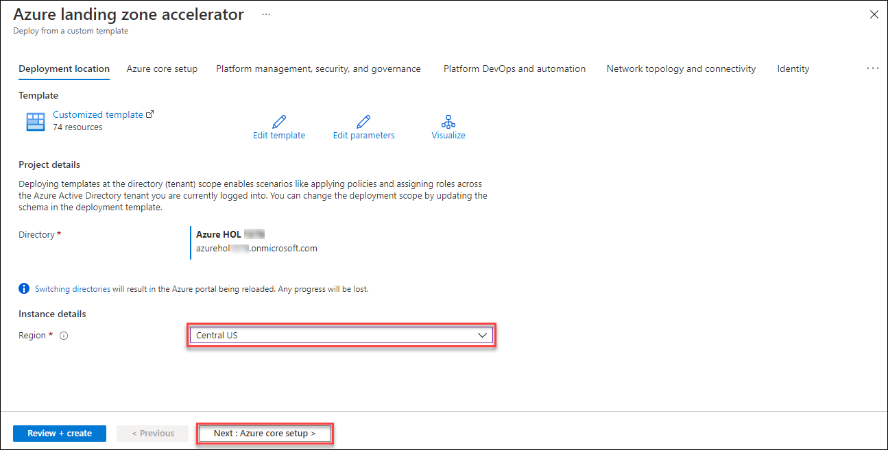

1. On the **Azure corp setup** section, provide a Management Group prefix (for this lab, we will use **eslz** as the prefix).
   - **Management Group prefix (1):** `eslz` 
   - **Select dedicated subscriptions or single subscription for platform resources (2):** `Dedicated (recommended)`  
   - Click on **Next: Platform management, security, and governance >(3)** to move to the next section.

   
   
1. On the **Platform management, security, and governance** blade, you will configure the core components to enable platform monitoring and security. The options you enable will also be enforced using Azure Policy to ensure resources, landing zones, and more are continuously compliant as your deployments scale and grows. To enable this, you must provide a dedicated (empty) subscription that will be used to host the requisite infrastructure. Use the following configuration:
   - Select **Yes (recommended) (1)** option for **Deploy Log Analytics workspace and enable monitoring for your platform and resources**.
   - **Management subscription (2):** `L3 - ES Management Sub - suffix`, here Suffix is some numeric value
   - **Azure Security Center Email Contact (3):** <inject key="AzureAdUserEmail"></inject>
   - Leave the other options as default and click on **Next : Platform DevOps and automation > (4)** to move on next section.

   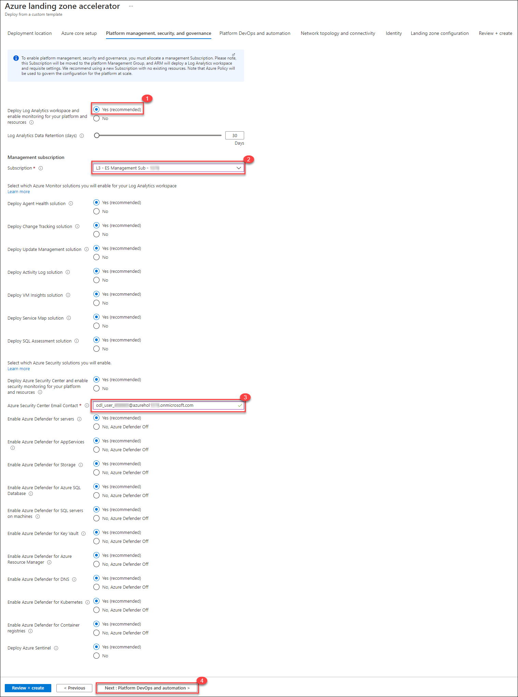
   
1. Generate GitHub **personal access (PA)** token for authenticating to your GitHub account programmatically by deployment, this token will be used by the deployment to create a new repository and discover the Enterprise-Scale deployment ARM templates and merge them into your main branch.
   - To create a PA token, follow the instructions here: https://docs.github.com/en/github/authenticating-to-github/creating-a-personal-access-token
   - Ensure the PA token has the following permissions:

   
   
1. Under the **Platform DevOps and automation** section, make sure `Deploy integrated CICD pipeline` is set to **Yes (recommended)**, also verify the below information.
   - **GitHub Organization or username (1):** enter your GitHub account username 
   - **New GitHub repository name (2):** `eslz`, repository will be created with this name
   - **GitHub personal access token (3):** Use the token which you have generated in previous step
   - **Service Principal Type (4):** `Create New` 
   - **Service Principal: Make selection (5)**, proceed to next step to create service Principal.
   
   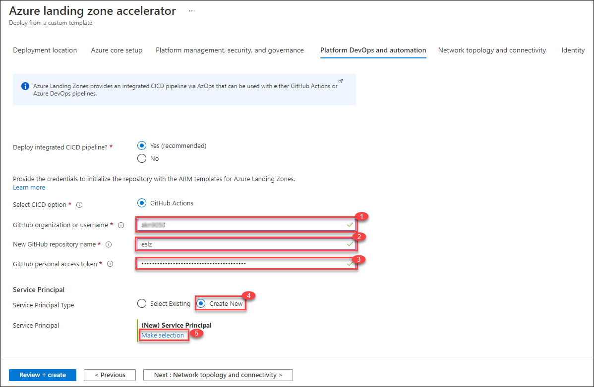

1. On **Register an application** blade, enter following details:
   - Name: `eslzsp`
   - In support account types choose **Accounts in this organizational directory only (Azure HOL Suffix only - Single tenant)**
   - Now, click on the **Register** button to register the application and move to the next step.

   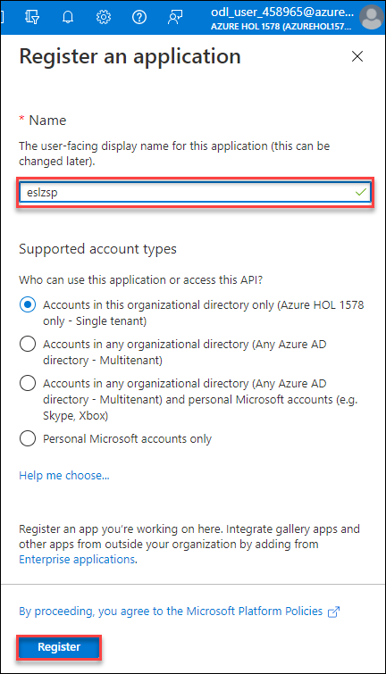

1. After registering, the application blade will open up automatically. Under **Certificates and secrets (1)** section, click on **+ New Client secret (2).**   

   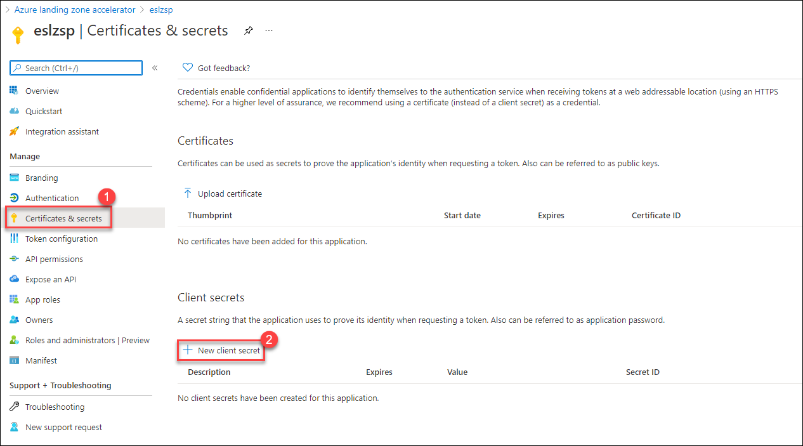
   
1. Now, on the **Add a client secret** blade, enter the following:
   - **Description (1)**: `eslzsp-secret`
   - **Expires (2):** Leave Default
   - Now, click on **Add (3)**, and move to next step.

   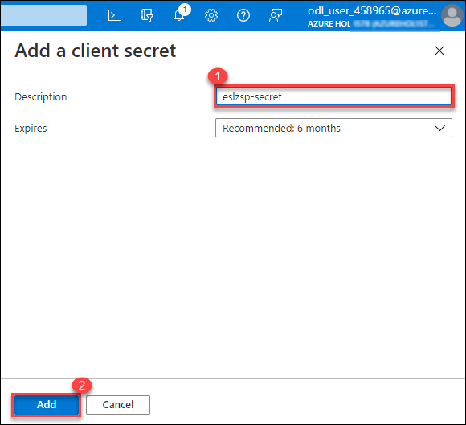
   
1. Once you have added the service principal secret. Under Client Secrets look for the secret `eslzsp-secret` which you have added in previous steps and **copy** the **secret value** using the **copy icon (2)** and make sure to note down the “Value” of the new client secret, you will need it during the next step. Now, click on **Azure landing zone accelerator (3)** to continue with the template deployment.
   
    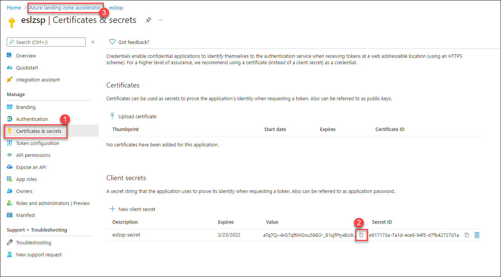
    
1. Under the **Platform DevOps and automation** section, enter the service principal secret value in **Password (1)** field which you have copied and then click on **Next: Network topology and connectivity (2)**. 

    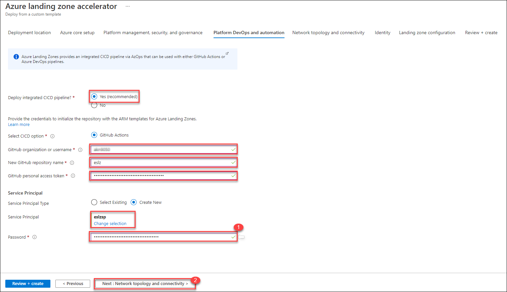
 
1. For the **Network topology and connectivity** section, you will configure the core networking platform resources, such as hub virtual network, gateways (VPN and/or ExpressRoute), Azure Firewall, DDoS Protection Standard and Azure Private DNS Zones for Azure PaaS services. Select following:
    - **Deploy networking topology (1):** `Hub and spoke with Azure Firewall`
    - **Subscription (2):** `L1 - Connectivity Sub - Sufiix`, here Suffix is some numeric value
    - **Region for the first networking hub (3):** `Central US`
    - **Deploy VPN Gateway (4):** `Yes`, once you click on yes, few options like Zone redundant, VPN Gateway SKU, and subnet for will automatically get enabled, keep the default values for those.
    - **Deploy ExpressRoute Gateway (5):** `Yes`
    - **Enable Azure Firewall as a DNS proxy (6):** `Yes`
    - **Select Availability Zones for Azure Firewall (7):** `Select all`
    - Now, click on **Next: Identity > (8)** and move on to the next step.

    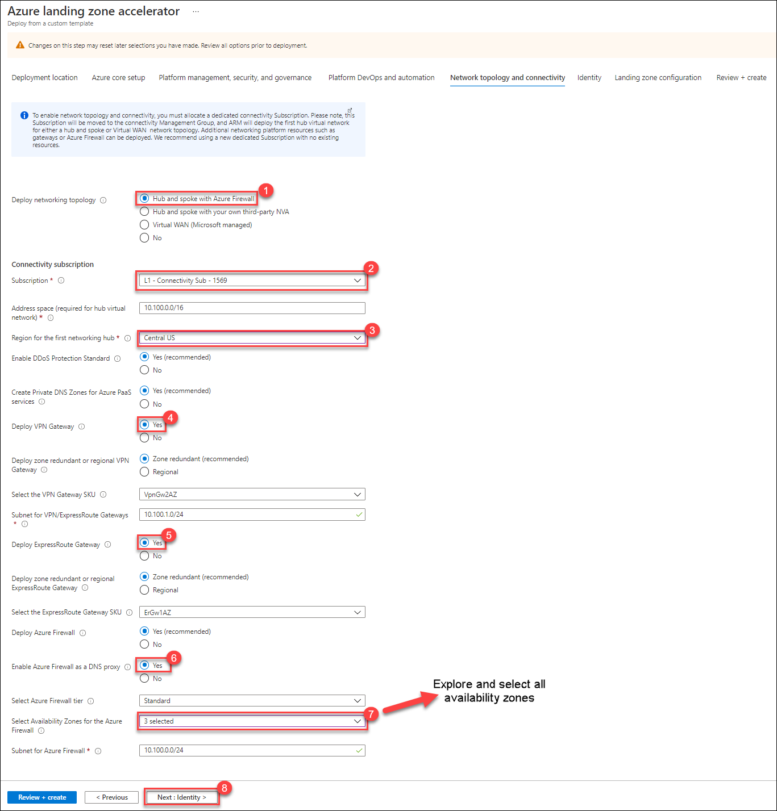
   
1. Under the **Identity** section, select
    - **Subscription (1):** `L2 - Identity Sub - Suffix`, here Suffix is some numeric value.
    - Leave default value for all other options
    - Click on **Next: Landing zone configuration > (2)** to move to Landing zone configuration tab.

    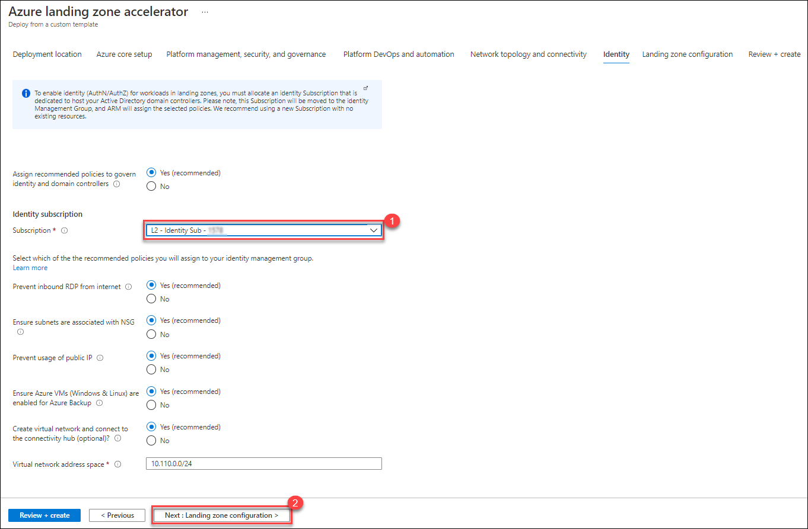
    
1. Under the **Landing zone configuration** section,
   - Select **Yes (recommended) (1)** for *Connect corp landing zones to the connectivity hub (optional)?*,
   - From **Subscriptions** select **L3 - ES Landing Zones Sub - Suffix** and **10.50.0.0/24 (2)** for Virtual Network Address space. Provided subscription will be bootstrapped as landing zones and governed by Azure Policy. This subscription will be bootstrapped as landing zones with a virtual network deployed and connected to the hub virtual network for corp connectivity. Virtual networks on these subscriptions will be connected to the hub virtual network using VNet peering, and if you deployed and enabled Azure Firewall as DNS proxy, DNS settings on these VNets will be configured with the Azure Firewall private IP address.
   - Now, click on **Next: Review + create > (3)** to review the input parameters you have given and selected.

    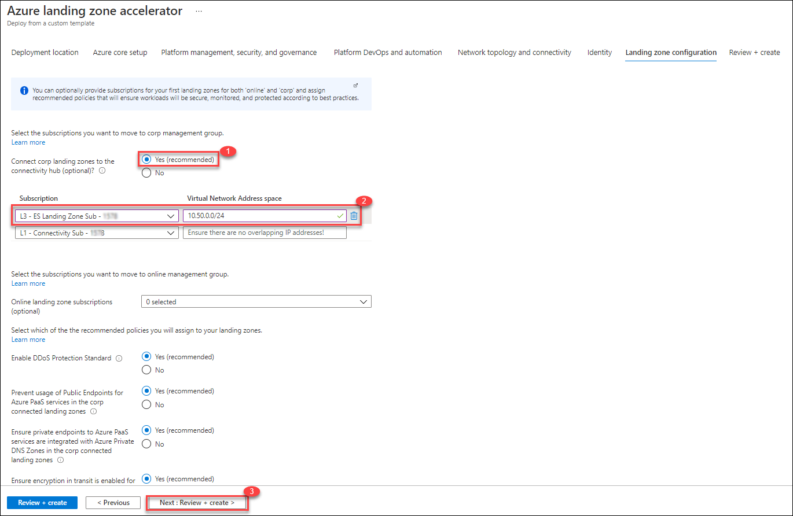
 
1. On the **Review + Create** page, the required permission and configuration will be validated before you can deploy. Once it has been validated successfully, you can click on **Create** to begin the deployment process.

   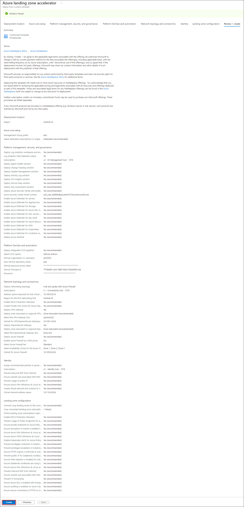

     > **Note**: Once deployment begins don't close the deployment page, so that you can review the deployment status.
    
1. Once the template deployment is completed you will see **Your deployment is complete** message on deployment page. It will take upto 90 Minutes to finish.

   > **Note**: There is know issue with deployment, deployment fails with policy assignments. This is a a known issue you potentially can run into as described here: https://github.com/Azure/Enterprise-Scale/blob/main/docs/EnterpriseScale-Known-Issues.md#deploying-the-reference-implementation-fails-due-to-policy--cannot-be-found-404
   > **Fix deployment**: Redeploy the template by following above steps which fix the issues most of the time. 

    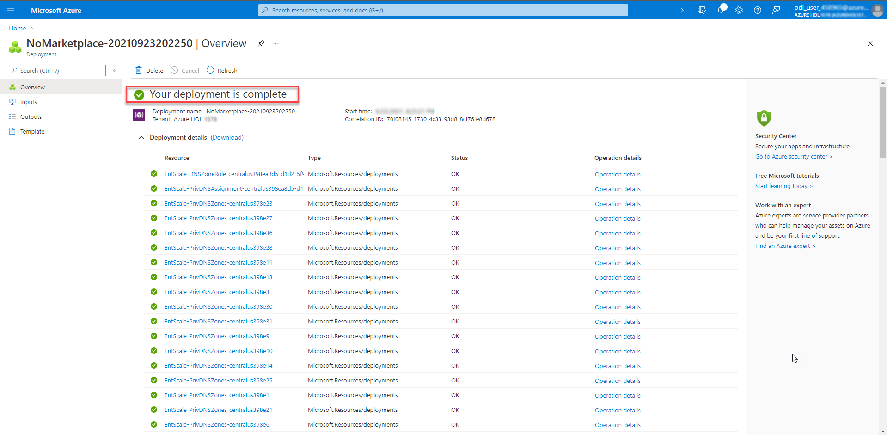
    
### Task 2: Validation post deployment (GitHub)

1. Once Enterprise-Scale has deployed and you enabled the CI/CD bootstrap, you should validate in your GitHub account that:
   * A new repository **eslz** has been created, with the name provided during setup.

1. To check the repository, login to your [Github](https://github.com/) account with your GitHub credentials. 
1. In the above right corner, right click on your GiHub profile and then select **Your repositories**.

   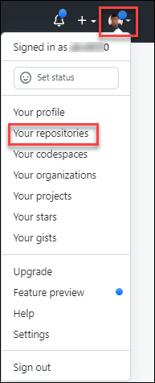

1. Now, under **repositories**, enter **eslz** in the search box to look for the repository. If the repository has been created successfully, it will be listed in search result.
   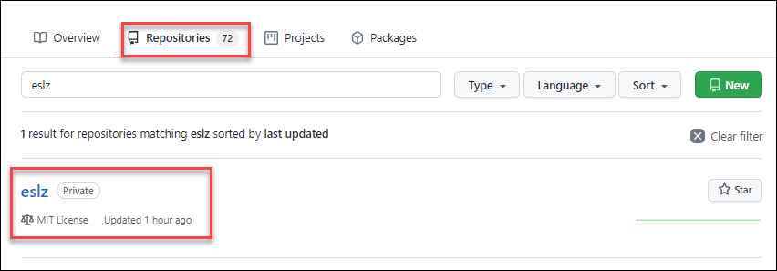
   
1. 

ARM_CLIENT_ID = Service Principal

ARM_CLIENT_SECRET = Service Principal Client Secret created in the Tenant
ARM_SUBSCRIPTION_ID = The management subscription ID created in the Tenant
ARM_TENANT_ID = Tenant ID of the Azure Tenant that was used to create ESLZ


*    A Pull Request is either in progress or has completed and automatically merged into the main branch.


*    The Azure hierarchy that got created using ARM templates as part of the Enterprise-Scale setup, such as management groups, subscription organization as well as policy definitions, policy assignments and role assignments are hydrated and organized into Git:


*    In each folder, you will find the ARM templates that were deployed at the scopes during the Enterprise-Scale setup. E.g., on the intermediate root group, you will find all policy definitions, and depending on the selection you made during the deployment, you will find resource templates in the platform subscriptions. Users can – whenever they are ready, start using these templates and bring their own templates to manage the platform using ARM templates and infrastructure as code.


## Post deployment activities

Once Enterprise-Scale has deployed, you can grant your application teams/business units access to their respective landing zones. Whenever there’s a need for a new landing zone, you can place them into their respective management groups (Online or Corp) given the characteristics of assumed workloads and their requirements.
