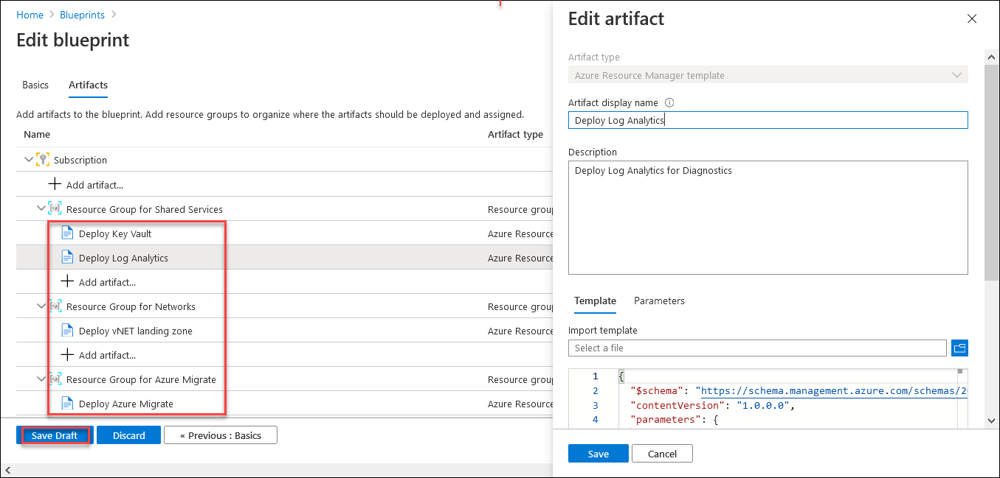
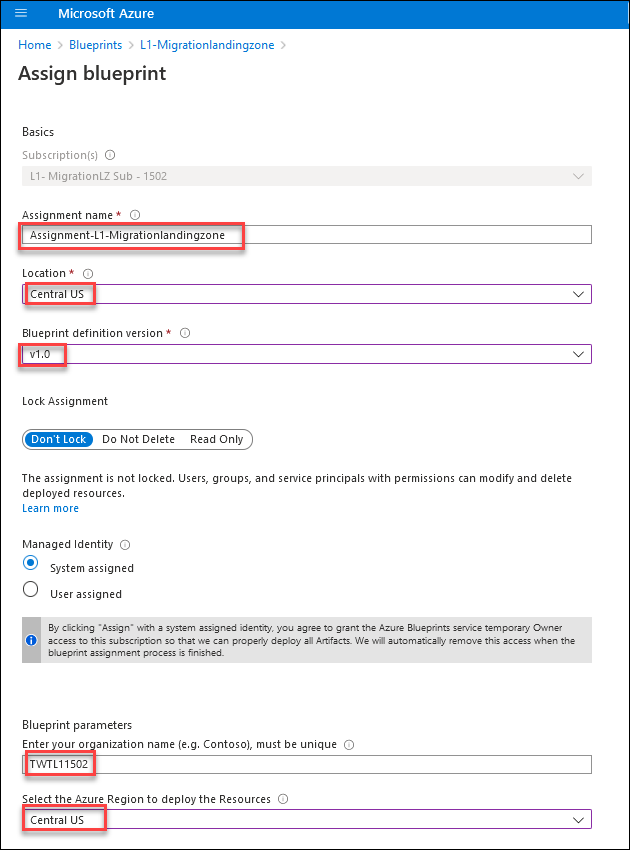
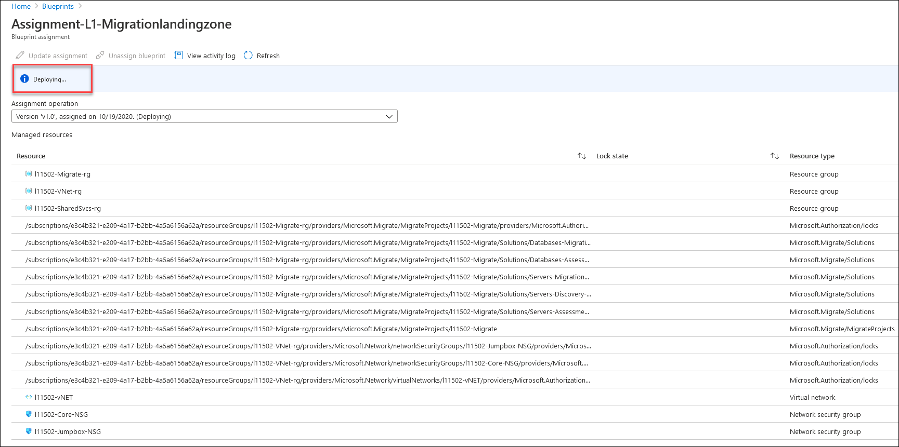
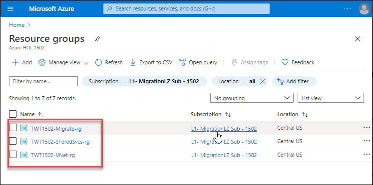
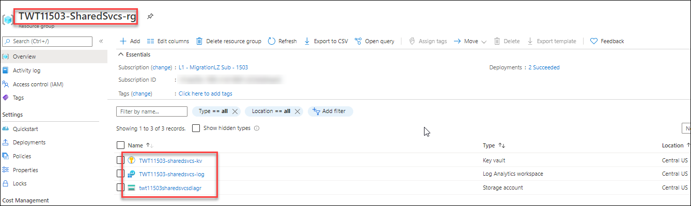
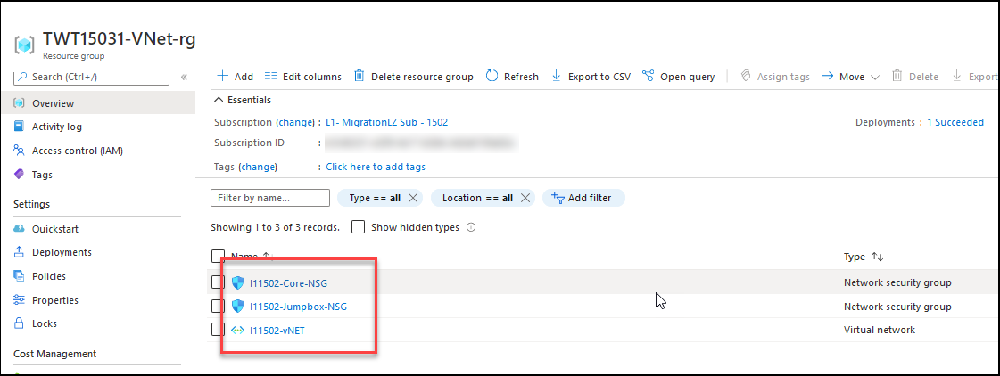
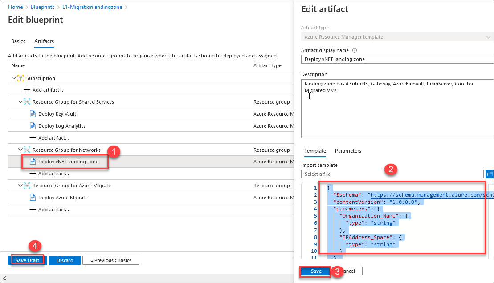
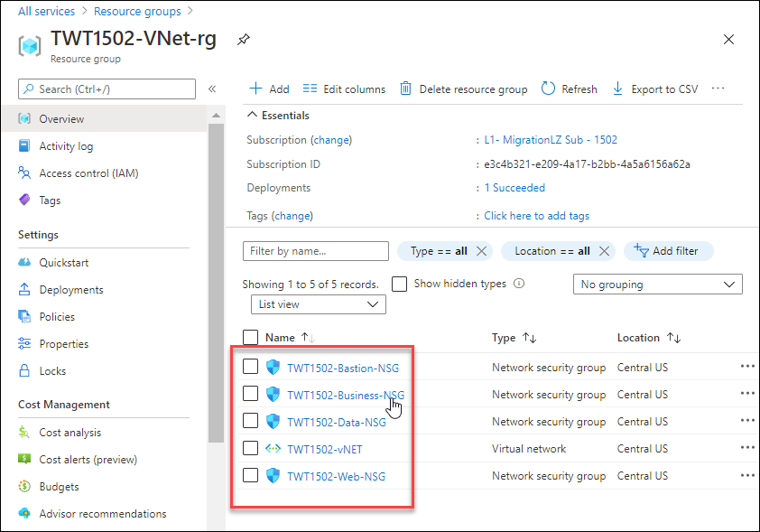
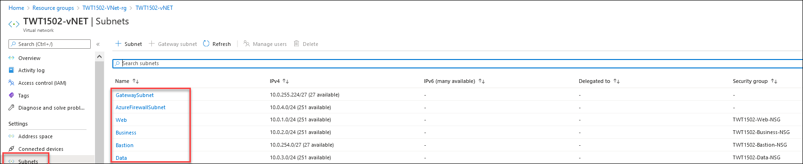

# Exercise 1: Start Small and Expand Migrate Landing Zone

## Context

Tailwind Traders is planning to migrate initial set of workloads from on-premises to cloud. They need a reference architecture to deploy and enforce resources, policies, and templates that will allow them to confidently get started with Azure.

In this exercise, you will create a blueprint definition based on **CAF Migration Landing Zone** and assign it at the subscription level to get start started with Azure. Also, you will update the blueprint to match DMS Network architecture of Tailwind Traders.

## Reference architecture

The Microsoft Cloud Adoption Framework for Azure **(CAF) Migration landing zone** blueprint is a set of infrastructure to help you set up for migrating your first workload to azure and manage your cloud estate in alignment with CAF.

The CAF Migration landing zone blueprint sample deploys foundation infrastructure resources in Azure that can be used by organizations to prepare their subscription for migrating virtual machines in to. It also helps put in place the governance controls necessary to manage their cloud estate. This sample will deploy and enforce resources, policies, and templates that will allow an organization to confidently get started with Azure.

This environment is composed of several Azure services used to provide a secure, fully monitored, enterprise-ready governance.You will explore the resources deployed with this blueprint in the below tasks.

 

>You will see Suffix/DeploymentID value on the Lab Environment tab, please use it wherever you see SUFFIX or DeploymentID in lab steps. This is a unique number associated with each lab deployment.

#### Task 1: Deploy the Microsoft Cloud Adoption Framework for Azure migrate landing zone blueprint sample

In this task , you will create a blueprint definition based on CAF Migration Landing Zone and also explore the capabilities it provides.

The below steps must be followed to deploy the Azure Blueprints CAF Migration landing zone blueprint sample:

- Recommended to deploy the CAF Foundation blueprint sample
- Create a new blueprint from the sample
- Mark your copy of the sample as Published
- Assign your copy of the blueprint to an existing subscription

> Note: Blueprints enable quick creation of governed subscriptions. This allows Cloud Architects to design environments that comply with organizational standards and best practices – enabling your app teams to get to production faster. Using blueprints you can compose artifacts such as templates, policies, role assignments, and resource groups based on common or organization-based patterns into re-usable blueprints.

1. From the Azure portal , type **Blueprint** at the search bar and select **Blueprints** under services. You will be redirected to **Blueprints| Getting started** page.
   
    
   
2. From the **Blueprints| Getting started** page, under the **Create a blueprint** header click on **Create**.This will redirect to **Create blueprint** page.

    

3. On the **Create blueprint** page, under the **Choose a blueprint sample** header, type **CAF** at the search bar and select the predefined blueprint sample **CAF Migration Landing zone**. You will be redirected to **Create blueprint** page.

    
 
4. On the **Create blueprint** page create the blueprint with the following characteristics:

   - **Name**: `L1MigrationLandingzone`
   - **Blueprint description**: Leave the default description
   - **Definition location**: Click on ellipse (**...**) symbol.
   
    
   
5. Next, set the **Definition Location** value to a subscription named **L1-MigrationLZ Sub-DeploymentID** and then click on **Select** to return back to the Create blueprint page
     
    
  
  >The definition location determines the **scope** that the blueprint may be assigned to, the management group or subscription where the blueprint is saved.

6. Click on **Next:Artifacts>>** section and explore the artifacts included along with the **CAF Migration Landing zone blueprint**.
   
    
   
   The blueprint is composed of following artifacts:
  - An **Azure Key Vault** instance used to host secrets used for the Certificates, Keys, and Secrets deployed in the shared services environment
  - **Log Analytics** is deployed to ensure all actions and services log to a central location from the moment you start your migration
  - **Azure Virtual Network** providing an isolated network and subnets for your virtual machine.
  - **Azure Migrate Project** for discovery and assessment ,to add the tools for Server assessment, Server migration, Database assessment, and Database migration.
   
7. After exploring the artifacts, Click on **Save Draft** to save the blueprint configurations as draft.

> Note: When a blueprint is first created, it's considered to be in Draft mode. When it's ready to be assigned, it needs to be Published , so the next step is to **publish the blueprint**.

8. Navigate to the **Blueprints** blade then under the **Blueprint definitions** section,select the blueprint definition **L1MigrationLandingzone**.
   
9. Click on **Publish blueprint**.

    

10. Enter the version as **v1.0** and click on **Publish** to publish the blueprint.
 
     
 
 > Note: Publishing requires defining a **Version** string (letters, numbers, and hyphens with a max length of 20 characters) along with optional **Change notes**. 
 The Version differentiates it from future changes to the same blueprint and allows each version to be assigned. This versioning also means different Versions of the same blueprint can be assigned to the same subscription.
 
 11. Once the copy of the blueprint sample has been successfully Published, it can be assigned to a subscription it was saved to.
 
 12. Navigate to the **Blueprints** blade then under the **Blueprint definitions** section,select the published blueprint definition **L1MigrationLandingzone**.
 
 13. Then select **Assign blueprint** option at the top of the blueprint definition page. 
     
      
      
 14. Now on the **Assign blueprint** page , provide the parameter values for the blueprint assignment:
    
     **Basics**
     - **Subscriptions**: `L1- MigrationLZ Sub-DeploymentID`
      >Select the subscription you saved your copy of the blueprint sample to. 
       
     - **Assignment name:** The name is pre-populated for you based on the name of the blueprint `Assignment-L1-Migrationlandingzone`.
       
     - **Location:** `CentralUS`
       >Select a region for the managed identity to be created in. Azure Blueprint uses this managed identity to deploy all artifacts in the assigned blueprint.
       
     - **Blueprint definition version:** `v1.0`
       >Pick a Published version of your copy of the blueprint sample.
       
     - **Lock Assignment:** Leave the default value
       
     - **Managed Identity:** Choose the default system assigned managed identity option.

     **Blueprint parameters:** 
       >The parameters defined in this section are used by many of the artifacts in the blueprint definition to provide consistency.
    
     - **Organization:** Enter your organization name as `TWTL1-DeploymentID`
     - **AzureRegion:** `CentralUS`
       
        

     **Artifact parameters**
       
       >The parameters defined in this section apply to the artifact under which it's defined. These parameters are dynamic parameters since they're defined during the assignment of the blueprint. 
       
      - **Deploy key vault:**
        Provide the **ObjectID** value 
        > Get the ObjectID value from the **Lab Environment** tab
      
      - **Deploy log analytics:**
        Provide the value `30` for Number of days data will be retained in Log Analytics.
        
        **Region:** `CentralUS`
      
      - **Deploy vNET Landing zone :** Provide the Virtual Network IP Addressspace as `10.0`
      
      - **Deploy Azure Migrate:**`CentralUS`
       
        Once all parameters have been entered, select **Assign** at the bottom of the page.
        
         

14. Now the blueprint assignment is created and the artifact deployment begins. This deployment will take around five minutes. 

15. To check on the status of deployment, open the blueprint assignment from the **Blueprints** pane followed by **Assigned blueprints** section
 
    
 
16. After the assignment is **Succeeded** ,review the deployed resources by the blueprint.

17. In the upper left corner of the portal window, to open the Resource Groups menu, click the toggle menu icon and then click on **Resource groups**.
    
    
    
    This blade displays all of the resource groups that you have access to the Azure subscriptions.

18. As you can see three resource groups named **-Migrate-rg,-SharedSvcs-rg,-VNet-rg** are deployed by the blueprint.

    
    
19. Review the deployed resources in each resource groups.

20. Under the **Resource groups** blade Click on **Migrate-rg** and then Click on **Show Hidden types** to see the resources created in this resource group.

    
   
   You should see a migration project created ,it is deployed for discovery and assessment,to add the tools for Server assessment, Server migration, Database assessment, and Database migration.
   
    >Some ancillary resources are created/managed by Azure infrastructure. The Portal does not display these resources by default. Toggle this checkbox **Show Hidden types** if you want to show/hide them. Displaying them is typically useful when you want to clean up your resource groups or subscriptions.
    
21. Now return to the **Resource groups** blade and click on **SharedSvcs-rg** and review the deployed resources.
    
    
  
    An **Azure Key Vault** instance used to host secrets used for the Certificates, Keys, and Secrets deployed in the shared services environment
    **Log Analytics** is deployed to ensure all actions and services log to a central location from the moment you start your migration.
    And a **Storage account** to store the diagnostic files.
   
22. Again return to the **Resource groups** blade and click on **VNet-rg** to check for the resources created in this resource group
    
    **Azure Virtual Network** along with Network security groups is created for providing an isolated network and subnets for your virtual machine.
 
   
   
#### Task 2: Update the Azure migrate landing zone blueprint sample to match with DMZ Architecture

1. Select the blueprint definition **L1-Migrationlandingzone** created in previous task and Click on **Edit blueprint**.
   
   
     
2. On the **Edit blueprint** page, Navigate to **Next Artifacts->** and then under the **Resource Group for Networks** click on **Deploy Vnet Landing zone**

3. Remove the existing JSON code for **Deploy Vnet Landing zone** and replace it with https://raw.githubusercontent.com/srushti-714/Cloud-Adoption-Framework-In-A-Day/main/Instructions/Templates/DMZ-VNET.json which deploys the **Virtual Network** with DMZ architecture.

   
     
4. Click on **Save Draft**

5. Click on the edited blueprint definition and then click on **Publish blueprint**.
   - Provide the version as **v2.0** and click on **Publish** to save the changes.
  
    
  
6. Navigate to **Blueprints->Assigned blueprints** ,Select **Assignment-L1-Migrationlandingzone** and then click on **Unassign blueprint** to unassign the previously assigned blueprint.
   
   
  
5. Now click on **Assign blueprint** and **repeat step 13 of task 1** to provide the required parameters and click on **Assign**
 >Note: Here the blueprint definition version should be **v2.0**

6. After the assignment is **succeeded** you can review the deployed VNET that matches the DMZ architecture.

7. Navigate to **TWTL2suffix-VNet-rg** and review the deployed resources.

   
   
   
> The architecture implements a DMZ, also called a perimeter network, between the on-premises network and an Azure virtual network. All inbound and outbound traffic passes through Azure Firewall.

>Note: To find more information about CAF migration landing zone follow this link : https://docs.microsoft.com/en-us/azure/governance/blueprints/samples/caf-migrate-landing-zone/
