# Exercise 1: Start Small and Expand Migrate Landing Zone

## Context

Tailwind Traders is planning to migrate the initial set of workloads from on-premises to the cloud. They need a reference architecture to deploy and enforce resources, policies, and templates that will allow them to confidently get started with Azure.

In this exercise, you will create a blueprint definition based on **CAF Migration Landing Zone** and assign it at the subscription level to get started with Azure. Also, you will update the blueprint to match DMZ Network architecture.

## Reference architecture

The Microsoft Cloud Adoption Framework for Azure **(CAF) Migration landing zone** blueprint is a set of infrastructure to help you set up for migrating your first workload to azure and manage your cloud estate in alignment with CAF.

The CAF Migration landing zone blueprint sample deploys foundation infrastructure resources in Azure that can be used by organizations to prepare their subscription for migrating virtual machines to. It also helps put in place the governance controls necessary to manage their cloud estate. This sample will deploy and enforce resources, policies, and templates that will allow an organization to confidently get started with Azure.

This environment is composed of several Azure services used to provide a secure, fully monitored, enterprise-ready governance. You will explore the resources deployed with this blueprint in the below tasks.

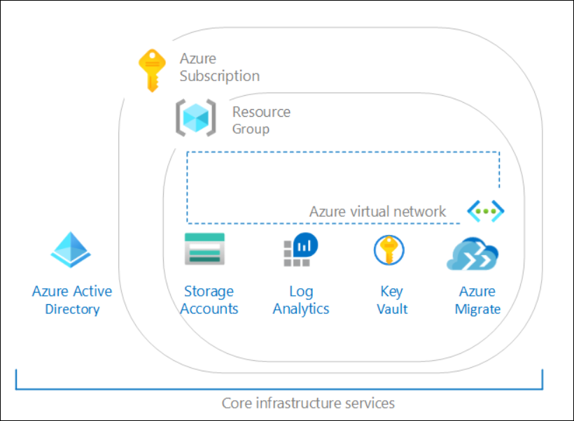 

>You will see **DeploymentID** value on the Environment details tab, please use it wherever you see DeploymentID in lab steps. This is a unique number associated with each lab deployment.

>Note: **L1-MigrationLZ Sub-Suffix** subscription is used to perform this exercise. The **Suffix** is the 4 digit XXXX value of the tenant, for example, if the username is odl_user_238206@azurehol**1505**.onmicrosoft.com, **1505** is the Suffix value.

#### Task 1: Deploy the Microsoft Cloud Adoption Framework for Azure migrate landing zone blueprint sample

Azure landing zones are the output of a multi subscription Azure environment that accounts for scale, security, governance, networking, and identity, and a migration landing zone is an environment that has been provisioned and prepared to host workloads that are being migrated from an on-premises environment into Azure.
 
In this task, you will create a blueprint definition based on CAF Migration Landing Zone and also explore the capabilities it provides.

The below steps must be followed to deploy the Azure Blueprints CAF Migration landing zone blueprint sample:

- Deploy the CAF Foundation blueprint sample
- Create a new blueprint from the sample
- Mark your copy of the sample as Published
- Assign your copy of the blueprint to an existing subscription

1. From the Azure portal, type **Blueprint** at the search bar and select **Blueprints** under services. You will be redirected to **Blueprints| Getting started** page.
   
   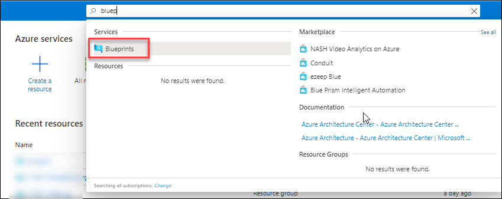 
   
   >Note: Blueprints enable quick creation of governed subscriptions. This allows Cloud Architects to design environments that comply with organizational standards and best practices – enabling your app teams to get to production faster. Using blueprints you can compose artifacts such as templates, policies, role assignments, and resource groups based on common or organization-based patterns into re-usable blueprints.
   
2. From the **Blueprints| Getting started** page, under the **Create a blueprint** header click on **Create**. This will redirect to **Create blueprint** page.

   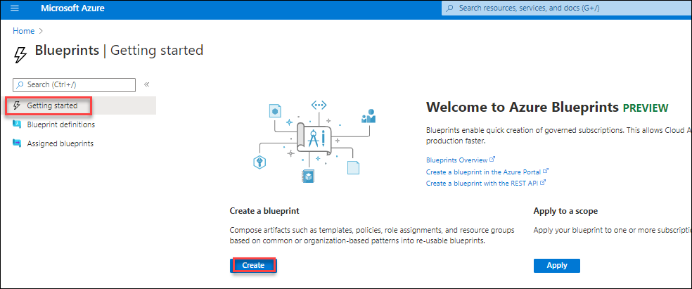

3. On the **Create blueprint** page, under the **Choose a blueprint sample** header, type **CAF** at the search bar and select the predefined blueprint sample **CAF Migration Landing zone**.

    
 
4. On the **Create blueprint** page, create the blueprint with the following characteristics:

   - **Name**: `L1-MigrationLandingzone`
   - **Blueprint description**: Leave the default description
   - **Definition location**: Click on **ellipse (**...**)** symbol.
   
   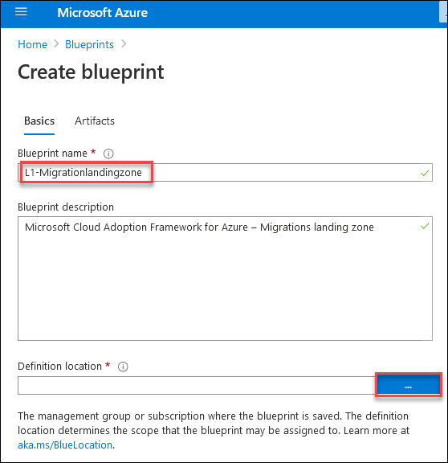 
   
5. Next, set the **Definition Location** value to a subscription named **L1-MigrationLZ Sub-Suffix** and then click on **Select** and return to the Create blueprint page.
     
   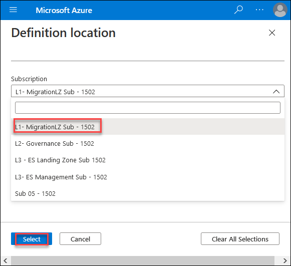 
  
   >The definition location determines the **scope** that the blueprint may be assigned to, the management group, or subscription where the blueprint is saved.

6. Click on **Next: Artifacts>>** section and explore the artifacts included along with the **CAF Migration Landing zone blueprint**.
   
   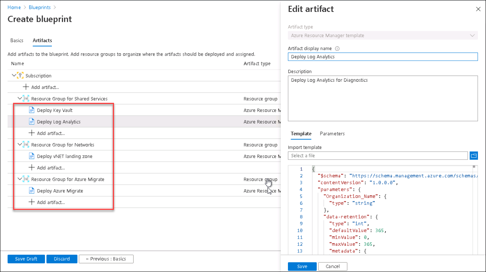 
   
   The blueprint is composed of the following artifacts:
   - An **Azure Key Vault** instance used to host secrets used for the Certificates, Keys, and Secrets deployed in the shared services environment
   - **Log Analytics** is deployed to ensure all actions and services log to a central location from the moment you start your migration
   - **Azure Virtual Network** providing an isolated network and subnets for your virtual machine.
   - **Azure Migrate Project** for discovery and assessment, to add the tools for Server assessment, Server migration, Database assessment, and Database migration.
   
7. After exploring the artifacts, click on **Save Draft** to save the blueprint configurations as a draft.

   >Note: Click **Save Draft** and allow approximately **10 seconds** for the Blueprint Definition to be saved

8. Next step is to publish the blueprint, click on the **notifications** icon and click on the **Saving blueprint definition succeeded**
    
    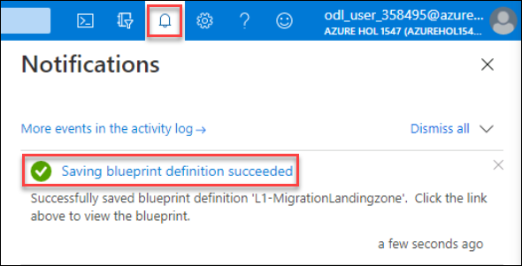
   
9. Click on **Publish blueprint** from the **L1-MigrationLandingzone** page.

   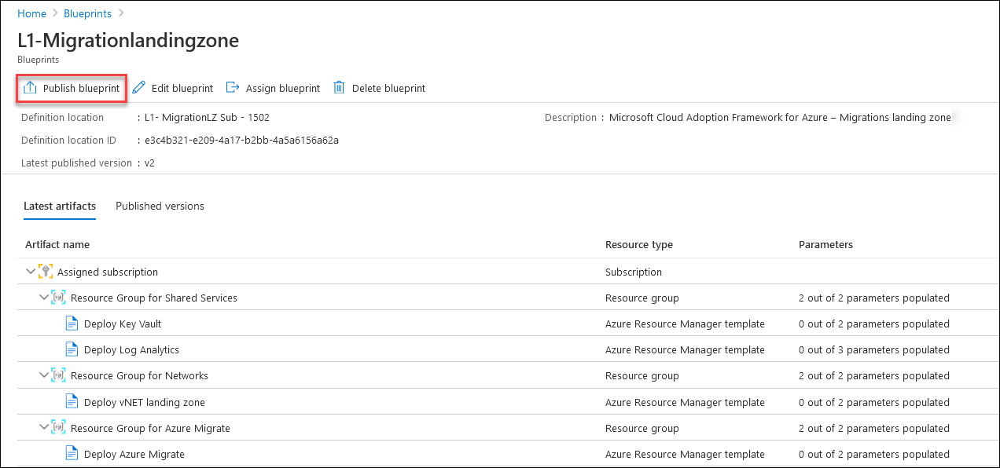 
   
   >When a blueprint is first created, it is considered to be in Draft mode. When it is ready to be assigned, it needs to be Published.

10. Enter the version as **v1.0** and click on **Publish** to publish the blueprint.
 
    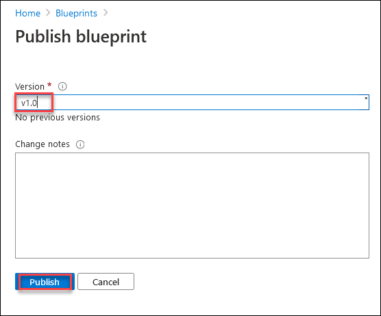 
 
    >Note: Publishing requires defining a **Version** string (letters, numbers, and hyphens with a max length of 20 characters) along with optional **Change notes**. 
 The Version differentiates it from future changes to the same blueprint and allows each version to be assigned. This versioning also means different versions of the same blueprint can be assigned to the same subscription.
 
11. The Blueprint sample copy is ready to be assigned to the subscription to which it is saved once it is published.
 
12. Select the **Assign blueprint** option at the top of the blueprint definition page. 
     
     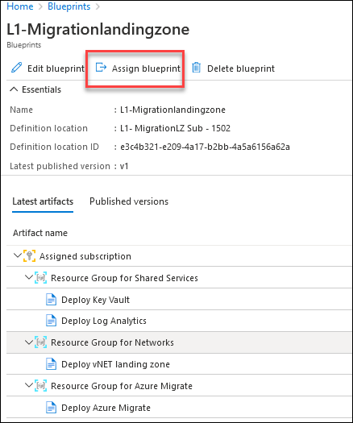 
      
13. On the **Assign blueprint** page, provide the parameter values for the blueprint assignment:
    
     **Basics**
     - **Subscriptions**: The subscription `L1-MigrationLZ Sub-Suffix` should be pre-selected and grayed out. This value reflects the Subscription where your Blueprint copy is saved.
       
     - **Assignment name:** The name is pre-populated for you based on the name of the blueprint `Assignment-L1-Migrationlandingzone`.
       
     - **Location:** `CentralUS`
       >Region for the managed identity to be created in. Azure Blueprint uses this managed identity to deploy all artifacts in the assigned blueprint.
       
     - **Blueprint definition version:** `v1.0`
       >Pick a Published version of your copy of the blueprint sample.
       
     - **Lock Assignment:** Leave the default value of **Don’t Lock**
       
     - **Managed Identity:** Choose the default **system assigned** managed identity option.

     **Blueprint parameters:** 
       >The parameters defined in this section are used by many of the artifacts in the blueprint definition to provide consistency.
    
     - **Organization:** Enter your organization name as TWT-<inject key="DeploymentID"  style="color:red" />
       >Get the DeploymentID from the Environment details tab. For example, if your DeploymentID is 238206 the name will be `TWT238206`
     
     - **AzureRegion:** `CentralUS`
       
        

     **Artifact parameters**
       
       >The parameters defined in this section apply to the artifact under which it is defined. These parameters are dynamic since they are defined during the assignment of the blueprint. 
       
      - **Deploy Key Vault:** Provide the **Objectid** value , Object id value is used to get the required permissions on key vault. 
         >Get the Objectid value from the **Environment details** tab.
      
      - **Deploy Log Analytics:** `30` that is the value for the number of days the data will be retained in Log Analytics.
        
          **Region:** `CentralUS`
      
      - **Deploy vNET Landing zone :** Provide the Virtual Network IP Address space as `10.0`
      
      - **Deploy Azure Migrate:** 
         Select the region for Azure Migrate: `CentralUS`
       
        Once all parameters have been entered, select **Assign** at the bottom of the page.
        
        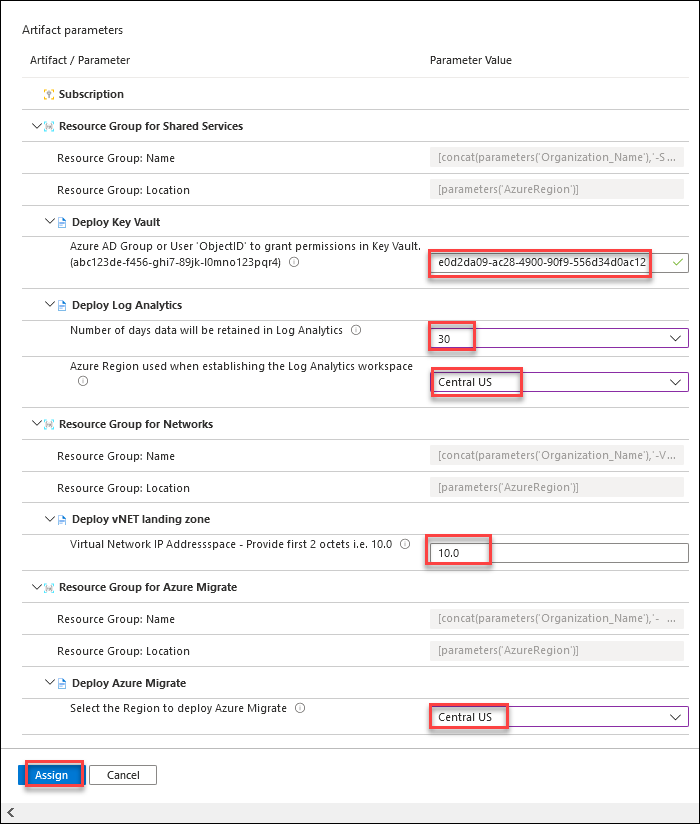 

14. Now the blueprint assignment is created and the artifact deployment begins. This deployment will take around **five** minutes. 

15. To check on the status of the deployment, click on the **notifications** icon and click on the **Blueprint assignment succeeded**
    
    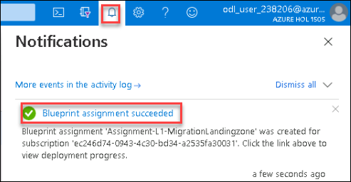
    
16. Observe the resources which are being deployed by the blueprint.
    
    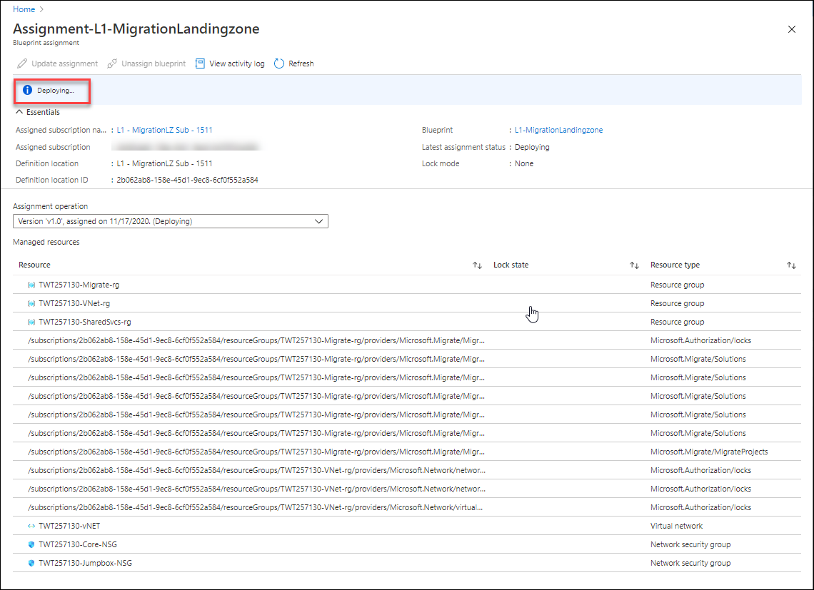
    
    >You can also check the deployment status by opening the blueprint assignment **Assignment-L1-Migrationlandingzone** from the **Blueprints** page and **Assigned blueprints** section, ensure you select the right scope **L1-MigrationLZ Sub-Suffix**
 
17. After the assignment is **Succeeded** review the deployed resources by the blueprint.
    
    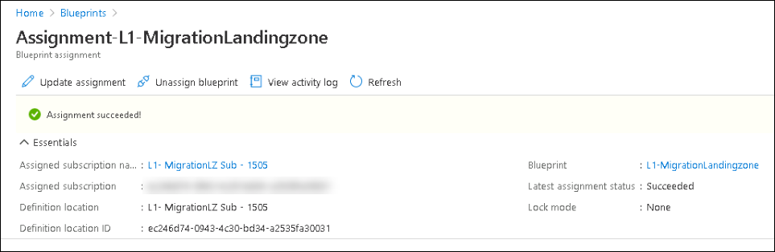
     
18. In the upper left corner of the portal window, to open the Resource Groups menu, click the toggle menu icon and then click on **Resource groups**.
    
    
    
    This blade displays all of the resource groups that you have access to in the Azure subscriptions.

19. On the **Resource Groups** blade filter the resource groups by Subscription **L1-MigrationLZ Sub-Suffix** and verify that four resource groups named -  **TWTDeploymentIDMigrate-rg, TWTDeploymentID-SharedSvcs-rg, and TWTDeploymentID-VNet-rg**, **NetworkWatcherRG** are created by the blueprint.

    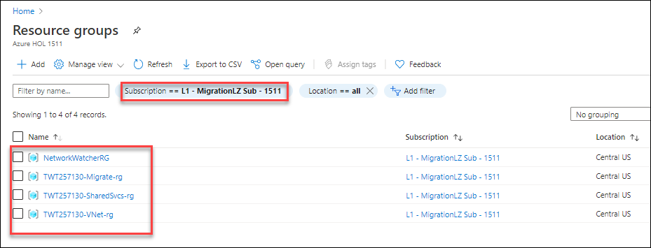
    
20. Review the deployed resources in each resource group.

21. Under the **Resource groups** blade Click on **TWTDeploymentID-Migrate-rg** and then Click on **Show Hidden types** to see the resources created in this resource group.

    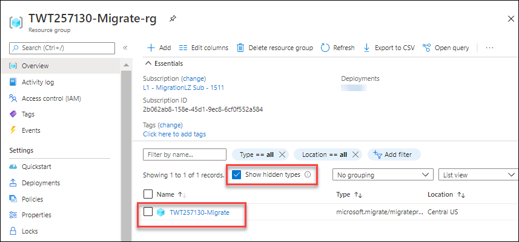
   
    You should see a **migration project** deployed for discovery and assessment, to add the tools for Server assessment, Server migration, Database assessment, and Database migration.
   
    >Some ancillary resources are created/managed by Azure infrastructure. The Portal does not display these resources by default. Toggle this checkbox **Show Hidden types** if you want to show/hide them. Displaying them is typically useful when you want to clean up your resource groups or subscriptions.
    
22. Now return to the **Resource groups** blade and click on **TWTDeploymentID-SharedSvcs-rg** and review the deployed resources.
    
    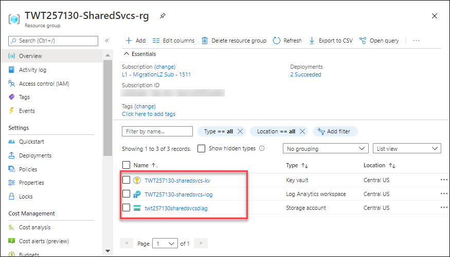
  
    - An **Azure Key Vault** instance used to host secrets used for the Certificates, Keys, and Secrets deployed in the shared services environment
    - **Log Analytics** is deployed to ensure all actions and services log to a central location from the moment you start your migration.
    - And a **Storage account** to store the diagnostic files.
   
23. Again return to the **Resource groups** blade and click on **TWTDeploymentID-VNet-rg** to check for the resources created in this resource group.
    
    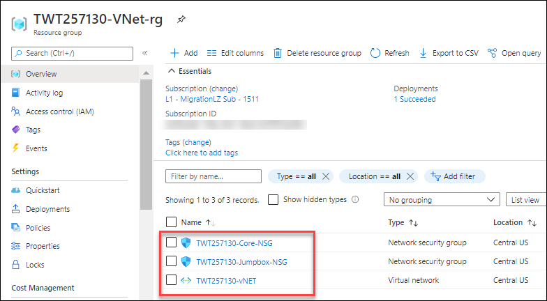
     
    **Azure Virtual Network** along with Network security groups is created for providing an isolated network and subnets for your virtual machine.
 
24. Click on **Virtual network** in the resource group and then select **Subnets** under the Settings section and look at the subnets deployed.
   
     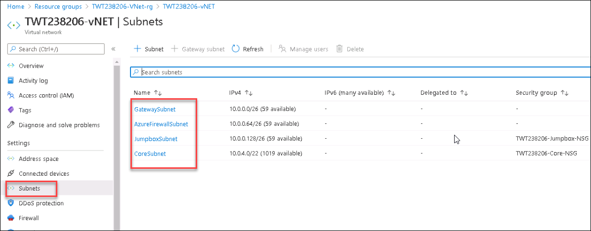
     
     A virtual network will be created with subnets for a gateway, firewall, jump box, and core subnet. A subnetwork or subnet is a logical subdivision of an IP network.
     
25. Again return to the **Resource groups** blade and click on **NetworkWatcherRG** and see that Network watcher is deployed.
 
     
 
     >Note: To find more information about CAF migration landing zone follow this link: https://docs.microsoft.com/en-us/azure/governance/blueprints/samples/caf-migrate-landing-zone/
   
#### Task 2: Update the Azure migrate landing zone blueprint sample to match with DMZ (Demilitarized Zone) Architecture

In this task, you will update the VNET Landing zone to deploy a virtual network to add a layer of security that uses the **DMZ architecture**(Demilitarized Zone). The architecture implements a DMZ, also called a **perimeter network**, between the on-premises network and an Azure virtual network.

The purpose of a DMZ is to add a layer of security to an organization's local area network, an external network node can access only what is exposed in the DMZ, while the rest of the organization's network is firewalled
 
**Azure virtual network**: The virtual network hosts the application and other resources running in Azure.
**Network security groups:** Use security groups to restrict network traffic within the virtual network. For example, in the deployment provided with this reference architecture, the web tier subnet allows TCP traffic from the on-premises network and from within the virtual network, the business tier allows traffic from the web tier and the data tier allows traffic from the business tier.

In this architecture, **Azure Firewall** is a managed firewall as a service, all inbound and outbound traffic passes through the Azure Firewall and the firewall instance is placed in its own subnet and it is deployed in the virtual network to control traffic between the gateway subnet and the subnet in which the application tier runs. In this way, the Azure Firewall is cost-effective because it is used as a shared solution consumed by multiple workloads.
**Virtual network routes**: Virtual network routes define the flow of IP traffic within the Azure virtual network. 
- In the **gateway subnet**, traffic sent to the web-tier subnet (10.0.1.0/24) is routed through the Azure Firewall instance.
- In the **web tier subnet**, Since there is no route for address space of the VNet itself to point to Azure firewall, web tier instances can communicate directly to each other, not via Azure Firewall.

- And **Azure Bastion** allows you to log into VMs in the virtual network through SSH or remote desktop protocol (RDP) without exposing the VMs directly to the internet. Use Bastion to manage the VMs in the virtual network.

>**Note** : As part of this lab, you will not be deploying the route tables along with the virtual network.

### Deploy the Virtual Network which implements a DMZ architecture.

1. Navigate to the **Blueprints** page and under the **Assigned blueprints** section, select **Assignment-L1-Migrationlandingzone** then click on **Unassign blueprint** to unassign the previously assigned blueprint.
   
   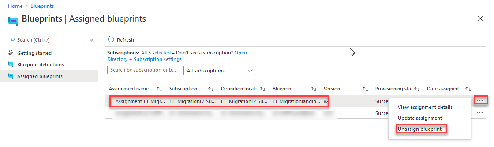
   
   >Select the scope **L1-MigrationLZ Sub-Suffix** if it is set to a different subscription.
   
2. Now go to the **Blueprints** pane and under the **Blueprint definitions** section.

3. Select the blueprint definition **L1-Migrationlandingzone** and Click on **Edit blueprint**.
   
   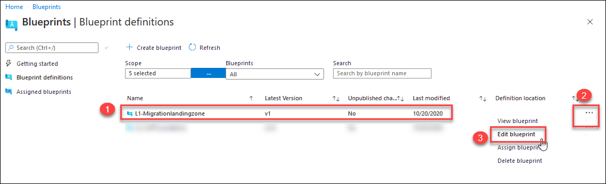
     
4. On the **Edit blueprint** page, Navigate to **Next Artifacts->** and then under the **Resource Group for Networks** click on **Deploy Vnet Landing zone**

5. Remove the existing JSON code for **Deploy Vnet Landing zone** then click on folder symbol under Import template and select the file **vnetdmz-deploy.json** located in **C:\LabFiles** which deploys the **virtual network** with DMZ architecture.

   >vnetdmz-deploy.json file is already downloaded in the C:\LabFiles in the jumpvm provided with the lab.

   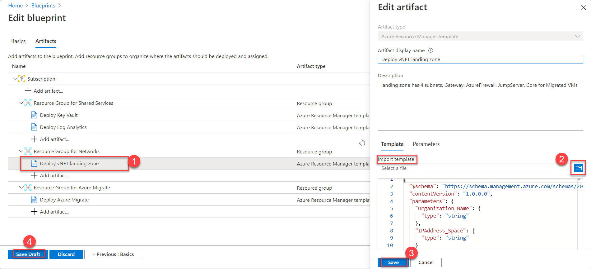
     
6. Click on **Save** then click on **Save Draft** to save the edited blueprint.

   >Note: Click **Save Draft** and allow approximately **10 seconds** for the Blueprint Definition to be saved
   
7. Next step is to publish the blueprint, click on the **notifications** icon and click on the **Saving blueprint definition succeeded**
    
   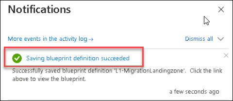
   
8. Click on **Publish blueprint**.

    

9. Select the **Publish blueprint** option and provide the version as **v2.0** then click on **Publish** to save the changes.
  
   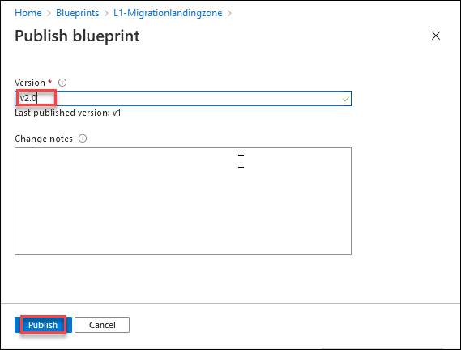 

10. Then click on the **Assign blueprint** option to assign the updated blueprint.

11. Now on the **Assign blueprint** page, provide the parameter values for the blueprint assignment:

    **Basics**
     - **Subscriptions**: The subscription `L1-MigrationLZ Sub-Suffix` should be pre-selected and grayed out. This value reflects the Subscription where your Blueprint copy is saved.
       
     - **Assignment name:** The name is pre-populated for you based on the name of the blueprint `Assignment-L1-Migrationlandingzone`.
       
     - **Location:** `CentralUS`
       >Region for the managed identity to be created in. Azure Blueprint uses this managed identity to deploy all artifacts in the assigned blueprint.
       
     - **Blueprint definition version:** `v2.0`
       >Pick a Published version of your copy of the blueprint sample.
       
     - **Lock Assignment:** Leave the default value
       
     - **Managed Identity:** Choose the default **system assigned** managed identity option.

     **Blueprint parameters:** 
       >The parameters defined in this section are used by many of the artifacts in the blueprint definition to provide consistency.
    
     - **Organization:** Enter your organization name as `DMZDeploymentID`
      >Get the DeploymentID from the Environment details tab. For example, if your DeploymentID is 238206 the name will be `DMZ238206`
     
     - **AzureRegion:** `CentralUS`
       
       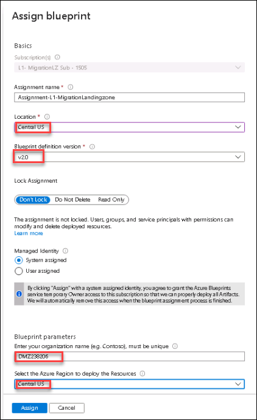 

     **Artifact parameters**
       
       >The parameters defined in this section apply to the artifact under which it is defined. These parameters are dynamic since they are defined during the assignment of the blueprint. 
       
      - **Deploy Key Vault:** Provide the **Objectid** value, Object id value is used to get the required permissions on key vault.
         >Get the Objectid value from the **Environment details** tab
      
      - **Deploy Log Analytics:** Choose`30` from the drop-down list. This is the value for the Number of days the 2data will be retained in Log Analytics.
         **Region:** `CentralUS`
      
      - **Deploy vNET Landing zone :** Provide the Virtual Network IP Address space as `10.0`
      
      - **Deploy Azure Migrate:**`CentralUS`
       
        Once all parameters have been entered, select **Assign** at the bottom of the page.
        
         
        
12. Now the blueprint assignment is created and the artifact deployment begins. This deployment will take around **five** minutes. 

13. To check on the status of the deployment, click on the **notifications** icon and click on the **Blueprint assignment succeeded**
    
    
     
14. Observe the resources which are being deployed by the blueprint.
    
    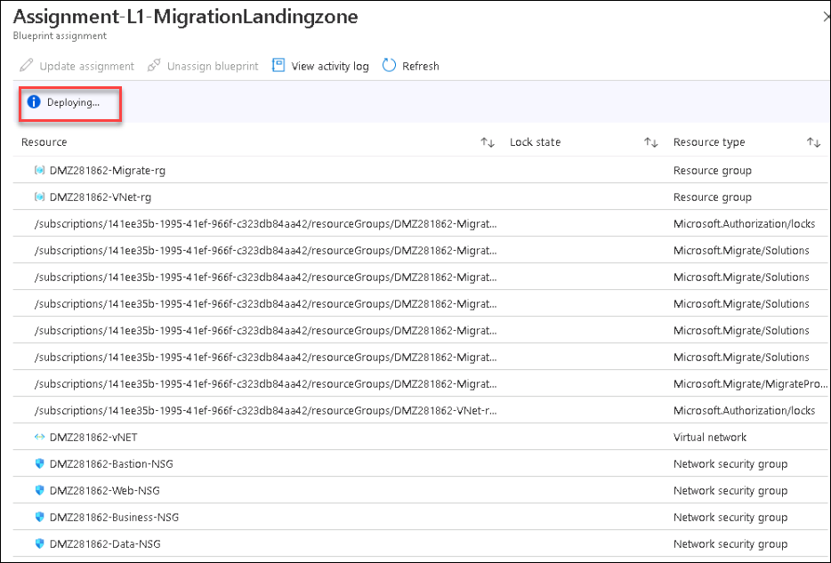
    
    >You can also check the deployment status by opening the blueprint assignment **Assignment-L1-Migrationlandingzone** from the **Blueprints** page and **Assigned blueprints** section, ensure you select the right scope **L1-MigrationLZ Sub-Suffix**
 
15. After the assignment is **Succeeded** review the deployed Virtual Network with DMZ architecture.
    
    
    
16. In the upper left corner of the portal window, to open the Resource Groups menu, click the toggle menu icon and then click on **Resource groups**.
    
    
    
    This blade displays all of the resource groups that you have access to the Azure subscriptions.

17. On the **Resource Groups** blade filter the subscription **L1-MigrationLZ Sub-Suffix** and select the resource group **DMZDeploymentIDVNet-rg** and review the resources deployed along with the virtual network

    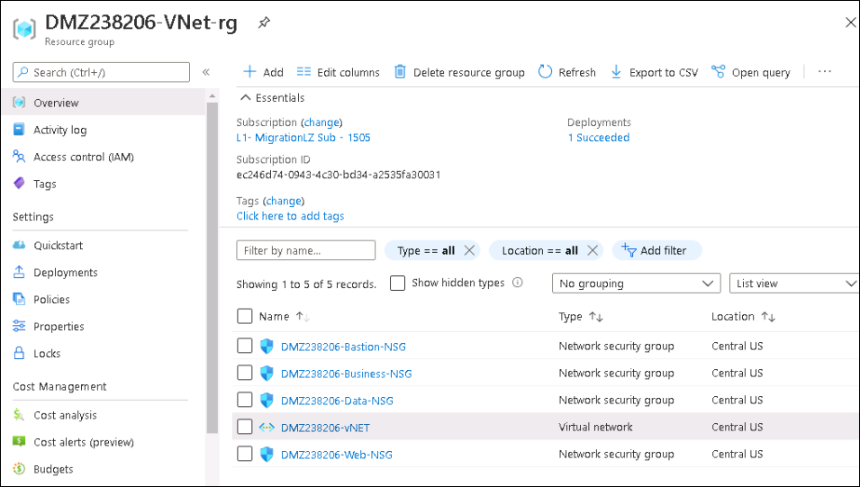
    
    **Azure virtual network**: The virtual network hosts the application and other resources running in Azure.
   
    **Network security groups:** Use security groups to restrict network traffic within the virtual network. For example, in the deployment provided with this reference architecture, the web tier subnet allows TCP traffic from the on-premises network and from within the virtual network; the business tier allows traffic from the web tier, and the data tier allows traffic from the business tier.
    
18. Select the virtual network and under the **settings** select **Subnets** option to see the created subnets with Virtual network.

    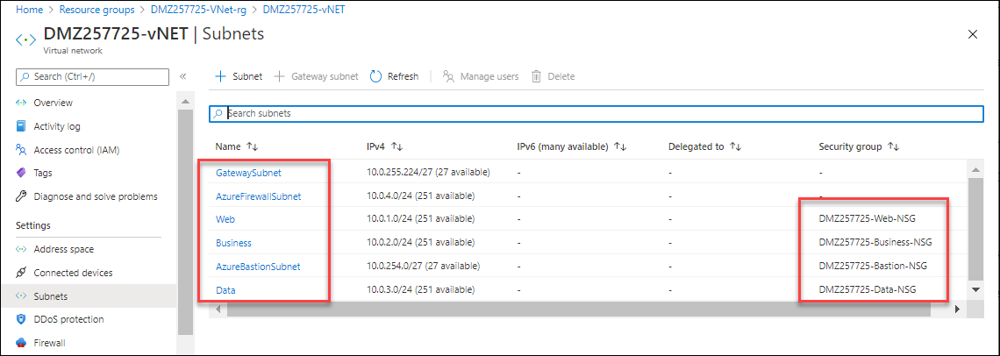
    
    **Azure Firewall** is a managed firewall as a service, all inbound and outbound traffic passes through the Azure firewall and the firewall instance is placed in its own subnet and it is deployed in the virtual network to control traffic between the gateway subnet and the subnet in which the application tier runs. In this way, the Azure Firewall is cost-effective because it is used as a shared solution consumed by multiple workloads.

     **Virtual network routes**: Virtual network routes define the flow of IP traffic within the Azure virtual network. 
   - In the **gateway subnet**, traffic sent to the web-tier subnet (10.0.1.0/24) is routed through the Azure firewall instance.
   - In the **web tier subnet**, Since there is no route for address space of the VNet itself to point to Azure Firewall, web tier instances can communicate directly to each other, not via Azure Firewall.
   - And **Azure Bastion** allows you to log into VMs in the virtual network through SSH or remote desktop protocol (RDP) without exposing the VMs directly to the internet. Use Bastion to manage the VMs in the virtual network.

     >Note: To find more information about DMZ architecture follow this link: https://docs.microsoft.com/en-us/azure/architecture/reference-architectures/dmz/secure-vnet-dmz

     In this exercise, you created a blueprint based on CAF Migration Landing Zone and explored the capabilities it provides. This implementation option does not implement any governance tooling. It is assumed that this landing zone is being used for limited production deployment to initiate learning, iteration, and development of the overall operating model in parallel to these early-stage migration efforts. To accelerate the parallel development of governance disciplines, you will be deploying the **CAF Foundation blueprint** in the next exercise.
     
     Click on **Next** to proceed with the next exercise.
