# Exercise 2: Governance

## Context

Migrations have gone well. However, there are no strict governance established across the organization. 
Tailwind Traders need to establish recommended best practices for governance and a way to audit that no deployments have been made that bypass those rules. This audit needs to scale across the entire organization.
•	Enable Resource Consistency
•	Enable Security Baseline
•	Enable Cost Management

## Reference architecture

The Microsoft Cloud Adoption Framework for Azure (CAF) Foundation blueprint deploys a set of core infrastructure resources and policy controls required for your first production grade Azure application. This foundation blueprint is based on the recommended pattern found in CAF.

The CAF Foundation blueprint sample deploys recommended infrastructure resources in Azure that can be used by organizations to put in place the foundation controls necessary to manage their cloud estate. This sample will deploy and enforce resources, policies, and templates that will allow an organization to confidently get started with Azure.

This implementation incorporates several Azure services used to provide a secure, fully monitored, enterprise-ready foundation. You will explore the resources deployed and policy defintions available with this blueprint in further tasks.

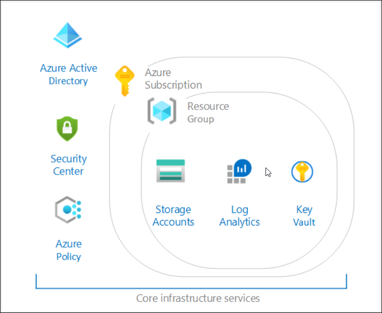 

#### Task 1: Deploy the Microsoft Cloud Adoption Framework for Azure Foundation blueprint sample

In this task you will deploy the Microsoft Cloud Adoption Framework for Azure (CAF) Foundation blueprint sample and the following steps must be taken:

- Create a new blueprint from the sample
- Mark your copy of the sample as Published
- Assign your copy of the blueprint to an existing subscription

1. Search for **Blueprint** from the search bar.

2. On the **Blueprints| Getting started** page, under the **Create a blueprint** header click on **Create** to start configuring the blueprint. 
    
3. Under the **Choose a  blueprint sample**, **Select** the already available blueprint sample **CAF Foundation Zone**

   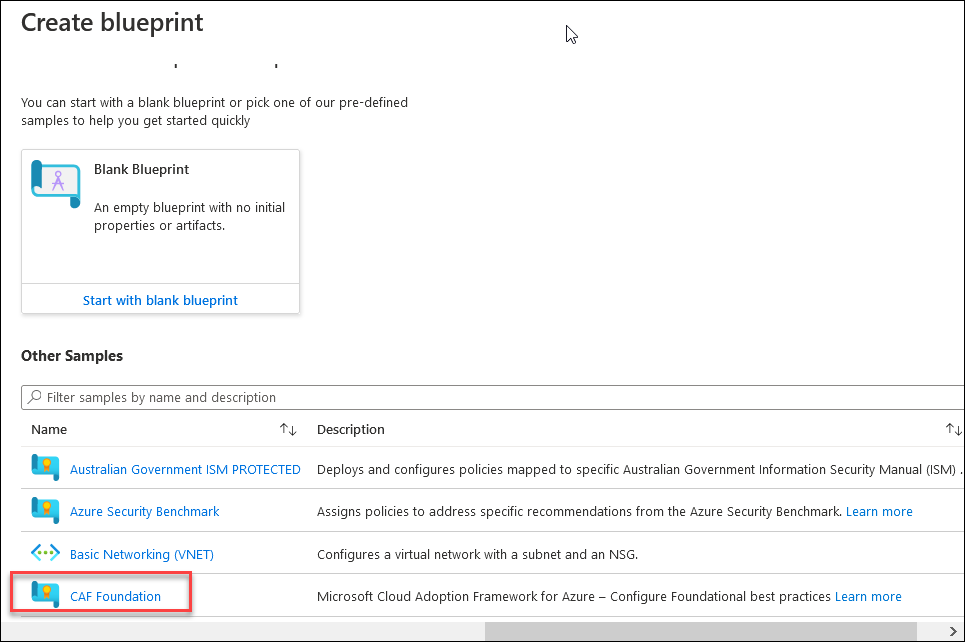 
 
4. On the **Create blueprint** page , Provide the following details:
   - Name : **L2CAFFoundationzone**
   - Blueprint description : Leave the default description
   - Definition location: Click on **...** symbol.
   
   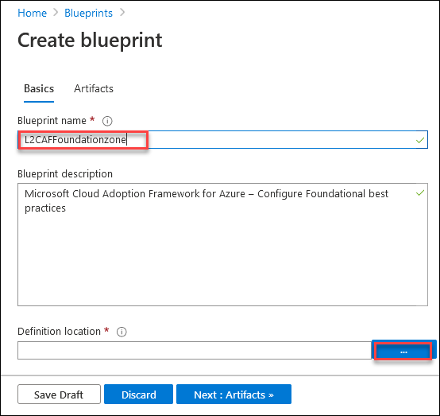 
   
5. The definition location determines the **scope** that the blueprint may be assigned to, the management group or subscription where the blueprint is saved.
   - **Definition Location** : Select the **Subscription** named **L2-Governance Sub-Suffix**
   - Click on **Select** and return to the Create blueprint page
     
   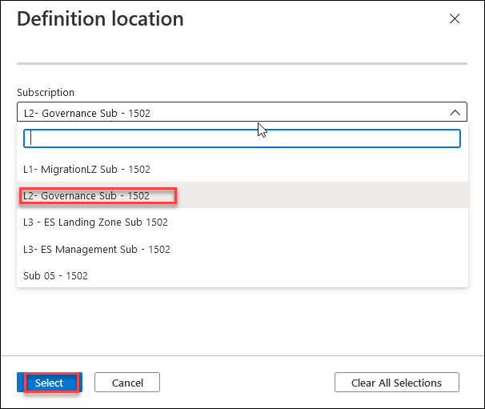 

6. Click on **Next:Artifacts>>** and take a look at the artifacts included along with the **CAF Foundation Zone blueprint sample**
   
7. Click on **Save Draft** to save the blueprint configurations as draft.

8. When a blueprint is first created, it's considered to be in **Draft mode**. When it's ready to be assigned, it needs to be Published , so the next step is to **publish the blueprint**.

9. Click on the blueprint definition you just created and then click on **Publish blueprint**
   
   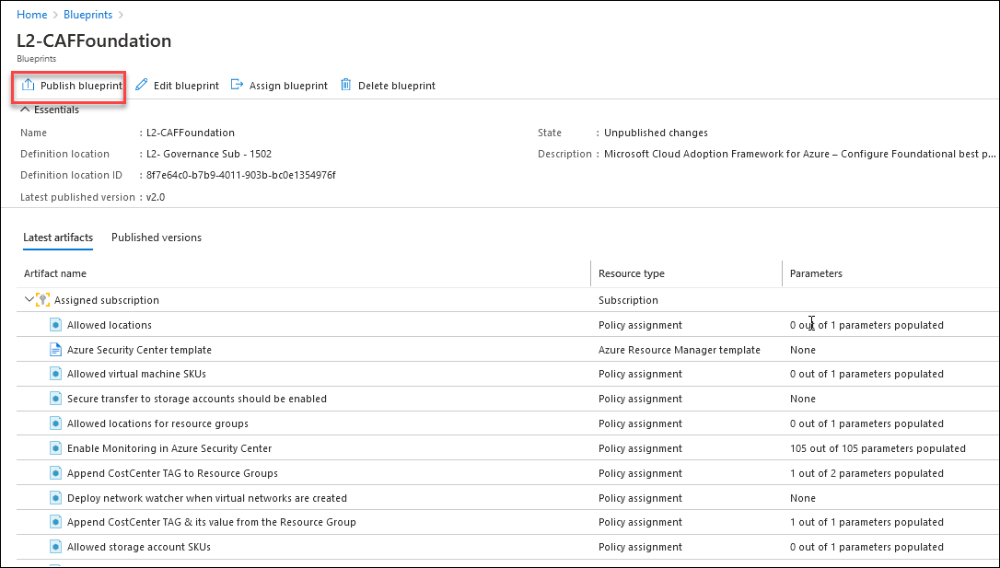 
   
10. Provide the version as **v1.0** and click on **Publish** to publish the blueprint.

    
   
11. Once the copy of the blueprint sample has been successfully Published, it can be assigned to a subscription it was saved to.
 
12. Select the published blueprint definition **L2CAFFoundationzone** and click on **Assign blueprint** at the top of the blueprint definition page.
     
    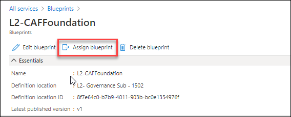

13. On the **Assign blueprint** page, Provide the parameter values for the blueprint assignment:
    
     **Basics**
     
     - **Subscriptions**: Select the subscription you saved your copy of the blueprint sample to.In this case it is **L2-Governance Sub-suffix**
       
     - **Assignment name**: The name is pre-populated for you based on the name of the blueprint that is **Assignment-L2-CAFFoundation**
       
     - **Location**: Select a region for the managed identity to be created in.
        >Azure Blueprint uses this managed identity to deploy all artifacts in the assigned blueprint.
       
     - **Blueprint definition version**: Pick a Published version of your copy of the blueprint sample that is **v1.0**
       
     - **Lock Assignment:** Leave the default value
       
     - **Managed Identity:** Choose the default system assigned managed identity option.

     **Blueprint parameters:** 
     
       >The parameters defined in this section are used by many of the artifacts in the blueprint definition to provide consistency.
     - **Organization**: Enter your organization name as **TWTL2-Suffix** 
     - **AzureRegion**: Select one Azure Region for Deployment.
     
       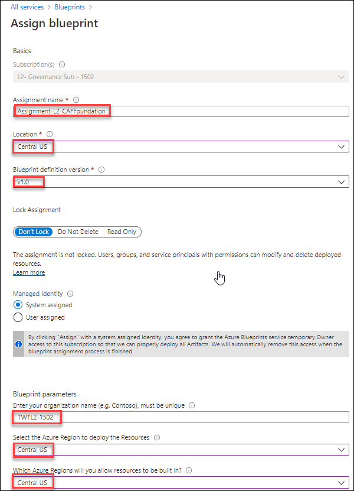
      
     **Artifact parameters**
       >The parameters defined in this section apply to the artifact under which it's defined. These parameters are dynamic parameters since they're defined during the assignment of the blueprint. 
       
      - Append CostCenter TAG to Resource Groups: **dev**
      - Deploy log analytics: Provide the value **30** for Number of days data will be retained in Log Analytics.
      - Region: Provide the same region where you are deploying the blueprint.
      
        Once all parameters have been entered, select **Assign** at the bottom of the page.
   
        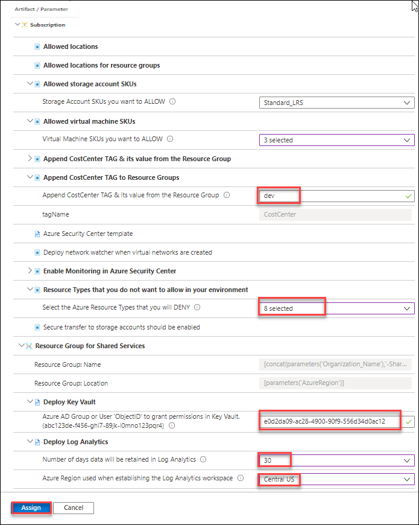
      
14. The blueprint assignment is created and artifact deployment begins. Deployment takes around five minutes. To check on the status of deployment, open the **blueprint assignment** and also look at the resources deployed by this blueprint.
    
    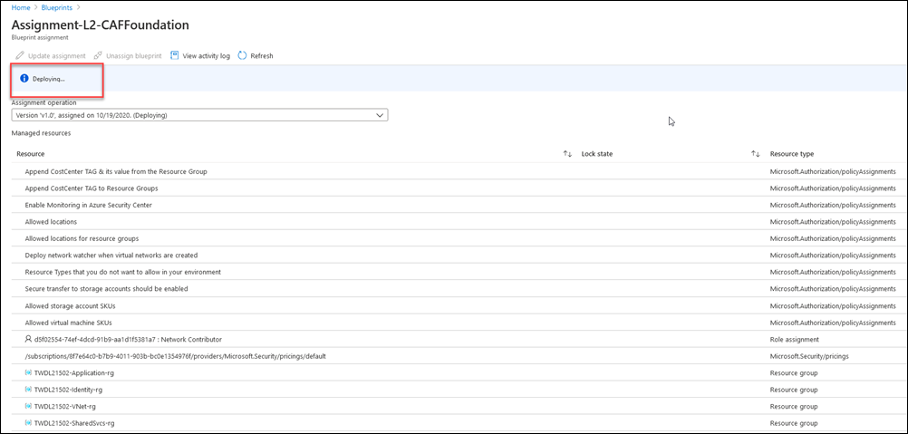 
       
#### Task 2: Enable Resource Consistency

1. Go to **Blueprints|Blueprint definitions** and select **L2CAFFoundationzone** that is the blueprint definition created in task 1 and Click on **Edit blueprint**.
   
   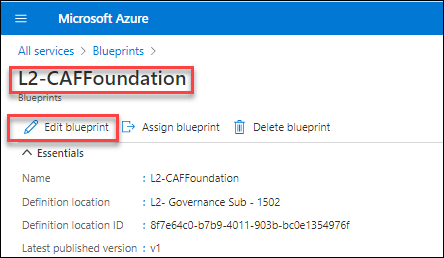
    
2. On the **Edit blueprint** click on **Next:Artifacts>>** and **explore the artifacts** included by default with the **CAF Foundation Zone** blueprint sample.
    
   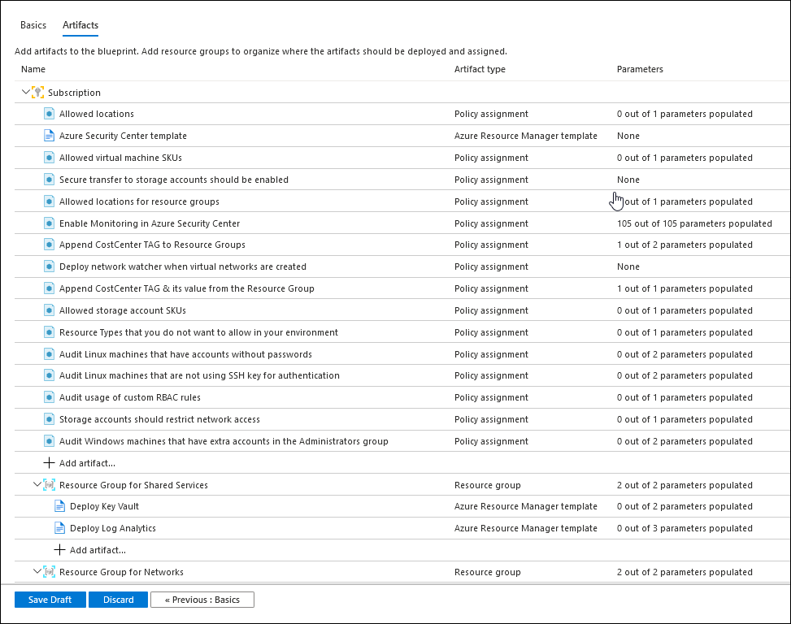
   
   **The blueprint is composed of following artifacts:**
   - An **Azure Key Vault** instance used to host secrets used for the VMs deployed in the shared services environment
   - **Log Analytics** is deployed to ensure all actions and services log to a central location from the moment you start your secure deployment in to Storage Accounts for diagnostic logging
   - **Azure Security Center** (standard version) provides threat protection for your migrated workloads

   **The blueprint also defines and deploys the following Azure Policy definitions:**

   - Append CostCenter TAG & its value from the Resource Group
   
   - Append CostCenter TAG to Resource Groups
   
   - Enable Monitoring in Azure Security Center
   
   - Allowed locations

   - Allowed locations for resource groups

   - Deploy network watcher when virtual networks are created

   - Resource Types that you do not want to allow in your environment

   - Secure transfer to storage accounts should be enabled

   - Allowed storage account SKUs

   - Allowed virtual machine SKUs
   
3. You can see the policy definition **Resource Types that you do not want to allow in your environment** is used to restrict unwanted resource types which will help in optimizing the cost.
  >Note: You will be selecting the resource types which you want to deny while assigning the blueprint i.e., in the next task.

4. And also to prevent any accidental deletion of resources we will be enforcing the **resource level locks**.
  >Note: You will be selecting the lock types that you want to apply while assigning the blueprint i.e., in the next task.

#### Task 3: Security

In this task you will be updating the blueprint by assigning the policy definitions inorder to increase the security levels.

1. On the **Edit blueprint page** of **L2CAFFoundationzone**,Click on **+Add Artifact** and select the **Policy definition** as the artifact type.
   
   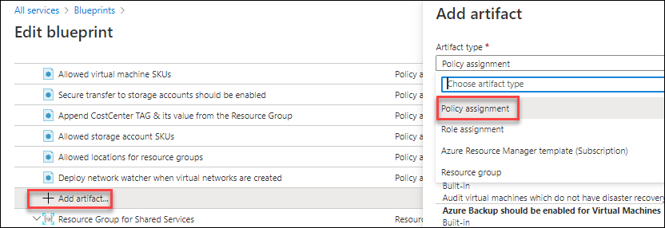 

2. **Search and add** all the following policy definitions to blueprint:

  - Storage accounts should restrict network access == Audit unrestricted network access to storage accounts
  - Audit usage of Custom RBAC rules
  - Audit Linux machines that have accounts without passwords
  - Audit Linux machines that are not using SSH key for authentication
  - Audit Windows machines that have extra accounts in the Administrators group
 
  >**Note**: These policy definitions are available along with the blueprint sample
 
   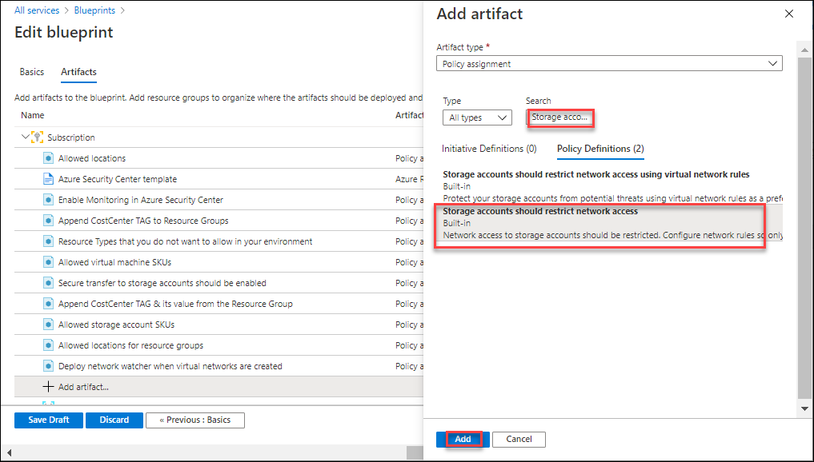 
  
3. Click on **Save Draft** to save the blueprint configurations as draft.

4. And then to save the changes made ,click on the blueprint definition and publish the blueprint as **v2.0** and Click on **Publish**

5. Once the edited copy of the blueprint sample has been successfully Published, the blueprint assignment can be updated to latest version of blueprint that is **v2.0** 
 
6. Under **Blueprints->Assigned blueprints**, Select the succeeded assignment **Assignment-L2-CAFFoundation** and click on **Update assignment** at the top of the blueprint definition page to update the latest version of blueprint.

    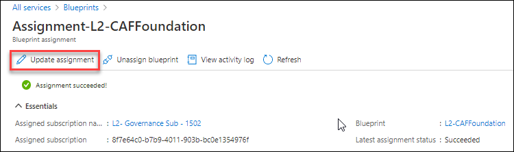 

7. Provide the parameter values for the to update the blueprint assignment:
 
   - **Blueprint definition version**: Pick a Published version of your  edited copy of the blueprint sample i.e., **v2.0**
       
   - **Lock Assignment:** Select **DonotDelete** option to enforce locks at resource level.
      
     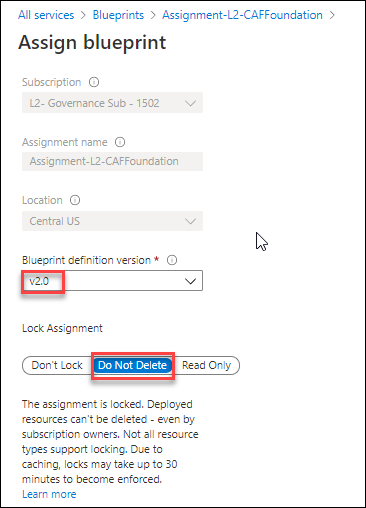
      
   - **Under Artifact parameters**
     >The parameters defined in this section apply to the artifact under which it's defined. These parameters are dynamic parameters since they're defined during the assignment of the blueprint. 
       
    - Resource Types that you do not want to allow in your environment: Select all resources **Microsoft.Network** 
        
      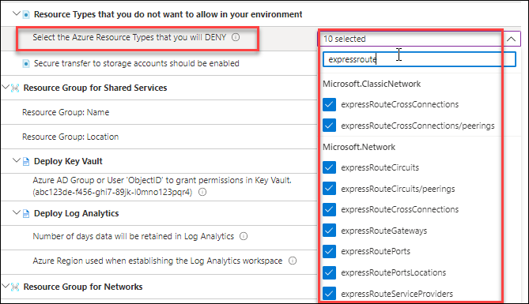
        
    - Leave all the options to default prepopulated values

7. Once all parameters have been entered, select **Assign** at the bottom of the page. The blueprint assignment is created and artifact deployment begins. Deployment takes around five minutes. To check on the status of deployment, open the blueprint assignment.

#### Task 4: Cost management

 In this task you will learn how to use **tags** to manage costs. **Tags** are a effective way to track costs by organizing the resources that span across multiple teams and Azure scopes. After you plan for resource tagging, you can configure an Azure policy to enforce tagging on resources.When tags are applied properly, you can apply them as a filter in **cost analysis** which helps in better understanding of cost and usage patterns.

#### Subtask1: Explore the policies applied to manage the cost.
 
1. **Append CostCenter TAG to Resource Groups**
    
   The policy **Append CostCenter TAG to Resource Groups** appends the specified tag **CostCenter** and its value to **resource groups** if any **resource group** is missing this tag when created or updated. 
 
2. **Append CostCenter TAG & its value from the Resource Group**
   
   The policy **Append CostCenter TAG & its value from the Resource Group** appends the specified tag **CostCenter** and its value to the **resources from the resource groups** if resources are missing this tag when created or updated.
   
  >Note: Both the policy definitions **Append CostCenter TAG to Resource Groups** and **Append CostCenter TAG to Resource Groups** are by default included with the blueprint sample **CAFFoundation**
   
 
 2.	Verify the tags in the deployed resources
 
 3.	Verify the details from Cost Management [ Read Only]

