# Exercise 3: Enterprise Scale

## Context

The Enterprise-Scale architecture is modular by design and allows organizations to start with foundational landing zones that support their application portfolios, regardless of whether the applications are being migrated or are newly developed and deployed to Azure. The architecture enables organizations to start as small as needed and scale alongside their business requirements regardless of scale point.
The Wing Tip company wants to start with Landing Zones for their workload in Azure, where hybrid connectivity to their on-premise data center is not required from the start. 

### Reference architecture

This reference implementation is ideal for customers who want to start with Landing Zones for their workload in Azure, where hybrid connectivity to their on-premise data center is not required from the start. You can build a flexible structure of management groups and subscriptions to organize your resources into a hierarchy for unified policy and access management. The following diagram shows an example of creating a hierarchy for governance using management groups.

 

If your organization has many subscriptions, you may need a way to efficiently manage access, policies, and compliance for those subscriptions. Azure management groups provide a level of scope above subscriptions. You organize subscriptions into containers called **management groups** and apply your governance conditions to the management groups. All subscriptions within a management group automatically inherit the conditions applied to the management group. Management groups give you enterprise-grade management at a large scale no matter what type of subscriptions you might have. All subscriptions within a single management group must trust the same Azure Active Directory tenant.

In this exercise, you will learn about Management groups and how to manage the organization with policies.

>You will see **DeploymentID** value on the Lab Environment tab, please use it wherever you see DeploymentID in lab steps. This is a unique number associated with each lab deployment.

>**Note:** You will use the subscriptions L3 - ES Landing Zone Sub -Suffix and L3- ES Management Sub - Suffix for this exercise.

#### Task 1: Deploy the Management Group structure using ARM template and Policy Set definitions

In this task, you are deploying the foundational Management Group structure as well as the policy and PolicySet definitions. To deploy this we will use the Contoso reference implementation ARM template.

1. Click on the **Deploy to Azure** button.

   
   
  >If a new window is opened outside the virtual machine, select the button **Deploy to Azure** right click and copy the link then open the copied link in the browser of the virtual machine to deploy the ARM Template. This link will deep link into the Azure Portal, passing in the ARM Template for deploying the resources.

2. On the **Custom deployment** blade, in the Basics section, choose the **Region** as `CentralUS` and click on **Next: Enterprise Scale Company Prefix.**

    

3. On the **Enterprise-Scale Company Prefix** section, provide a company prefix (for this lab, we will use **WT** as the prefix) Please click **Next: Platform management, security, and governance** to move to the next section.

    
   
4. On the **Platform management, security, and governance** section select the management subscription **L3- ES Management Sub - Suffix** and policies need to be configured.     

   Leave the other options set to default and Click on **Next: Next: Landing zone configuration** to move to the next section.
    
    

5. In the **Landing zone configuration** section, your tenant will be enabled to host workload Landing Zones. Configure the section as illustrated in the following screenshot this will deploy the chosen policy assignment at the Landing Zone scope, Select the Landing zone subscription that is **L3 - ES Landing Zone Sub -Suffix**

   And Click on **Next: Review + create** to move to the next section.
   
   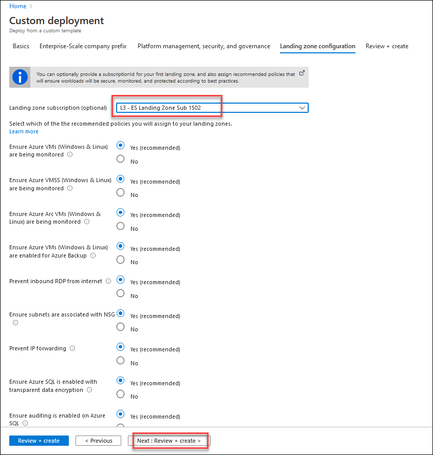 
  
6. After the template has passed the validation click **Create**. This will deploy the initial Management Group structure together with the required Policy/PolicySet definitions. It will also move the subscription under the right Management Group and will also deploy a Log Analytics Workspace and enable platform monitoring. This process will take around **10 minutes** to complete. 

    
   
7. To check the deployment status click on the **Notification** icon and Click on **Deployment in Progress**.

   

8. Once the deployment is completed successfully, in the Azure Portal type **Management Groups** into the search box and select the **Management Groups** under services. 

   
 
9. Click on the **WT** Management Group. 
   
     

10. You should see the following Management Groups in your environment:
    - WT-decommissioned
    - WT-landing zones
    - WT-platform
    - WT-sandboxes
    
    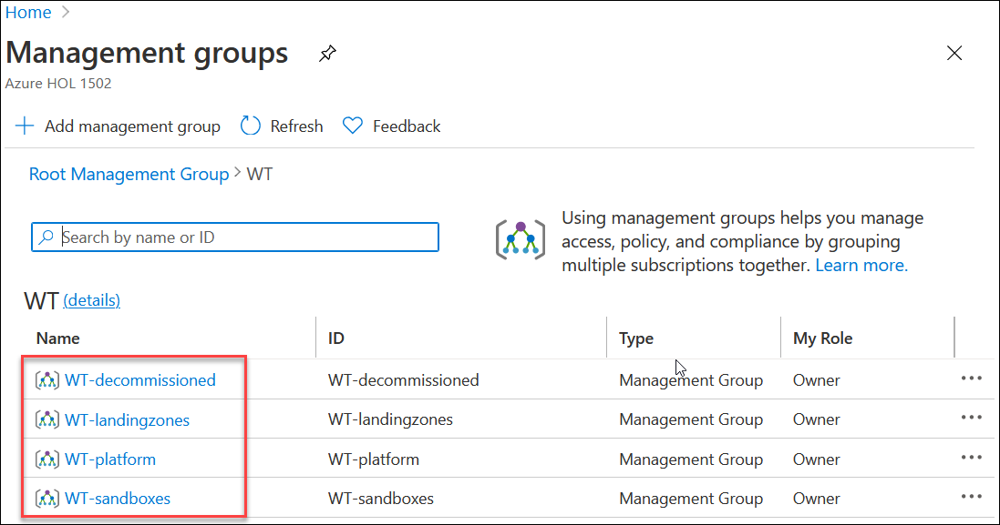 

11. In the **WT** Management Group click on **details**
   
    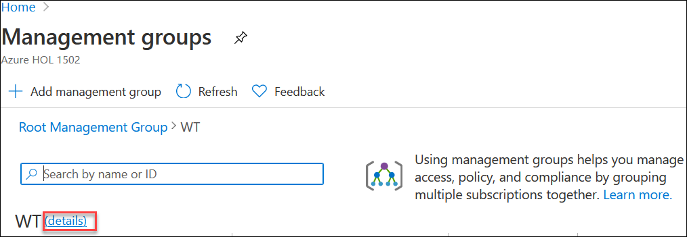 

12. Next, in the **WT** Management Group click on **Policies** 

    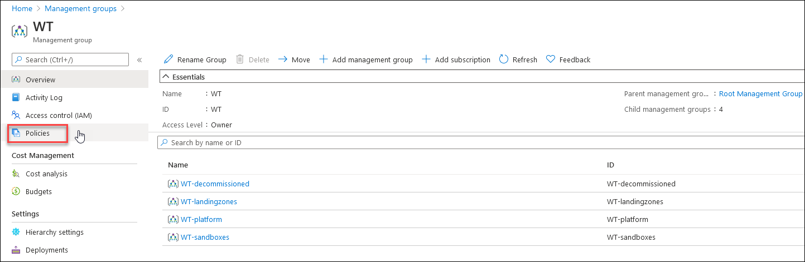 

13. In the **Policy | Definitions** blade, select the scope **WT** and under **Type** select **Custom**, you will see a list of Initiative and policy definitions as shown below which are assigned at the management group level.
   
     

14. In the upper left corner of the portal window, to open the Resource Groups menu, click the toggle menu icon and then click on **Resource groups**.
    
    
    
    This blade displays all of the resource groups that you have access to the Azure subscriptions.
    
15. On the **Resource Groups** blade, Select the subscription **L3- ES Management Sub - Suffix** and select the resource group **WT-mgmt**.
     
    

16. On the **WT-mgmt** page review the resources deployed by the ARM template
    
    
 
    >For more information about management groups check out this link https://docs.microsoft.com/en-us/azure/governance/management-groups/overview
 
#### Task 2: Deploy Resources into an Enterprise scale landing zone (ESLZ).

#### Create a Key Vault and review Diagnostic settings

After deploying the ESLZ reference implementation (Wingtip), and bringing in a subscription for the platform management, policies are already assigned to ensure resources will have diagnostics/monitoring enabled.

1. In the upper left corner of the portal window, to open the Resource Groups menu, click the toggle menu icon and then click on **Resource groups**.
    
    
    
2. In the Azure portal, type **key vault** at the search bar and select **Keyvaults** under services.
   
   
   
3. On the **Key vaults** page click on **+Add** .
    
   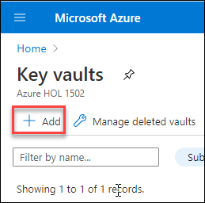

4. **Create a key vault** by providing the following details:
   - Select the subscription **L3- ES Management Sub-Suffix** 
   - Create a resource group named **kvmgmt**
   - Provide the keyvault name : **kvDeploymentID**
   - Region: `CentralUS`
   - Leave the default options for other details
   
    Click on **Review+Create** to create the key vault.
   
    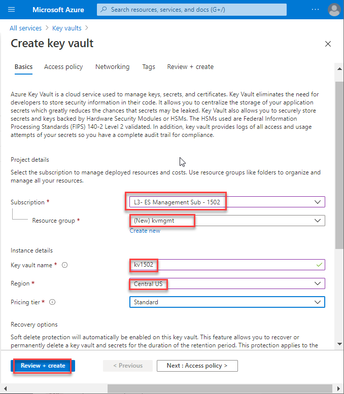

5. Once you have started the deployment, monitor the **Activity Log** to see the policy effect. You should see **deployIfNotExists** Policy action and examine the JSON payload
  
   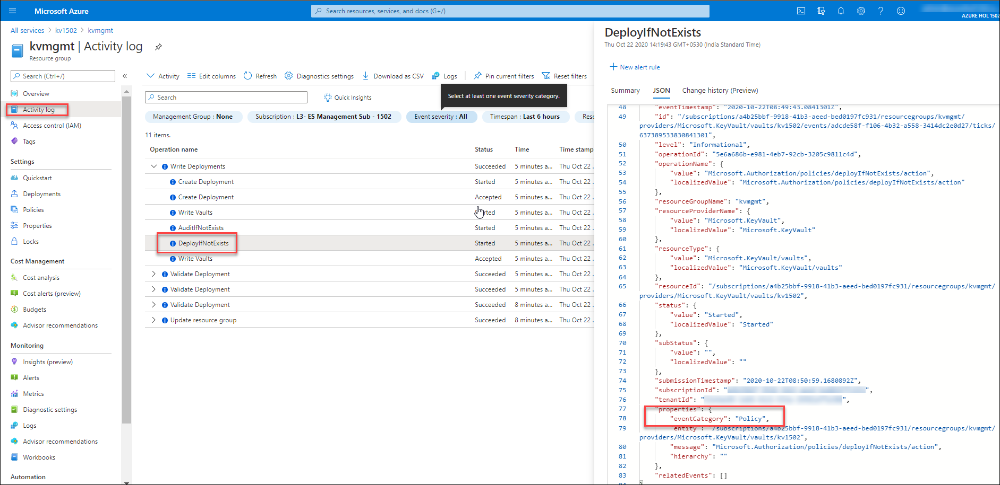
 
6. Post a successful deployment of the KeyVault, you should start to see (approx. 6-10 minutes) another deployment of the resource appearing in the resource group **kvmgmt** under **Deployments** section.
   
   
   
   >Note: **deployIfNotExists** policy effect evaluates to determine if the Log analytics workspace is enabled for the key vault. If not, then a deployment to enable is executed by enforcing the policy.
  
7. Navigate to the key vault you just created and review the **Diagnostics settings**, verify if it is connected to your **Log Analytics workspace**.

   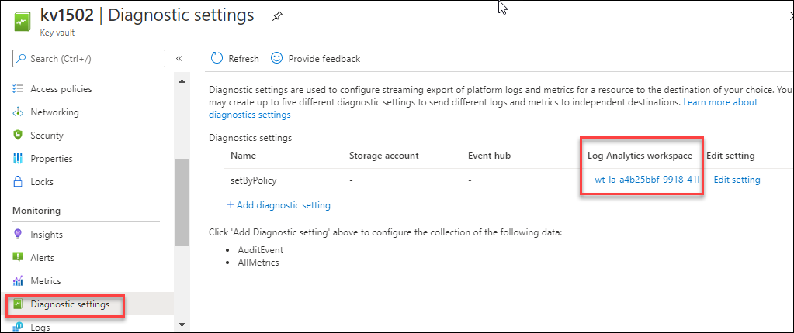
   
8. Now, on the key vault page click on **Insights** under **Monitoring** and explore the Azure Monitor Insights view

   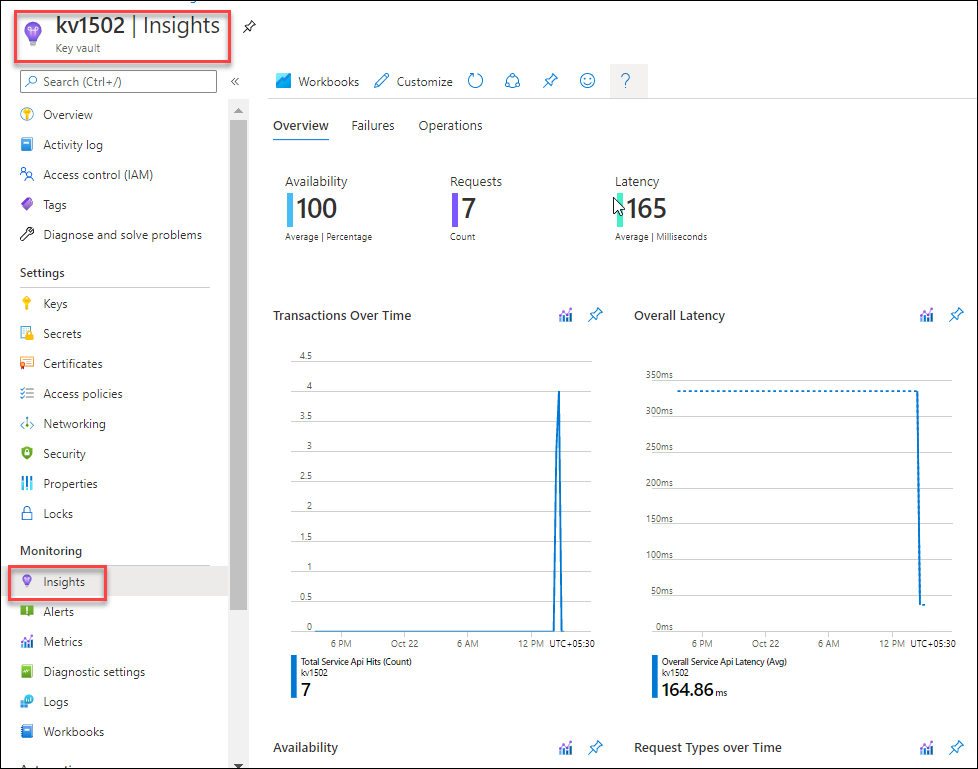
  
9. Navigate to Azure **Policy** and select the **management group** hosting the management subscription, and review the compliance state of the policies.

   Also, check the policies that are **non-compliant** in your environment, and why?
   
    

#### Review Policy to your Landing Zone

As you saw in the previous task, policies ensure that security and compliance are being met regardless of how resources are being created. In this task, you will assign a new policy to ensure Key Vaults in the landing zones will always have soft-deletion enabled.

1. Now, type **Policy** at the search bar and select **Policy** under services.

   
      
2. Under **Policy** blade select **Definitions** under the Authoring section and select the **WT-online** management group as scope.
    
    - Definition type: Choose **Policy** and click on policy **Append-KV-SoftDelete**
    
   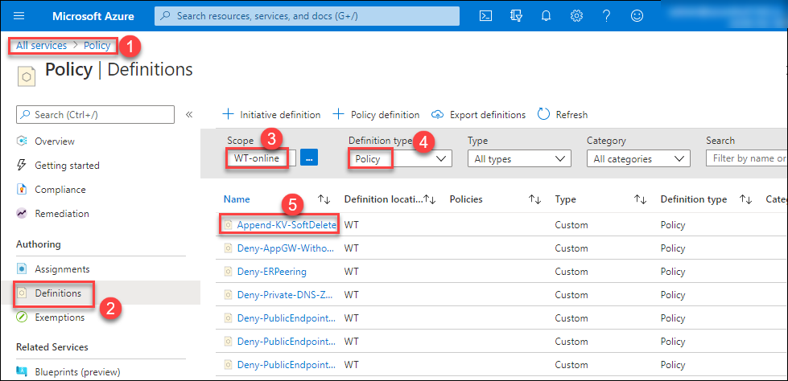
   
   >Note: When a Key Vault is created without soft delete enabled then this policy Append-KV-SoftDelete is enforced and will enable the soft deletion. 
   
3. Review the policy definition **Append-KV-SoftDelete** and check what the policy will do on KeyVault resources. Once reviewed, Click on **Assign** to assign the policy to a particular scope.
   
   
   
4. **Assign** the policy at the **WT-online** management group scope, and provide the assignment a description as **This policy will ensure all key vaults are being created with soft deletion enabled**.

  - Leave the other options default and Click on **Review+Create** for the assignment to be successfully applied.
   
    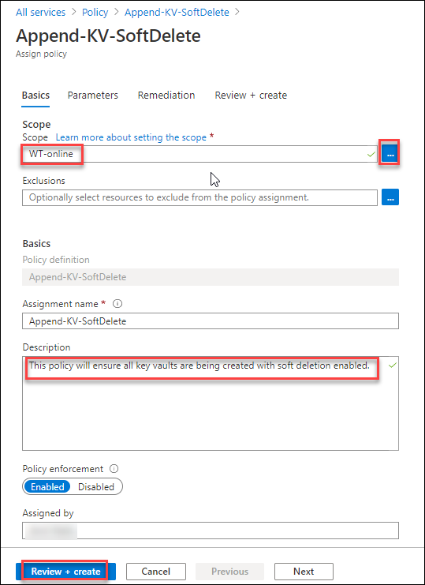
   
   >Assign the policy to enable soft deletion on key vault.
   
   In this exercise, you deployed the Management Group structure using ARM template and Policy Set definitions and learned about the Enterprise scale landing zone

   Click on **Next** to proceed with the next exercise.
