# Exercise 3: Enhance your landing zone

### What is AzOps?

AzOps is an opinionated CI/CD pipeline to operationalize the Azure *platform* and *landing zones* that enables organizations to focus on the ARM template development, and not having to deal with multiple deployment scripts targeting different Azure scopes. The organization and folder structure in Git is dynamically representing the Azure graph (management groups (parent, child relationships), and subscription organization), so the platform operators can easily determine at which *scope* they want to invoke the ARM template deployment by simply making a PR with the ARM template(s) and parameter files (optionally), and AzOps will invoke the deployment accordingly.

Also, when there’s a new *scope* (management groups, subscriptions, and resource groups) being created, either explicitly via the pipeline – and also out of band (via Portal, CLI, PS etc.), AzOps will discover these and represent them correctly back into Git.


This exercise includes the following tasks:

- [Task 1: Create a new Policy Assignment to enhance governance on your Azure landing zone](#task-1-create-a-new-policy-assignment-to-enhance-governance-on-your-Azure-landing-zone)
- [Task 2: Update a Policy Assignment to enforce](#task-2-update-a-policy-assignment-to-enforce)
- [Task 3: Create a new Role Assignment on a landing zone](#task-3-create-a-new-role-assignment-on-a-landing-zone)


### Operating the Azure platform using AzOps (Infrastructure as Code with GitHub Actions)

When you have deployed Azure landing zone accelerator with GitHub integration, you will have a ready-to-go repository with integrated GitHub Actions containing all the ARM templates that were used during deployment, organized in the following way:

*    Management group tree structure represented as folders in Git

*    Subscriptions represented as folders in their respective management group folder in Git

*    Resource Groups represented as folders in their respective subscription folder in Git

*    Policy Definitions, Policy Set Definitions, Role Definitions, and Role Assignments as composite ARM resource templates partitioned at the folder representing the respective scope in Azure (management group, subscription)

*    Resources (e.g., virtual networks, Log Analytics workspace, Automation account etc.) represented as composite ARM resource templates into their respective resource group (folder)

You can edit/update the existing ARM templates in your repository and GitHub actions will push (deploy) to the respective Azure scope. You can also author and bring your own ARM templates and deploy them to the respective Azure scope.

The following section will demonstrate how one can operationalize the Azure landing zone accelerator platform using ARM templates, via the GitHub repository that got created using AzOps (GitHub Actions).

### Task 1: Create a new Policy Assignment to enhance governance on your Azure landing zone

Azure landing zone accelerator with its Policy-Driven Governance principle relies heavily on Azure Policy to determine the goal state of the overall platform. As an example, this exercise will demonstrate how a developer can make a new policy assignment at the “Online” landing zone management group scope.

1. In GitHub, navigate to your repository and then under the **<> Code (1)** section click on the **‘root/eslz (eslz)’ (2)** folder. 
     
   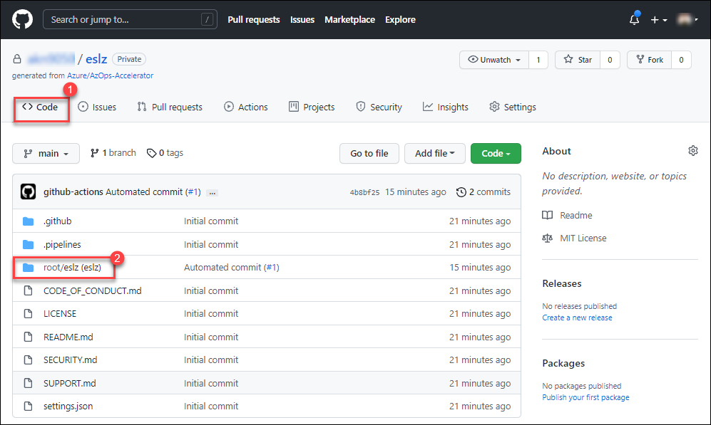
   
2. From here, navigate to the following path `root/eslz (eslz)/eslz-landingzones (eslz-landingzones)/eslz-online (eslz-online)/` as shown below. Next, click on **Add file (1)** and then **Create new file (2)**. 

   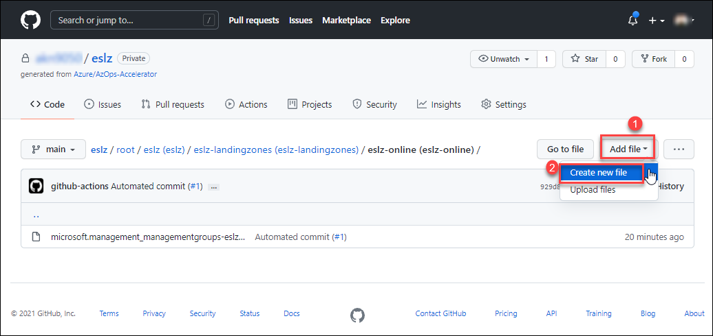
   
3. Name the file **"locationAssignment.json" (1)**, Copy and paste the following ARM template json in **Edit file (2)** pane. 
     * Select **Create a new branch for this commit and start a pull request (3)**
     * Branch Name: `location assignment` **(4)**
     * Now, click on **Propose new file (5)**

``` json
{
    "$schema": "https://schema.management.azure.com/schemas/2019-08-01/managementGroupDeploymentTemplate.json#",
    "contentVersion": "1.0.0.0",
    "parameters": {
        "policyAssignmentEnforcementMode": {
            "type": "string",
            "allowedValues": [
                "Default",
                "DoNotEnforce"
            ],
            "defaultValue": "DoNotEnforce",
            "metadata": {
                "description": "Input will determine if the policyAssignment should be enforced or not."
            }
        },
        "policyDefinitionId": {
            "type": "string",
            "defaultValue": "/providers/Microsoft.Authorization/policyDefinitions/e56962a6-4747-49cd-b67b-bf8b01975c4c",
            "metadata": {
                "description": "Provide the policyDefinition resourceId"
            }
        },
        "policyAssignmentName": {
            "type": "string",
            "defaultValue": "AllowedLocations"
        },
        "policyDescription": {
            "type": "string",
            "defaultValue": "Policy to ringfence Azure regions."
        },
        "listOfAllowedLocations": {
            "type": "array",
            "defaultValue": [
                "westeurope",
                "northeurope"
            ]
        }
    },
    "variables": {},
    "resources": [
        {
            "type": "Microsoft.Authorization/policyAssignments",
            "apiVersion": "2019-09-01",
            "name": "[parameters('policyAssignmentName')]",
            "identity": {
                "type": "SystemAssigned"
            },
            "location": "[deployment().location]",
            "properties": {
                "description": "[parameters('policyDescription')]",
                "displayName": "[parameters('policyDescription')]",
                "policyDefinitionId": "[parameters('policyDefinitionId')]",
                "enforcementMode": "[parameters('policyAssignmentEnforcementMode')]",
                "parameters": {
                    "listOfAllowedLocations": {
                        "value": "[parameters('listOfAllowedLocations')]"
                    }
                }
            }
        }
    ]
}
```

   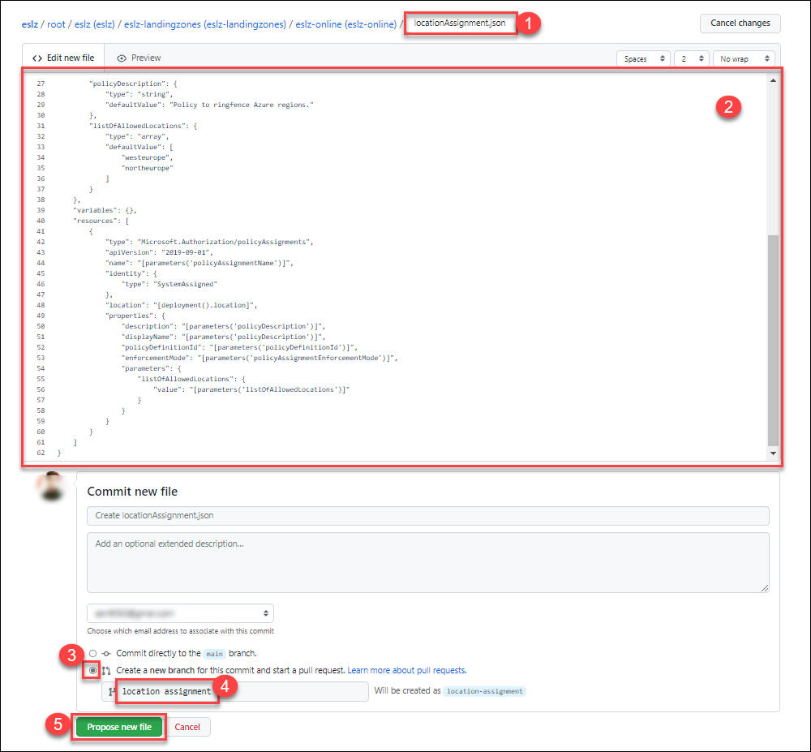
   
4. Now, click on **Create pull request (1)**. Now, a new Pull Request will be created and will trigger the Validate workflow. Go to **Actions (2)** to monitor the process.

   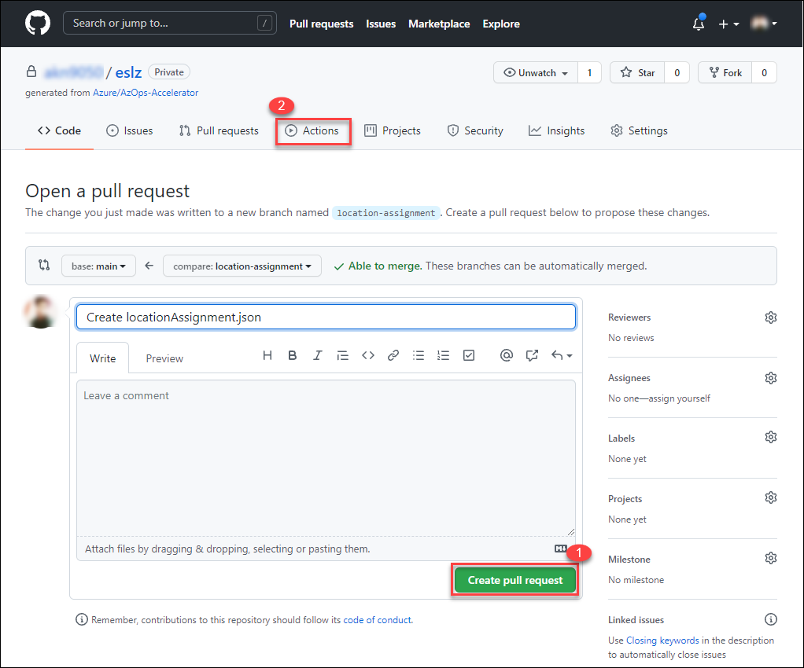
   
5. Under the **Actions** tab you will be able to monitor the workflow runs. You will see **Create locationAssignment.json** either on running or completed state.

   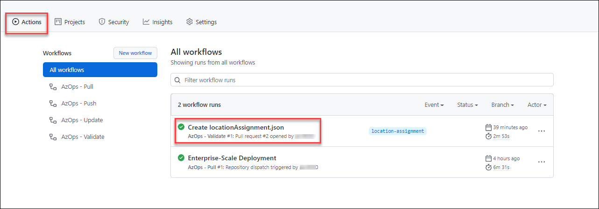

6. Once completed, switch back to **Pull requests** tab and then open the pull request which you have raised. The pull request will show **WhatIf results** as a comment.

   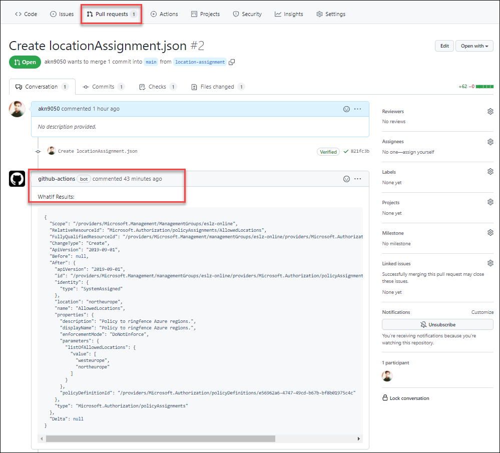

7. You should review the comment and then approve the pull request by clicking **Squash and merge** and **Confirm squash and merge** to finalize your action. You will be able to delete the branch once the merge is completed.

   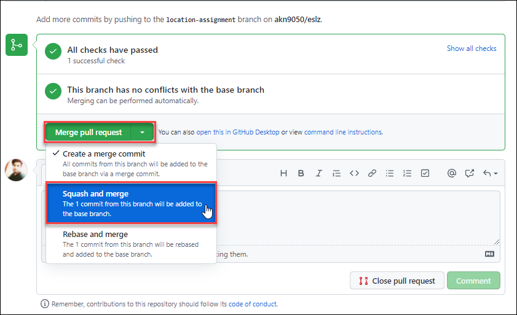

8. This will then kick off the "AzOps - Push" workflow, which can be monitored under the **Actions (1)** tab. You can monitor the progress more closely by clicking on **Create locationAssignment.json (#2) AzOps - Push #1: commit (2).

   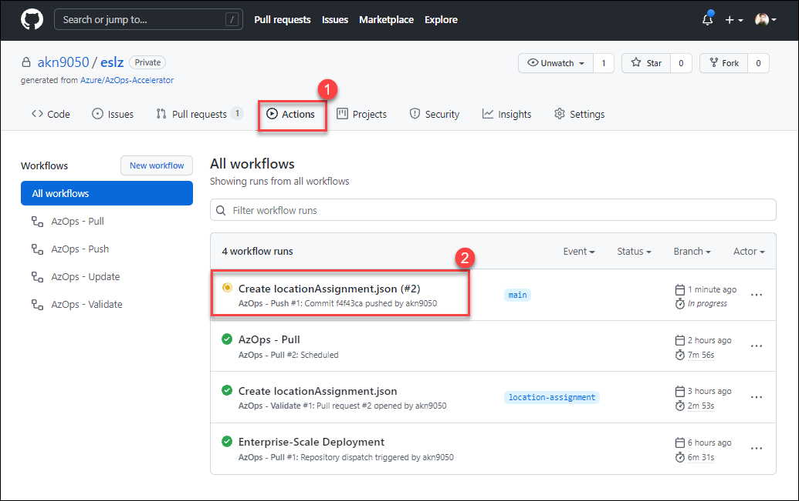
   
9. Once the push is completed, you will see **Status: Success** and a check mark for the **Push** request.

   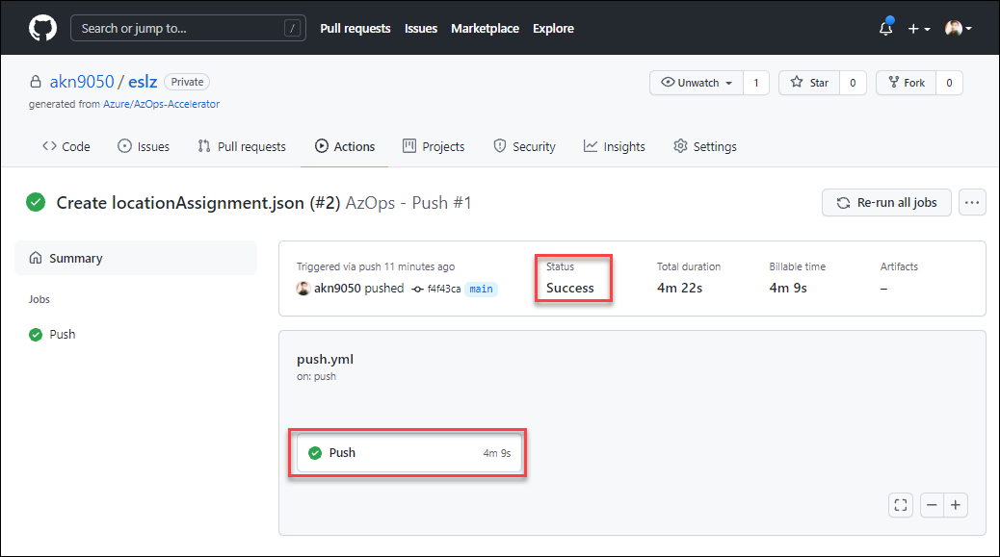

10. Now, go to the Azure portal, where you have logged in already, in the search box type `Management groups` **(1)** and then click on **Management groups (2)** under services. 

    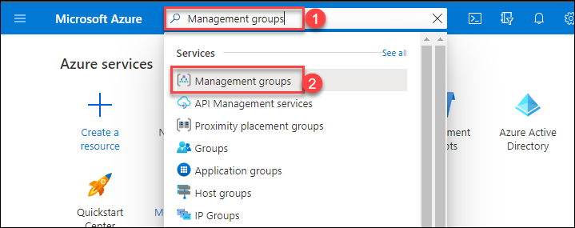
   
11. Now, on the management groups tab, expand the hierarchy **eslz (1)**, **eslz-landingzones (2)** and then click on **eslz-online (3)** management group as shown below.

    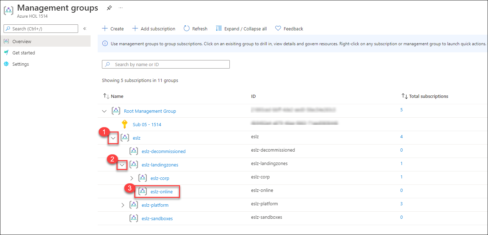
   
12. Under **eslz-online (1)** management group, click on **Deployments (2)** and then you will see **AzOps-locationAssignment (3)** in **Succeeded** state.

    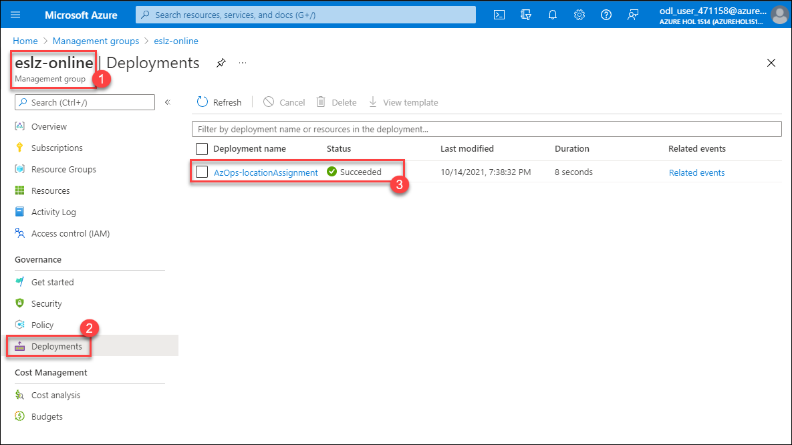
   
13. On the **eslz-online** management group, navigate to the **Policy (1)** from the left panel under **Governance** and click on **Assignments (2)** under **Authoring**. Next, on the top right search bar type `Policy to ringfence Azure regions` **(3)** and verify that there’s a new assignment called **Policy to ring-fence Azure regions (4)**. Click on that.

    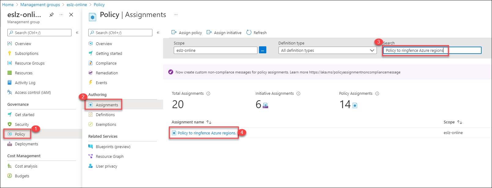
    
14. Click on **Edit assignment**.

    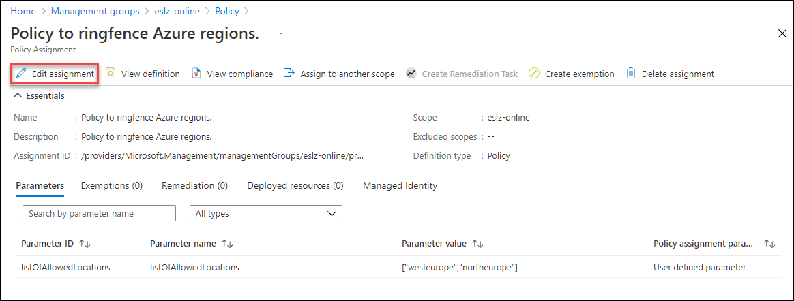
    
15. Verify that the Policy is not being enforced but will only scan for compliance and validate resources per the policy rule defined in the policy definition.

    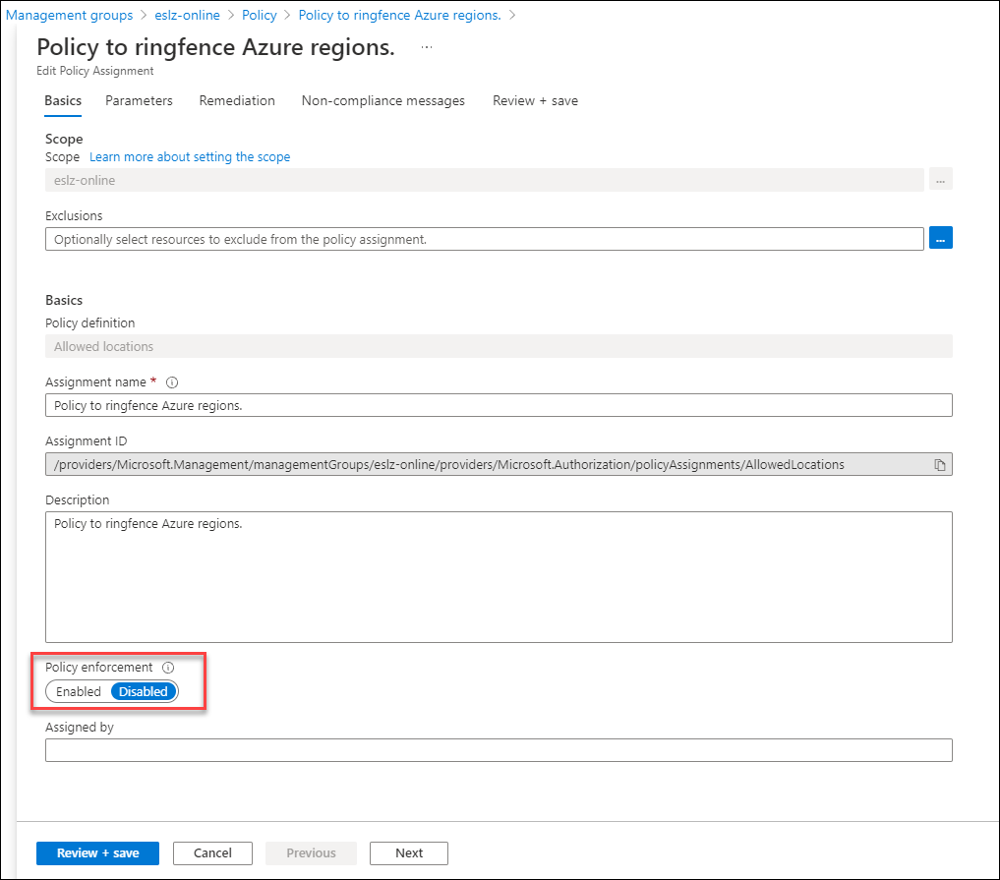

Once the policy compliance scan has been completed, you will get a compliance result for the policy you assigned. This is to make sure the effect is working as intended, before moving on to the next step to update the enforcement mode. I.e., this policy will prevent resources being created outside of the allowed locations specified.

### Task 2: Update a Policy Assignment to enforce

In this task, we will modify the existing policy assignment to ensure that the policy effect is enforced.

1. Go back to the page where you have logged in your **GitHub account**. Next, under **<> Code (1)**, navigate to the following path **root/eslz (eslz)/eslz-landingzones (eslz-landingzones)/eslz-online (eslz-online)/ (2)**, and click on **locationAssignment.json (3)**.

   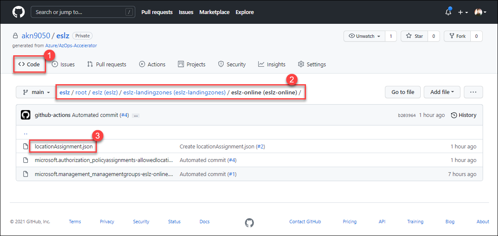
   
2. Now, click on the pencil icon 🖋  to edit the file as highlighted below.

   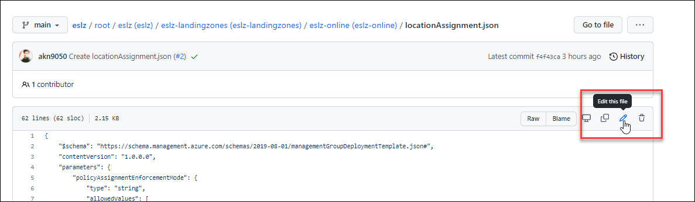
   
3. Change the "defaultValue" of the “policyAssignmentEnforcementMode” parameter to `Default`.

   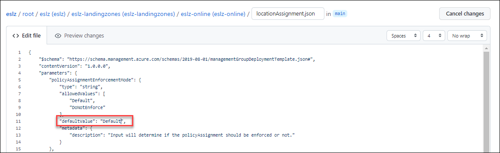

4. On the ‘Commit changes’ dialogue box, select **Create a new branch for this commit and start a pull request (1)**, and provide the branch name as `Update Policy Assignment` **(2)**. Click **Propose changes (3)** to finalize your action.

   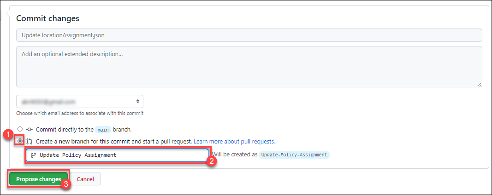
   
5. Click on **Create pull request**.

   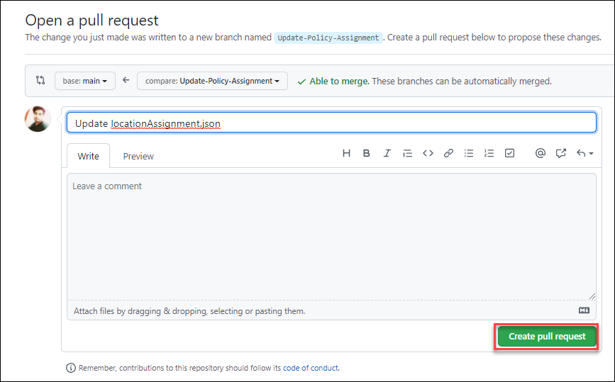
   
6. This will now start the same process as above by validating and showing a *WhatIf* output as a comment on the pull request. Once reviewed, approved, and merged the AzOps push workflow will trigger and deploy the template with the updated property, so that the policy effect will be enforced (in this case, deny resource creation outside of the ringfenced Azure regions). Follow the same steps of **Task 1, Steps 7-15** and revisit the policy in the Azure portal and verify that the policy enforcement is set to ‘Enabled’.

   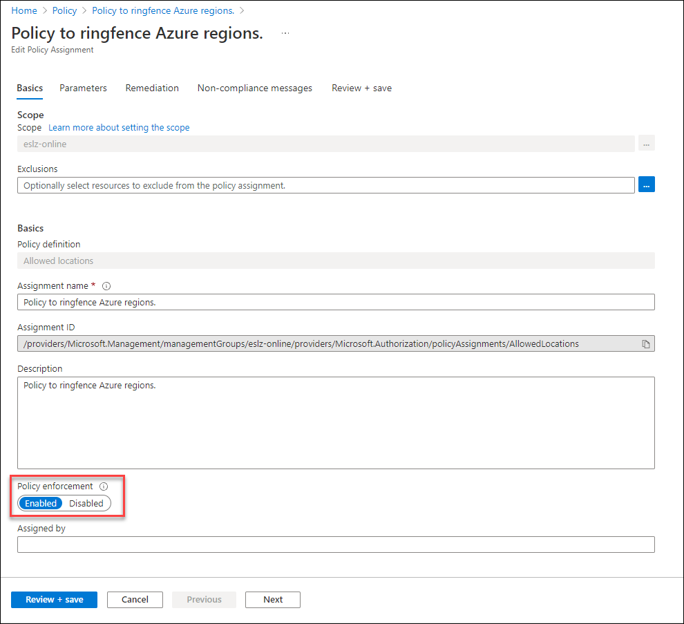

### Task 3: Create a new Role Assignment on a landing zone

To grant a user, a group, or a service principal access to a landing zone (subscription), you can use the following ARM template where you provide the principalId (object id of the user, group, or service principal) as input to the parameter, and place the template into the subscription folder into your landing zone management group(s).

1. In GitHub repo, navigate to the following path `eslz/root/eslz (eslz)/eslz-landingzones (eslz-landingzones)/eslz-corp (eslz-corp)/l3 - es landing zone sub - xxxx (xxxx-xxxx-xxxx-xxxx-xxxx/  (1)`. Click on **Add file (2)** and **Create new file**. 
> **Note:** Here the value of the xxxx's will be rondom in your lab environment and is based on subscription id and name.

   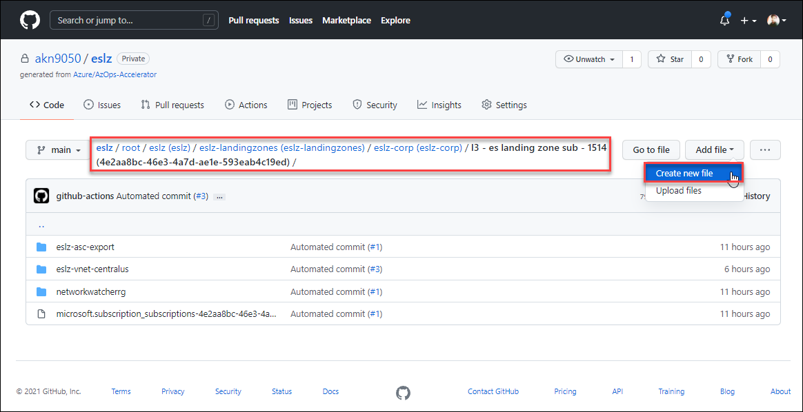
   
2. Name the file **roleAssignment.json" (1)** and copy/paste the following ARM template .json in **Edit file (2)** section.
   - Replace, <inject key="Objectid" style="color:IndianRed"/> in template (3).
   - Select **Create a new branch for this commit and start a pull request (4)**
   - Branch Name: **role-assignment (5)**
   - Finally, click on **Propose new file (6)**

```
{
    "$schema": "https://schema.management.azure.com/schemas/2018-05-01/subscriptionDeploymentTemplate.json#",
    "contentVersion": "1.0.0.0",
    "parameters": {
        "principalId": {
            "type": "string",
            "defaultValue": "<Provide-Principal-Id>",
            "metadata": {
                "description": "Provide the objectId of the principal (user, group, SPN, managed identity etc.) that will be granted RBAC at scope."
            }
        },
        "roleDefinitionId": {
            "type": "string",
            "defaultValue": "b24988ac-6180-42a0-ab88-20f7382dd24c",
            "metadata": {
                "description": "Provide the id of the built-in roleDefinition. Default is 'Contributor'."
            }
        }
    },
    "resources": [
        {
            "type": "Microsoft.Authorization/roleAssignments",
            "apiVersion": "2017-09-01",
            "name": "[guid(parameters('principalId'))]",
            "properties": {
                "principalId": "[parameters('principalId')]",
                "roleDefinitionId": "[concat('/providers/Microsoft.Authorization/roleDefinitions/', parameters('roleDefinitionId'))]"
            }
        }
    ]
} 
```
     
   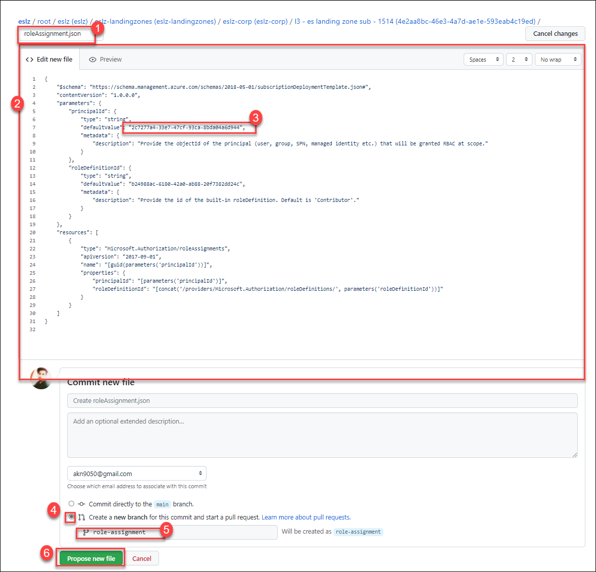
     
2. Now, click **Create pull request**.
     
   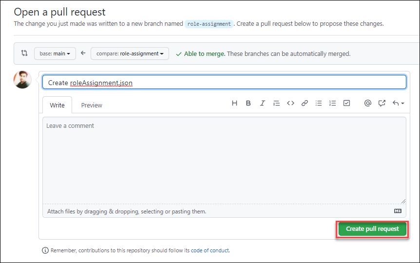
     
3. Under the **Actions (1)** tab, monitor the **Create roleAssignment.json (2)** validate to run, it will 3-5 minutes to complete.
     
   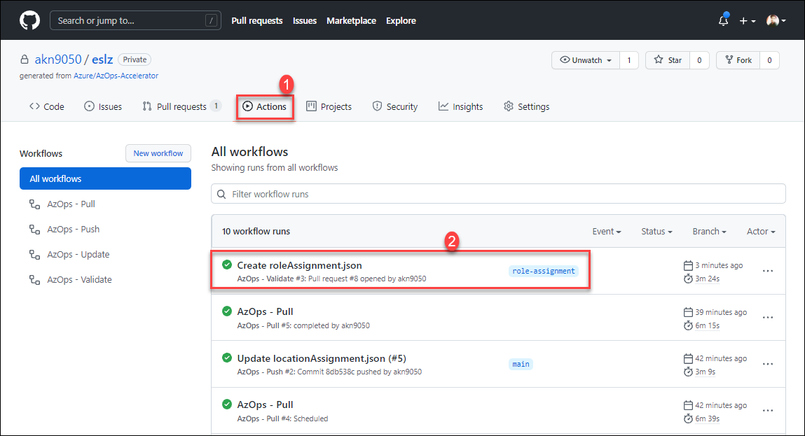   
     
4. Once completed, switch back to the **Pull requests** tab and open the pull request which you have just raised. The pull request will show the **WhatIf results** as a comment. Click on **Squash and merge** to merge the pull request.
     
   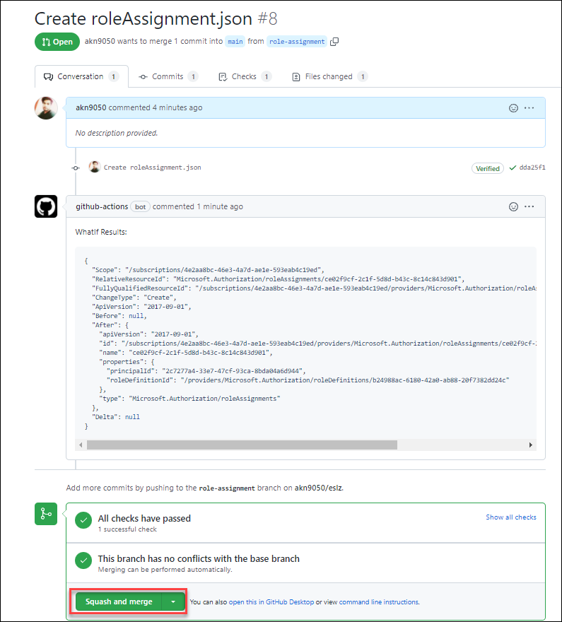  
     
5. Now, click on **Confirm squash and merge** to finalize your actions. You can also delete the branch once the merge has completed. It will trigger the **push** workflow under the **Actions** tab.
     
    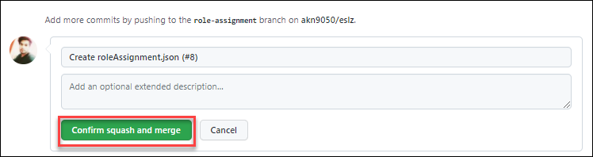    
     
6. This will then kicko ff the "AzOps - Push" workflow, which can be monitored underthe Actions (1) tab. It will take approximately 10 minute to complete. Verify if **Create roleAssignment.json (2)** is completed.
     
    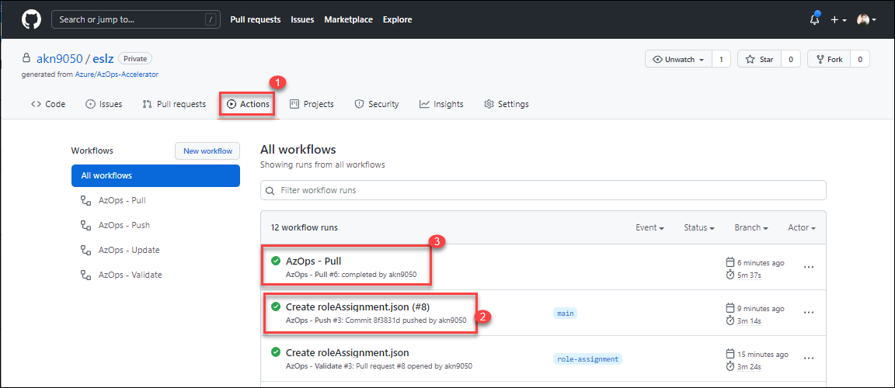
     
7. Now, go to the Azure portal, where you have logged in already, in the search box type **Management groups (1)** and then click on **Management groups (2)** under Services.
     
    
     
8. Now, on the management groups tab, expand the following herarchy: **eslz (1) > eslz-landingzones (2) > eslz-corp (3)** and then click on **L3 - ES Landing Zone Sub - Suffix (4)** subscription.
     
   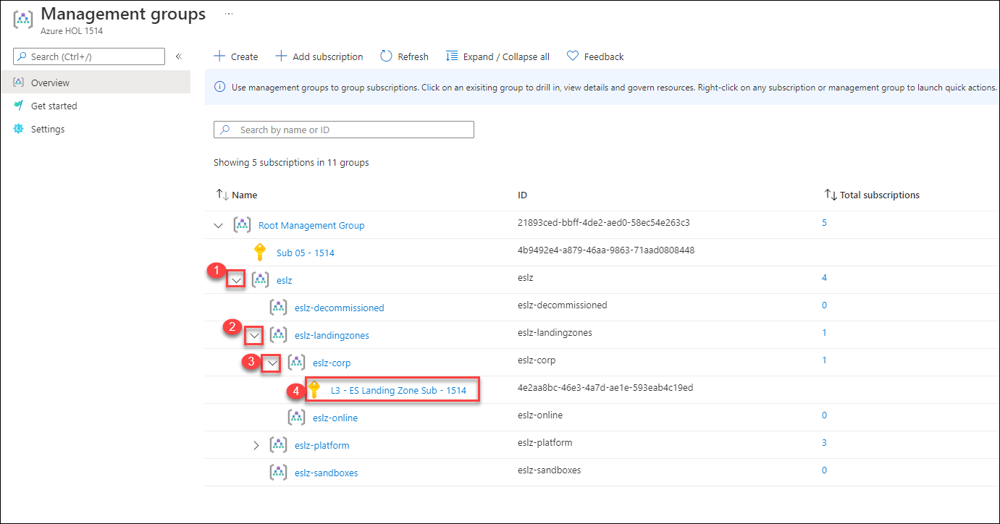   
     
9. Click on **Access control (IAM (1)** on the subscription **L3 - ES Landing Zone Sub - *Suffix* (4)**. Next, click on **Role assignments (2)** and verify if **Contributor (3)** role is assigned on the subscription for <inject key="AzureAdUserEmail" />
     
   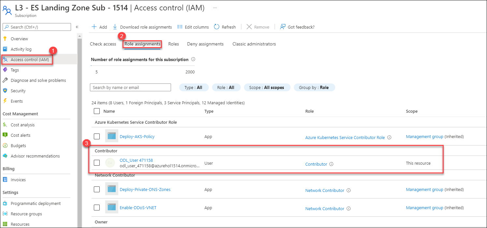
   
