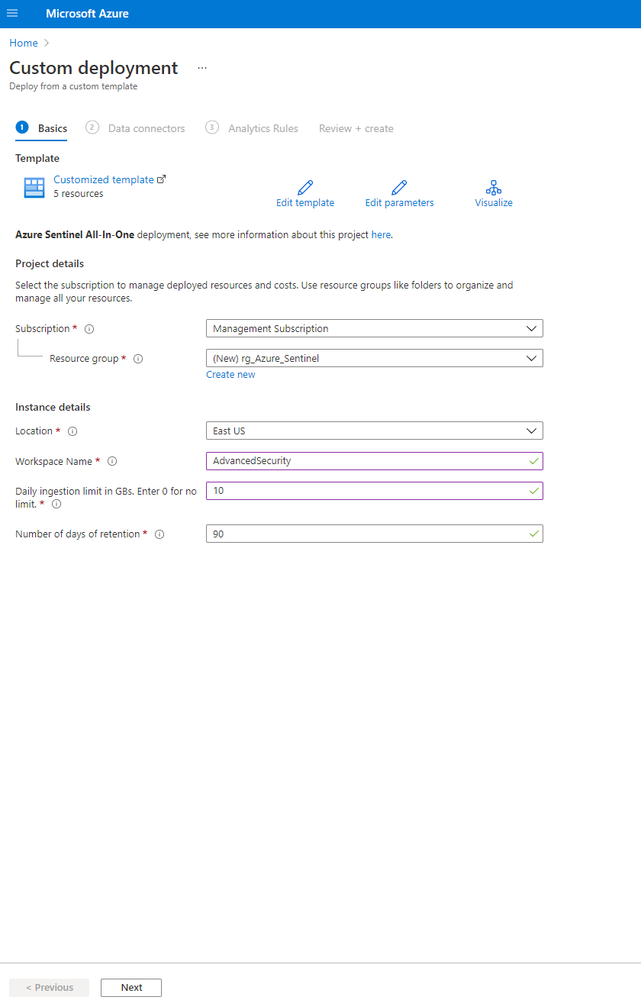
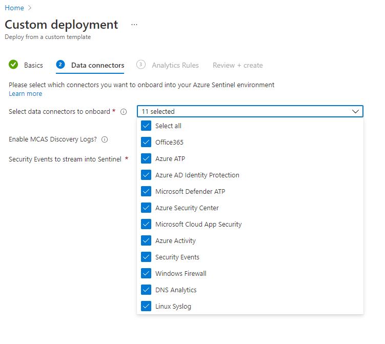
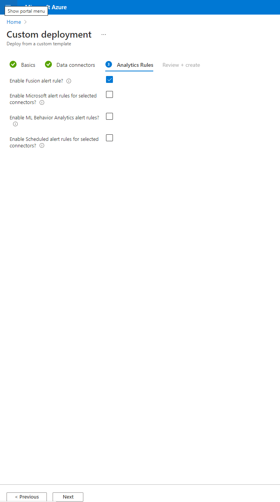
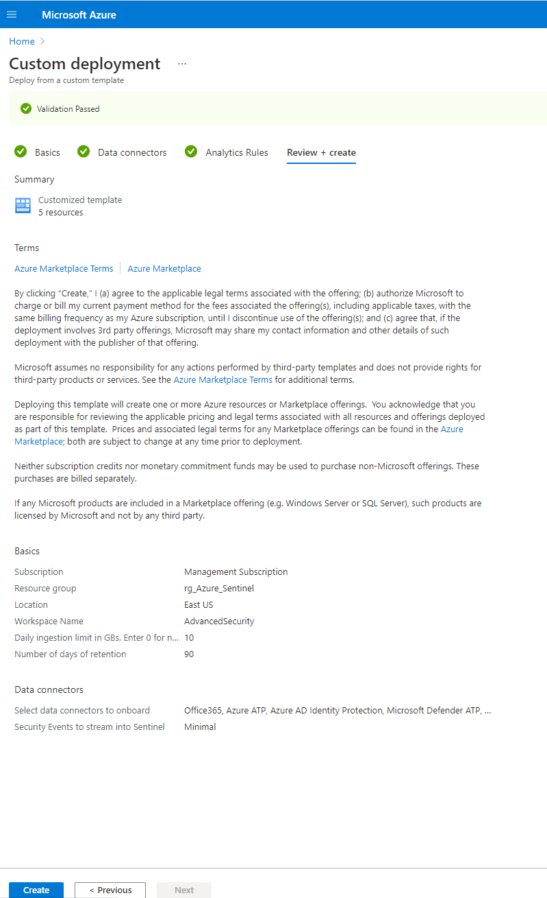

# Exercise 3: Manage and update your infrastructure

### What is AzOps?

AzOps is an opinionated CI/CD pipeline to operationalize the Azure *platform* and *landing zones* that enables organizations to focus on the ARM template development, and not having to deal with multiple deployment scripts targeting different Azure scopes. The organization and folder structure in Git is dynamically representing the Azure graph (management groups (parent, child relationships), and subscription organization), so the platform operators can easily determine at which *scope* they want to invoke the ARM template deployment by simply making a PR with the ARM template(s) and parameter files (optionally), and AzOps will invoke the deployment accordingly.

Also, when there’s a new *scope* (management groups, subscriptions, and resource groups) being created, either explicitly via the pipeline – and also out of band (via Portal, CLI, PS etc.), AzOps will discover these and represent them correctly back into Git.

>You will be using the subscription **Sub 05 - Suffix** and the resource group **CAF** for this exercise.

This exercise includes the following tasks:

- [Task 1: Enhance your governance posture](#task-1-enhance-your-governance-posture)
- [Task 2: Enhance your security posture](#task-2-enhance-your-security-posture)


### Operating the Azure platform using AzOps (Infrastructure as Code with GitHub Actions)

When you have deployed Enterprise-Scale with GitHub integration, you will have a ready-to-go repository with integrated GitHub Actions containing all the ARM templates that were used during deployment, organized in the following way:

*    Management group tree structure represented as folders in Git

*    Subscriptions represented as folders in their respective management group folder in Git

*    Resource Groups represented as folders in their respective subscription folder in Git

*    Policy Definitions, Policy Set Definitions, Role Definitions, and Role Assignments as composite ARM resource templates partitioned at the folder representing the respective scope in Azure (management group, subscription)

*    Resources (e.g., virtual networks, Log Analytics workspace, Automation account etc.) represented as composite ARM resource templates into their respective resource group (folder)

You can edit/update the existing ARM templates in your repository and GitHub actions will push (deploy) to the respective Azure scope. You can also author and bring your own ARM templates and deploy them to the respective Azure scope.

The following section will demonstrate how one can operationalize the Enterprise-Scale platform using ARM templates, via the GitHub repository that got created using AzOps (GitHub Actions).

### Task 1: Create new Policy Assignment for validation

Enterprise-Scale with its Policy Driven Governance principle relies heavily on Azure Policy to determine the goal state of the overall platform. As an example, this exercise will demonstrate how a developer can make a new policy assignment at the “Online” landing zone management group scope.

1. In GitHub, navigate to your repository and then under the code section click on the ‘root/eslz (eslz)’ folder. 
     
   
   
2. From here, navigate through the following path `root/eslz (eslz)/eslz-landingzones (eslz-landingzones)/eslz-online (eslz-online)/  (1)`, click on **Add file (2)** and then **Create new file**. 

   
   
3. Name the file **"locationAssignment.json" (1)**, Copy and paste the following ARM template json in **Edit file (2)** pane. 
     * Select **Create a new branch for this commit and start a pull request (3) **
     * Branch Name: `location assignment` (4)
     * Now, click on **Propose new file (5)**

``` json
{
    "$schema": "https://schema.management.azure.com/schemas/2019-08-01/managementGroupDeploymentTemplate.json#",
    "contentVersion": "1.0.0.0",
    "parameters": {
        "policyAssignmentEnforcementMode": {
            "type": "string",
            "allowedValues": [
                "Default",
                "DoNotEnforce"
            ],
            "defaultValue": "DoNotEnforce",
            "metadata": {
                "description": "Input will determine if the policyAssignment should be enforced or not."
            }
        },
        "policyDefinitionId": {
            "type": "string",
            "defaultValue": "/providers/Microsoft.Authorization/policyDefinitions/e56962a6-4747-49cd-b67b-bf8b01975c4c",
            "metadata": {
                "description": "Provide the policyDefinition resourceId"
            }
        },
        "policyAssignmentName": {
            "type": "string",
            "defaultValue": "AllowedLocations"
        },
        "policyDescription": {
            "type": "string",
            "defaultValue": "Policy to ringfence Azure regions."
        },
        "listOfAllowedLocations": {
            "type": "array",
            "defaultValue": [
                "westeurope",
                "northeurope"
            ]
        }
    },
    "variables": {},
    "resources": [
        {
            "type": "Microsoft.Authorization/policyAssignments",
            "apiVersion": "2019-09-01",
            "name": "[parameters('policyAssignmentName')]",
            "identity": {
                "type": "SystemAssigned"
            },
            "location": "[deployment().location]",
            "properties": {
                "description": "[parameters('policyDescription')]",
                "displayName": "[parameters('policyDescription')]",
                "policyDefinitionId": "[parameters('policyDefinitionId')]",
                "enforcementMode": "[parameters('policyAssignmentEnforcementMode')]",
                "parameters": {
                    "listOfAllowedLocations": {
                        "value": "[parameters('listOfAllowedLocations')]"
                    }
                }
            }
        }
    ]
}
```

   
   
4. Now, on this page click on **Create pull request (1)** and once the pull request is created a 

5. Examine the file and note that we are using default values for the parameters. You could modify these, or you could also provide a locationAssignment.parameters.json file to provide the parameters.

6. On the ‘Commit new file’ option, select ‘Create a new branch for this commit and start a pull request’, and give it a name.


7. Click ‘Propose new file' and on the next page, click 'Create Pull Request." A new Pull Request is being created which will trigger the Push workflow. Go to **Actions** to monitor the process.


8. Once completed, the pull request should automatically merge.

9. In Azure portal, you can navigate to the <prefix>-online management group and verify that the deployment resource got created and deployed successfully. Each deployment invoked via AzOps will have an ‘AzOps’ prefix.


10. Navigate to ‘Policies’ on the <prefix>-online management group and verify that there’s a new assignment called ‘Policy to ring-fence Azure regions’.

     

11. Click on ‘Edit assignment’ to verify that the Policy is not being enforced but will only scan for compliance and validate resources per the policy rule defined in the policy definition.


Once the policy compliance scan has completed, you will get a compliance result for the policy you assigned to validate the effect is working as intended, before going to the next step to update the enforcement mode. I.e., this policy will prevent resources being created outside of the allowed locations specified.

You can now merge the pull request and delete the branch.

## Task 2: Enhance your security posture

1. Launch the Click to deploy for Azure Sentinel All-In-One Accelerator


<a href="https://portal.azure.com/#create/Microsoft.Template/uri/https%3A%2F%2Fraw.githubusercontent.com%2FAzure%2FAzure-Sentinel%2Fmaster%2FTools%2FSentinel-All-In-One%2FARMTemplates%2Fazuredeploy.json/createUIDefinitionUri/https%3A%2F%2Fraw.githubusercontent.com%2FAzure%2FAzure-Sentinel%2Fmaster%2FTools%2FSentinel-All-In-One%2FARMTemplates%2FcreateUiDefinition.json" rel="nofollow noopener noreferrer" target="_blank"></a>

2. Fill out the template deployment settings below.



3. Select the data connectors



4. Select fusion rules alerts



5. Create Deployment



