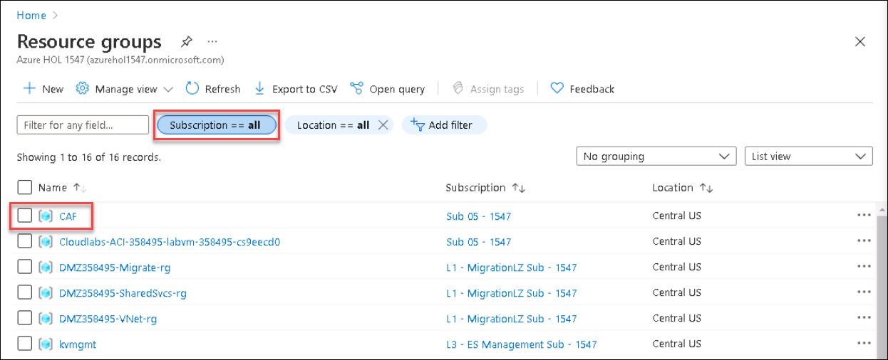
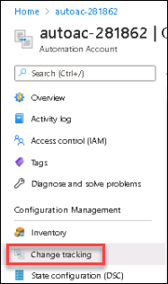
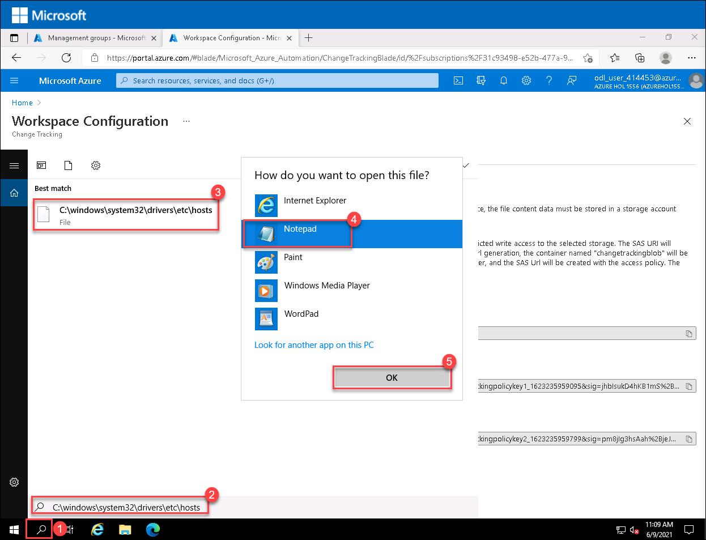
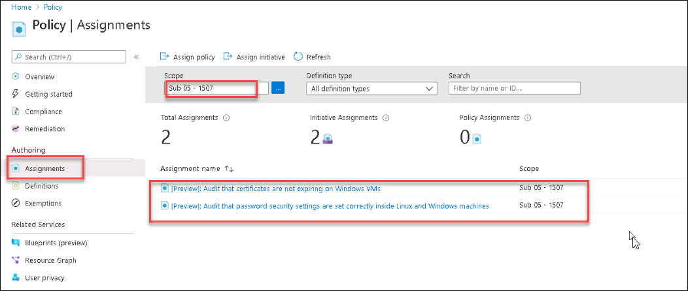
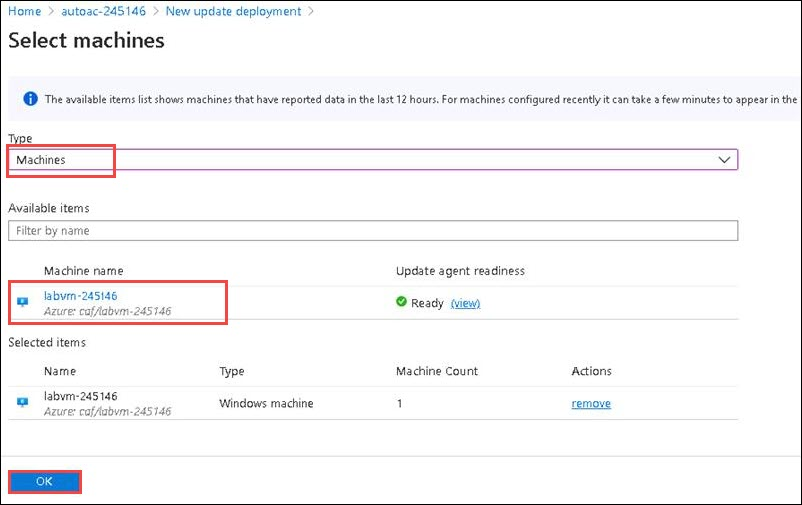
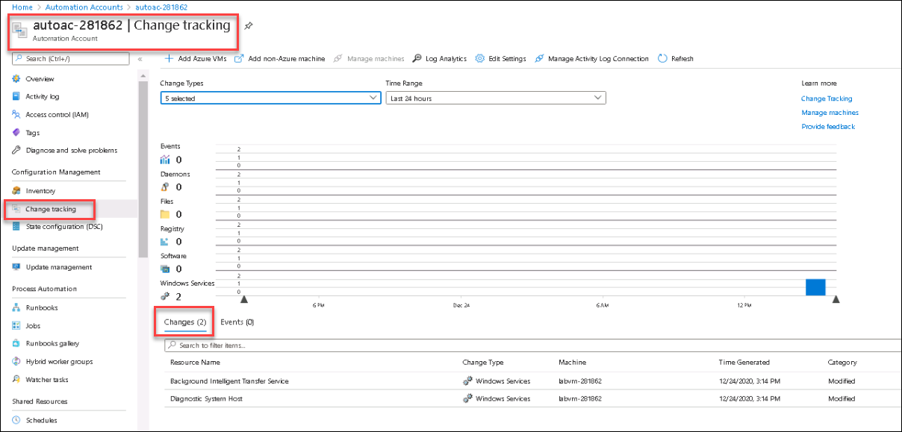

# Exercise 4: Operations Management

## Context
Azure server management services provide a consistent experience for managing servers at scale. These services cover both Linux and Windows operating systems. They can be used in production, development, and test environments. The server management services can support Azure IaaS virtual machines, physical servers, and virtual machines that are hosted on-premises or in other hosting environments.

In this exercise, you will cover how to Onboard Change Tracking, Inventory, and Update Management solutions to Azure virtual machine

>Note: To onboard the server management services Azure **Update Management, Change Tracking and Inventory**, **log analytics workspace, automation account, and virtual machine**  are required and these are already provided as pre-requisite in the resource group **CAF**.

>You will be using the subscription **Sub 05 - Suffix** and the resource group **CAF** for this exercise.

#### Task 1: Enable server management services on a Virtual Machine

In this task, you will enable all service management services Change Tracking, Inventory, and Update Management on a virtual machine.

#### Subtask1: Enable Change Tracking and Inventory on a Virtual Machine

Azure **Change Tracking and Inventory** provide alerts on the configuration state of your hybrid environment and changes to that environment. It can report critical files, service, software, and registry changes that might affect your deployed servers. By default, the Azure Automation inventory service does not monitor files or registry settings. The solution does provide a list of registry keys that we recommend for monitoring.

A **Log Analytics workspace** is a unique environment for storing Azure Monitor log data. Each workspace has its own data repository and configuration. Data sources and solutions are configured to store their data in particular workspaces. Azure monitoring solutions require all servers to be connected to a workspace so that their log data can be stored and accessed.

The management services require an **Azure Automation account**. You use this account, and the capabilities of Azure Automation, to integrate Azure services and other public systems to deploy, configure, and manage your service management processes.

In this section, you will enable consistent control and compliance of your VMs with Change Tracking and Inventory.

1. In the upper left corner of the portal window, to open the Resource Groups menu, click the toggle menu icon and then click on **Resource groups**.
    
   
    
    This blade displays all of the resource groups that you have access to the Azure subscriptions.
    
1. Make Sure all subscriptions are selected in subscriptions, then select CAF resource group from teh list.

   

1. From `CAF` resource group resources select automation account **autoac-<inject key="DeploymentID" enableCopy="false"/>**
   
   

1. From the **Automation account** blade, under the **Configuration Management**, click on **Inventory** 

   
   
1. On the **Automation account| Inventory** page ensure the Log Analytics workspace **logan-<inject key="DeploymentID" enableCopy="false"/>** and Automation account **autoac-<inject key="DeploymentID" enableCopy="false"/>** are already selected and click on **Enable** to enable the log analytics workspace for Inventory solution.

   
   
   >Deployment will be initiated which deploys the log analytics workspace, it takes around 2 minutes for the deployment to be completed.
   
1. **Refresh** the page once log analytics is enabled.
  
1. From the **Automation account|Inventory** blade click on **+Add Azure VMs**, this will open up a new page **Enable Inventory**
   
   

1. On the **Enable Inventory** page ensure the subscription **Sub 05-Suffix** and resource group **CAF** are selected by default, then select the virtual machine **labvm-<inject key="DeploymentID" enableCopy="false"/>**. Click on **Enable** to add the virtual machine to enable Change Tracking and Inventory.
   
   
   
   > Deployment will be initiated which deploys the log analytics workspace, it takes around 2 minutes for the deployment to be completed.
   
   > Note: Since Inventory is enabled ,change tracking will also be enabled.

1. **Refresh** the page once Inventory is enabled.

1. After adding the Virtual machine to Inventory, it should show under the **Machines** tab.

   
   
   >It will take around 30 to 45 minutes for the virtual machine to reflect under the **Machines** tab, You can continue with the lab.

1. Now from the **Automation account| Inventory** blade, click on **Edit Settings**. This will redirect you to **Workspace Configuration** page

   

1. On the **Workspace Configuration** page under the **Windows Registry**, review the **Registry keys** available.
   
   
   
   >A registry key is an organizational unit in the Windows registry, an internal database the computer uses to store configuration information
   
##### Subtask2: Enable Update Management on a Virtual machine

In this section, you will see how Update Management in Azure Automation is used to manage operating system updates for your Windows and Linux machines in Azure, in on-premises environments, and in other cloud environments. 

1. Navigate to **autoac-<inject key="DeploymentID" enableCopy="false"/>** Automation account blade and under the **Update management** section, select **Update management**.
 
   

2. On the **Automation account| Update Management** ensure the Log Analytics workspace **logan-<inject key="DeploymentID" enableCopy="false"/>** and Automation account **autoac-<inject key="DeploymentID" enableCopy="false"/>** are selected then click on **Enable** to enable the log analytics workspace for Update management solution. **Refresh** the page after the deployment is completed.

   
   
   > Deployment will be initiated which deploys the log analytics workspace, it takes around 2 minutes for the deployment to be completed.

3. Once the deployment is completed, refresh the page of azure portal.

4. From the **Automation account| Update Management** blade, click on **+Add Azure VMs**. This will open up a new page, **Enable Update Management**.
   
   

5. On the **Enable Update Management** page ensure the subscription **Sub 05-Suffix** and resource group **CAF** are already selected then select the virtual machine **labvm-<inject key="DeploymentID" enableCopy="false"/>** and click on **Enable** enable Update Management.
   
   
   
   >This will enable update management on a virtual machine to manage operating system updates for your Windows and Linux machines in Azure.

##### Subtask3: Configure file tracking on Windows

In this section you will see when you add a new file or registry key to track, Azure Automation enables it for Change Tracking and Inventory and how by using Change Tracking and Inventory you can track changes to files and folders/directories. 

1. Navigate to  **autoac-<inject key="DeploymentID" enableCopy="false"/>** **Automation account** blade, select **Change tracking** under **Configuration Management**.
  
   
   
2. Select **Edit Settings**.
   
   
   
3. On the **Workspace Configuration** page, select the **Windows Files** tab and then click **+ Add** to add a file to be tracked.
   
   

4. On the **Add Windows File for Change Tracking pane**, enter the information for the file or folder to track and click **Save**. 
   - Item name: `hosts`  that is the name of the file to be tracked.
   - Path type: Choose **Folder**
   - Enter path: `C:\windows\system32\drivers\etc\hosts*` that is the path to check for the file hosts.
     > Note: Path type `File` do not support `wildcards`, so make sure to change the Path Type to `Folder`
   - Recursion: **On**
     >True if recursion is used when looking for the item to be tracked, and False otherwise.

   - Upload File content: **True**
   
     >True to upload file content on tracked changes, and False otherwise.
   
   

5. After adding the file to track, the next step is to enable tracking for file content changes.
  
   >Note: File content tracking allows you to view the contents of a file before and after a tracked change. The feature saves the file contents to a storage account after each change occurs.
  
6. On the **Workspace Configuration** page, switch to **File Content** tab and click on **Link**. This selection opens the **Add Content-Location for Change Tracking** page.

   >Linking a storage account is required to save the content of the file modified.
   
   

7. Next on the **Add Content-Location for Change Tracking** blade, select the subscription **Sub 05-Suffix** then select the storage account **Storage<inject key="DeploymentID" enableCopy="false"/>** for storing the file contents from the drop-down menu.

   
  
8. Select **On** for Upload file content for all settings and then click on **Save**.

9. On the labvm-<inject key="DeploymentID" enableCopy="false"/> which is already connected in browser and you are working in. Click on the Search icon(1) and then add following path in search box **C:\windows\system32\drivers\etc\hosts**(2). Now, click on **C:\windows\system32\drivers\etc\hosts**(3) and select **Notepad**(4) and click on **OK**(5) to open the file with notepad.
   
   
   
10. Edit the file **hosts**, edit the values in the file in order to check how **Change Tracking** solution tracks the file.Ensure to **Save** the file after editing.
   
    
   
    >For example if the value is  38.25.63.10, edit the value by modifying the last digit 38.25.63.11

11. As the frequency of Change Tracking and Inventory is 30 minutes to check for a change in a windows file, you will check the logs later at the end of the exercise to check for the changes made to the hosts file. 
   
#### Task 2: Guest Configuration Policy 

In this task, you will use the Azure Policy Guest Configuration extension to audit the configuration settings in a virtual machine to verify that password security settings in Windows and Linux computers are set correctly and also to check whether any certificates are about to expire.
Use the PowerShell commands to deploy these policies to:
- Verify that password security settings in Windows and Linux computers are set correctly.
- Verify that certificates aren't close to expiration on Windows VMs.

1. In the Azure portal, open the **Azure Cloud Shell** by clicking on the icon in the top right of the Azure Portal.
   
   
   
2. If prompted to select either Bash or PowerShell, select **PowerShell**.

3. Click on **show advanced settings**.

   
   
4. In **advanced settings**, select the subscription **Sub 05-Suffix** and region **CentralUS**. 
    - Resource Group: Use existing `CAF`
    - Storage Account: Use existing **storage<inject key="DeploymentID" enableCopy="false"/>**
    - File share: fileshare
   
   
   
   Now, click on **Create Storage**.

5. Ensure you are connected to **Powershell** session.
   
   
   
6. Set the scope where you will be applying the policies to by running the below command:
   
   ```
   $Subscription = Get-AzSubscription | Where-Object { $_.Name -like "*sub 05*"  } | Sort-Object -Property Name
   $scope = "/subscriptions/" + $Subscription.Id
   ```

7. **Assign** the available policy definition **Verify that password security settings in Windows and Linux computers are set correctly** by running the below command:
   ```
   $PasswordPolicy = Get-AzPolicySetDefinition -Name "3fa7cbf5-c0a4-4a59-85a5-cca4d996d5a6"
   New-AzPolicyAssignment -Name "PasswordPolicy" -DisplayName "[Preview]: Audit that password security settings are set correctly inside Linux and Windows machines" -Scope     $scope -PolicySetDefinition $PasswordPolicy -AssignIdentity -Location centralus
   ```

8. **Assign** the available policy definition **Verify that certificates aren't close to expiration on Windows VMs** by running the below command:
    ```
    $CertExpirePolicy = Get-AzPolicySetDefinition -Name "b6f5e05c-0aaa-4337-8dd4-357c399d12ae"
    New-AzPolicyAssignment -Name "CertExpirePolicy" -DisplayName "[Preview]: Audit that certificates are not expiring on Windows VMs" -Scope $scope -PolicySetDefinition     $CertExpirePolicy -AssignIdentity -Location centralus
    ```
9. Next, Verify if the policies are assigned to the subscription **sub 05-Suffix**

10. From the Azure portal, type **policy** at the search bar and select **Policy** under services. You will be redirected to the **Policy** page.
   
    

11. Minimize the cloud shell session.

12. On the **Policy | Assignments** page, select the scope to **sub 05-Suffix** subscription and verify if the policies applied in the previous steps are successfully assigned.

    
   
#### Task 3: Create Update Schedules 

Creating update schedules to schedule the installation of updates to ensure that all the servers have the latest ones and can quickly assess the status of available updates on all agent machines and manage the process of installing required updates for servers. 

In this task, you will deploy and install software updates on machines that require the updates by creating a scheduled deployment. Updates classified as optional are not included in the deployment scope for Windows machines, Only required updates are included in the deployment scope. The scheduled deployment defines which target machines receive the applicable updates

The following are the steps to schedule an update on a virtual machine.

1. Navigate to the **CAF** resource group then the **Automation account** blade and under the **Update management** section, select **Update management**.
 
   

2. From the **Automation account| Update Management** page select **+Schedule update deployment** option. You will be redirected to **New update deployment** page.
   
   
 
3. On the **New update deployment** page. Provide the following details and click on **Create**.
    
    - DeploymentID: <inject key="DeploymentID" />
    - Name: **update-DeploymentID**, replace DeploymentID with its value
    
    - Operating system: **Windows**
    - **Machines to update** under the Items to update section: Under **Type**, select **Machines** from the dropdown. Under **Machine name** select **labvm-<inject key="DeploymentID" enableCopy="false"/>**
    
       
     
      >If you don't see any machine, note that for machines configured recently it can take around 15 minutes to appear in the list.
        
    - Schedule Settings: Select the **start time and timezone** for scheduling the updates.
    - Leave the default values for other options
   
    
   
#### Task 4: Review the result of Change Tracking process in the log analytics workspace.
  
  In this task, you will review the results of subtask3 as Change Tracking and Inventory checks for the changes in a windows file for every 30 minutes.

1. In the Azure Portal, from the **autoac-<inject key="DeploymentID" enableCopy="false"/>**  **Automation account** page, scroll down to **Monitoring** section and select **Logs**.
  
    
    
2. Click on **Get Started** and if a **Queries** popup window appears, close the window and continue.
   
3. Now on the **Automation account| Logs** blade, click on **Select a scope** and set the scope to the virtual machine **labvm-<inject key="DeploymentID" enableCopy="false"/>** then click on **Apply**.
  
    
      
>**Note:** If you are not able to see the option **Select a Scope** in Queries page. Please Zoom-out the LabVM Screen then you will be able to get as mentioned in the above Image. 

4. In Log Analytics, paste the following query and click on **Run** to search for changes to the hosts file:
    ```
    ConfigurationChange | where FieldsChanged contains "FileContentChecksum" and FileSystemPath contains "hosts"
    ```
    
   
    This query searches for changes to the contents of files that have a path that contains the word "hosts."
    
    >IMPORTANT: If the query returns the output as **No results found**, then the Change Tracking and Inventory checks have not happened yet or there might be a delay in the file tracking process.
 
5. You can also check for the changes made by navigating to **autoac-<inject key="DeploymentID" enableCopy="false"/>** **Automation account** blade, select **Change tracking** under **Configuration Management** and **Changes** tab at the bottom left.
    
    
    
    >IMPORTANT: If you are not able to see the changes under the **Changes** tab also, then the Change Tracking and Inventory checks have not happened yet or there might be a delay in the change tracking process.
    
    >For more information about Server management services check this link: https://docs.microsoft.com/en-us/azure/cloud-adoption-framework/manage/azure-server-management/
    
    In this exercise, you learned about Server management services and how to track any file content change using Change Tracking and Inventory solutions and also you have seen how to schedule updates on a virtual machine.
