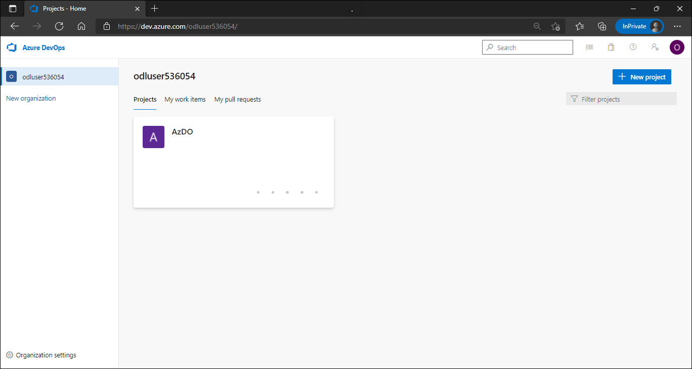
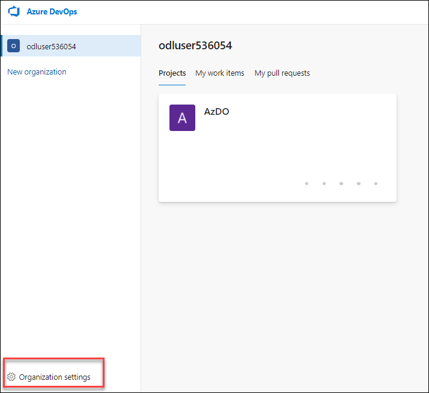
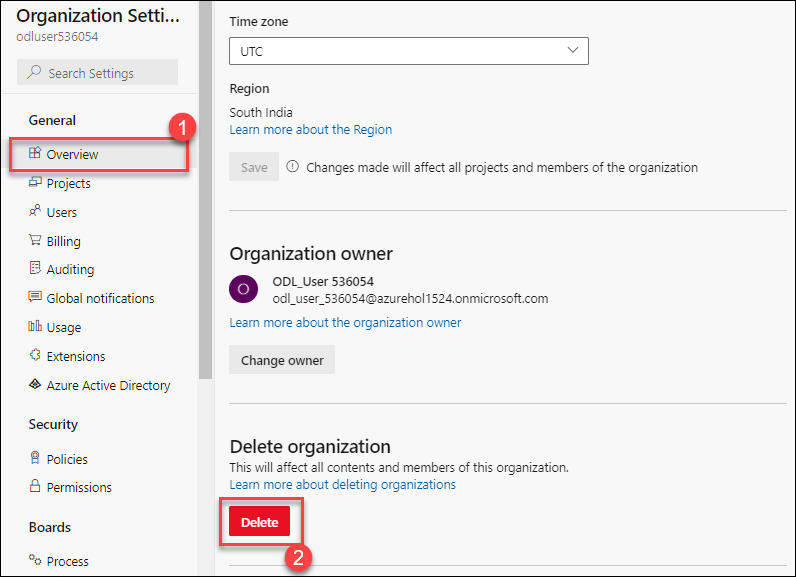
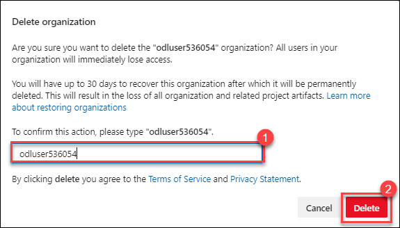

## After the hands-on lab

## Exercise 1: Delete the Azure DevOps organization

In this exercise, you will delete Azure DevOps organization created in support of the lab.

1. In your JumpVM, open a new browser tab and navigate to **https://dev.azure.com/odluser<inject key="DeploymentID" enableCopy="false" />**.

   

2. Select **Organization settings**.

   

3. On Organization settings page Select **Overview(1)**, scroll down to end of the page and under Delete organization select **Delete(2)**.

   

4. In the resulting dialog box, enter the name of the organization **odluser<inject key="DeploymentID" enableCopy="false" />**, and then select **Delete(2)**.

   

