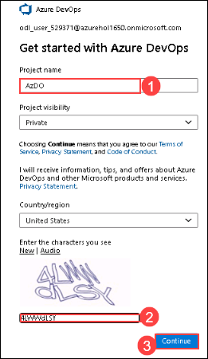

# Lab 02: AzGovViz - Azure Governance Visualizer - Setup


# Exercise 1: AzGovViz from Console

## Task 1: Execute as Service Principal

A Service Principal by default has no read permissions on Users, Groups and Service Principals, therefore we need to grant additional permissions in AAD

1. We need to Grant API permissions for the Service Principal´s Application, in Azure portal search for Active Directory *(1)* and click on **Azure Active Direcectory** from the search results *(2)*.

   

2. Click on **App registrations** under Manage *(1)* and select the **eslzp** application *(2)* we created in lab 1.

   

3. Now click on **API permissions** under **Manage** and then click on **+ Add a permission**.

   

4. A side window **Request API permissions** will open, here click on **Microsoft Graph**

   

5. Under Microsoft Graph select **Application permissions** *(1)*, and expand the group of permissions and select the following set of permissions.

   - Application / Application.Read.All *(2)*
   - Group / Group.Read.All *(3)*
   - User / User.Read.All *(4)*
   - Once all the mentioned permissions are selected, click on *Add permissions** button at the bottom.

   

6. All the configured permissions can be previewed under **API permissions**.

   


### Task 2: Clone the AzGovViz repository

1. In your JumpVm click on start and open **Powershell**.

2. Run the following command in powershell to clone the GitHub repository.

``` 
Set-Location "C:\ProgramData\Microsoft\Windows\Start Menu\Programs\Git"  
git clone "https://github.com/JulianHayward/Azure-MG-Sub-Governance-Reporting.git"
```

### Task 3: Run AzGovViz Console

1. Run the following command in powershell to connect to your Azure account.
>**Note:** Replace <TenantID> with your Tenant Id which can be found in your Azure active directory.

```
Connect-AzAccount -TenantId <TenantId> -UseDeviceAuthentication
```

2. Now the powershell will ask you to go to ```https://microsoft.com/devicelogin``` *(1)* and enter the code mentioned in powershell *(2)*. Enter the code and click on sign in.

   


3. Copy and paste the following command in powershell. Replace the <target management Group Id > with your Group ID.

```
c:\Git\Azure-MG-Sub-Governance-Reporting\pwsh\AzGovVizParallel.ps1 -ManagementGroupId <target Management Group Id> c:\AzGovViz-Output
```


```
c:\Git\Azure-MG-Sub-Governance-Reporting\pwsh\AzGovVizParallel.ps1 -ManagementGroupId <target Management Group Id> -OutPath "c:\AzGovViz-Output"
```

# Exercise 2: AzGovViz in Azure DevOps

### Task 1: Create AzDO Project

1. Go to ```www.dev.azure.com``` and enter the captcha and click on Create.

 

### Task 2: Import AzGovViz Github repository

1. In Azure Devops, Click on **Repos** and select **Files**, and click on **Import**.

 

2. In the import page, enter the following URL ```https://github.com/JulianHayward/Azure-MG-Sub-Governance-Reporting.git``` and click on **Import**.

 

3. Once Import is succesful, you will receive the following message on screen.

 


### Task 3: Create AzDO Service Connection

For the pipeline to authenticate and connect to Azure we need to create an AzDO Service Connection which basically is a Service Principal (Application)  


1. Click on 'Project settings' (located on the bottom left)

2. Under 'Pipelines' click on 'Service connections'

3. Click on 'New service connection'.

 

4. Select the connection/service type 'Azure Resource Manager' and click 'Next'.

 

4. For the authentication method select 'Service principal (automatic)' and click 'Next'

 

5. For the 'Scope level' select 'Management Group', in the Management Group dropdown select the target Management Group ```eszl```, in the 'Details' section apply a Service Connection name ```eslz-serviceconnection2``  and optional give it a description and click 'Save'.

 


7. Now the Service Connection has been created.

### Task 4: Grant permissions in Azure

1. Copy and paste the following in powershell to create a '__Reader__' RBAC Role assignment on the target Management Group scope for the AzDO Service Connection´s Service Principal. Replace <objectId of the AzDO Service Connection´s Service Principal> and <managementGroupId> with values.

```powershell
$objectId = "e1529f07-75ac-404d-8938-74638e253d5e"
$role = "Reader"
$managementGroupId = "<managementGroupId>"

New-AzRoleAssignment `  
-ObjectId $objectId `  
-RoleDefinitionName $role `  
-Scope /providers/Microsoft.Management/managementGroups/$managementGroupId
```

### Task 5: Grant permissions in AAD


In this task we need to grant API permissions for the Service Principal´s Application that we created earlier.

1. We need to Grant API permissions for the Service Principal´s Application, in Azure portal search for Active Directory *(1)* and click on **Azure Active Direcectory** from the search results *(2)*.

   

2. Click on **App registrations** under Manage *(1)* and select the **eslzp** application *(2)* we created in lab 1.

   

3. Now click on **API permissions** under **Manage** and then click on **+ Add a permission**.

   

4. A side window **Request API permissions** will open, here click on **Microsoft Graph**

   

5. Under Microsoft Graph select **Application permissions** *(1)*, and expand the group of permissions and select the following set of permissions.

   - Application / Application.Read.All *(2)*
   - Group / Group.Read.All *(3)*
   - User / User.Read.All *(4)*
   - Once all the mentioned permissions are selected, click on *Add permissions** button at the bottom.

   

6. All the configured permissions can be previewed under **API permissions**.

   


### Task 6: Grant permissions on AzGovViz AzDO repository

When the AzDO pipeline executes the AzGovViz script the outputs should be pushed back to the AzGovViz AzDO repository, in order to do this we need to grant the AzDO Project´s Build Service account with 'Contribute' permissions on the repository.
    
1. In AzDO click on '__Project settings__' (located on the bottom left), under '__Repos__' open the '__Repositories__' page

2. Click on the AzGovViz AzDO Repository and select the tab '__Security__'

3. On the right side search for the Build Service account  
     __%Project name% Build Service (%Organization name%)__ and grant it with '__Contribute__' permissions by selecting '__Allow__' (no save button available)

### Task 7: Edit AzDO YAML file

* Click on '__Repos__'
* Navigate to the AzGovViz Repository
* In the folder '__pipeline__' click on '__AzGovViz.yml__' and click '__Edit__'
* Under the variables section 
    * Enter the Service Connection name that you copied earlier (ServiceConnection)
    * Enter the Management Group Id (ManagementGroupId)
* Click '__Commit__'

### Task 8: Create AzDO Pipeline

* Click on '__Pipelines__'
* Click on '__New pipeline__'
* Select '__Azure Repos Git__'
* Select the AzGovViz repository
* Click on '__Existing Azure Pipelines YAML file__'
* Under '__Path__' select '__/pipeline/AzGovViz.yml__' (the YAML file we edited earlier)
* Click ' __Save__'

### Task 9: Run the AzDO Pipeline

* Click on '__Pipelines__'
* Select the AzGovViz pipeline
* Click '__Run pipeline__'

### Task 10: Create AzDO Wiki (WikiAsCode)

Once the pipeline has executed successfully we can setup our Wiki (WikiAsCode)

* Click on '__Overview__'
* Click on '__Wiki__'
* Click on '__Publish code as wiki__'
* Select the AzGovViz repository
* Select the folder '__wiki__' and click '__OK__'
* Enter a name for the Wiki
* Click '__Publish__'

# AzGovViz GitHub Codespaces

Note: Codespaces is available for organizations using GitHub Team or GitHub Enterprise Cloud. [Quickstart for Codespaces](https://docs.github.com/en/codespaces/getting-started/quickstart)

  
  
  
  

