# Lab 02: AzGovViz- Azure Governance Visualizer

Do you want to get granular insights on your technical Azure Governance implementation? - document it in CSV, HTML, Markdown and JSON?
AzGovViz is a PowerShell based script that iterates your Azure Tenant´s Management Group hierarchy down to Subscription level. It captures most relevant Azure governance capabilities such as Azure Policy, RBAC and Blueprints and a lot more. From the collected data AzGovViz provides visibility on your HierarchyMap, creates a TenantSummary, creates DefinitionInsights and builds granular ScopeInsights on Management Groups and Subscriptions. The technical requirements as well as the required permissions are minimal.

You can run the script either for your Tenant Root Group or any other Management Group.

   > **Note:** The following lab is dependent on Lab 1, Exercise 1.

## Exercise 1: AzGovViz from Console

### Task 1: Execute as Service Principal

A Service Principal by default has no read permissions on Users, Groups and Service Principals, therefore we need to grant additional permissions in AAD

1. We need to Grant API permissions for the Service Principal´s Application, in Azure portal search for Active Directory *(1)* and click on **Azure Active Directory** from the search results *(2)*.

   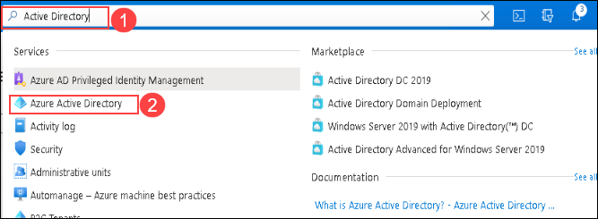

2. Click on **App registrations (1)** under the Manage section on the left and select the **eslzp (2)** we created in lab 1.

   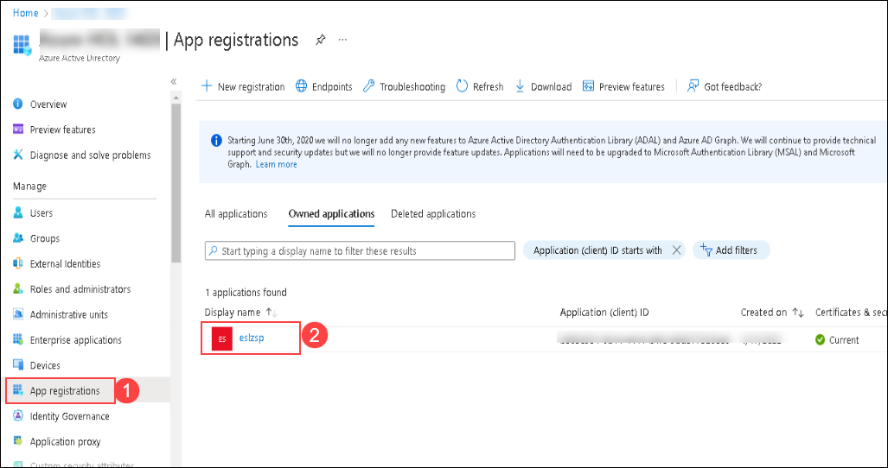

3. Now click on **API permissions** under **Manage** and then click on **+ Add a permission**.

   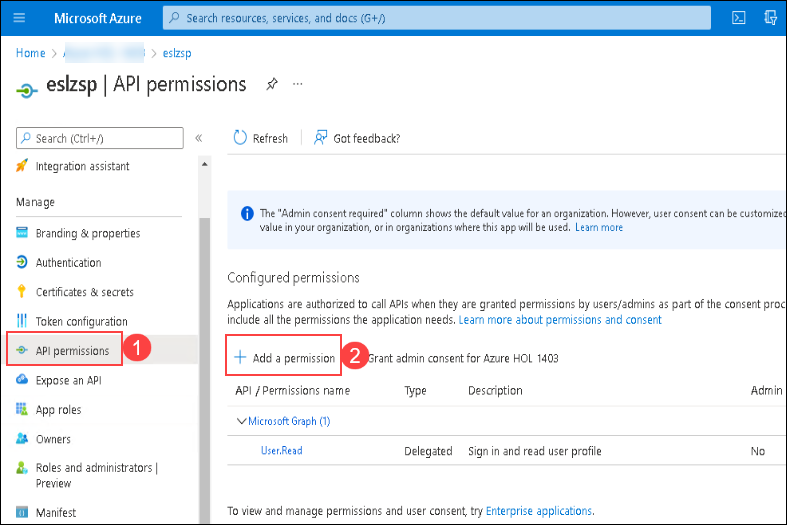

4. A side window **Request API permissions** will open, here click on **Microsoft Graph**

   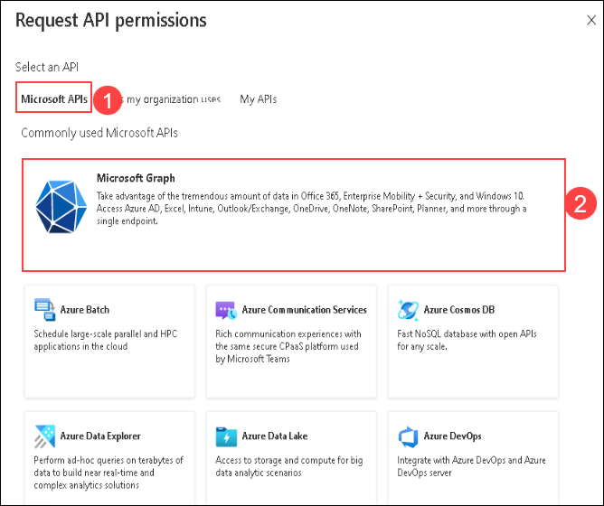

5. Under Microsoft Graph select **Application permissions** *(1)*, and expand the group of permissions and select the following set of permissions.

   - Application / Application.Read.All *(2)*
   - Group / Group.Read.All *(3)*
   - User / User.Read.All *(4)*
   - Once all the mentioned permissions are selected, click on *Add permissions** button at the bottom.

   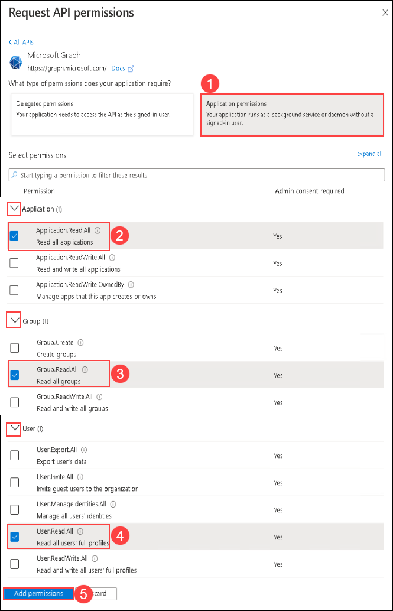

6. Now, click on **Grant Admin Consent** *(1)* and on the *Grant admin consent confirmation* click on **Yes** *(2)*

   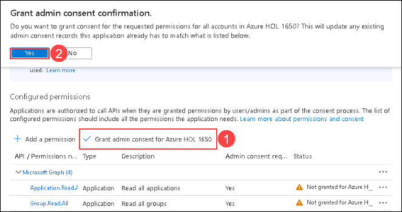


### Task 2: Clone the AzGovViz repository

1. In your JumpVm click on start and open **Powershell Core**.

   **Note:** Make sure the icon of powershell matches the icon in the screenshot below.

   


2. Run the following commands in powershell to clone the GitHub repository.

   ``` 
   Set-Location "C:\Program Files\Git"
   ```
   ```
   git clone "https://github.com/JulianHayward/Azure-MG-Sub-Governance-Reporting.git"
   ```

### **Task 3: Run AzGovViz Console**

1. Run the following command in powershell to connect to your Azure account.
   >**Note:** Replace <TenantID> with your Tenant Id with  **<inject key="tenantId" />**

   ```
   Connect-AzAccount -TenantId <TenantId> -UseDeviceAuthentication
   ```

2. As per the warning, to complete the sign in, you need to visit the following URL in a new tab and enter the code given in the warning.

   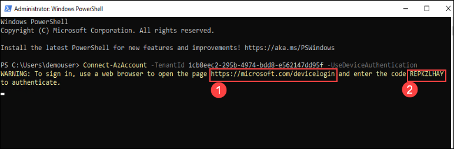

3. In a new browser tab, visit ```https://microsoft.com/devicelogin``` and enter the code mentioned in your poewrshell *(1)* then click on **Next** *(2)*.

   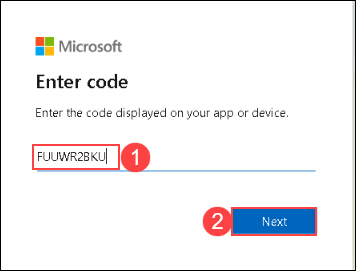

4. Now on **Pick an account** window select your Azure Account.

   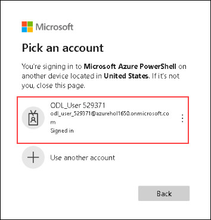

5. On the **Are you trying to sign in to Microsoft Azure PowerShell?** prompt, click on **Continue**.

   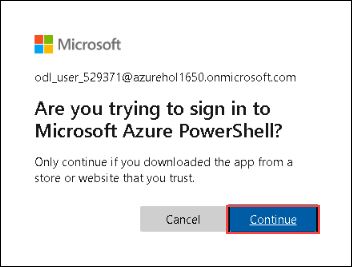

6. Once the above steps are done, return to powershell and run the command below.

   ```
   C:\'Program Files'\Git\Azure-MG-Sub-Governance-Reporting\pwsh\AzGovVizParallel.ps1 -ManagementGroupId eslz
   ```

7. Once the script is completed successfully and you get the below output, you can continue with the next exercise.

   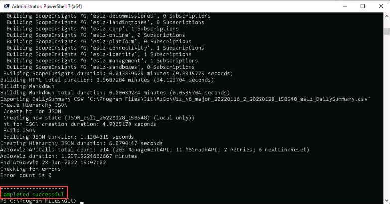

## Exercise 2: AzGovViz in Azure DevOps

### Task 1: Create AzDO Project

1. In a new browser tab, go to ```https://dev.azure.com``` and on the 'Get started with Azure DevOps' page, click on **Continue**.

   

2. Now, make sure the region is set to **Central US** *(1)*, enter the **captcha** code *(2)*, and click on **Continue** *(3)*.

   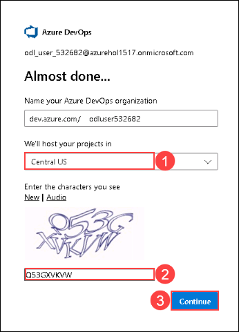

3.  On 'Create a project to get started' page, enter the below details and click on **+ Create project** *(3)*.

   - Project name: **AzDO** *(1)*
   - Visiblity: Select **Private** *(2)*


### **Task 2: Import AzGovViz Github repository**

1. In Azure Devops, Click on **Repos** **(1)** and select **Files** **(2)**, and click on **Import** **(3)**.

   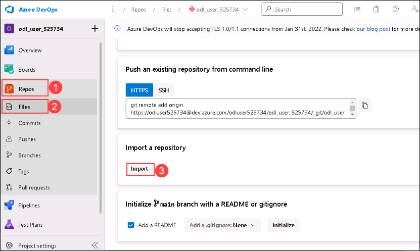

2. In  *Import a Git repository* window, enter the following URL ```https://github.com/JulianHayward/Azure-MG-Sub-Governance-Reporting.git``` *(1)* and click on **Import** *(2)*.

   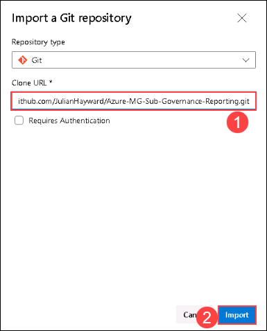

3. Once Import is successful, you will receive the following message on the screen.

   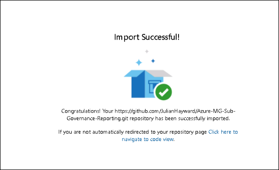


### **Task 3: Create AzDO Service Connection**

For the pipeline to authenticate and connect to Azure we need to create an AzDO Service Connection which basically is a Service Principal (Application)  


1. Click on **Project settings** *(1)* (located on the bottom left).

2. Under 'Pipelines' click on **Service connections** *(2)*.

3. Click on **Create service connection** *(3)*.

   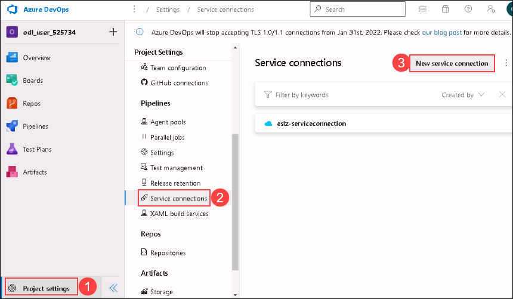

4. Select the *New service connection* type **Azure Resource Manager** *(1)* and click **Next** *(2)*.

   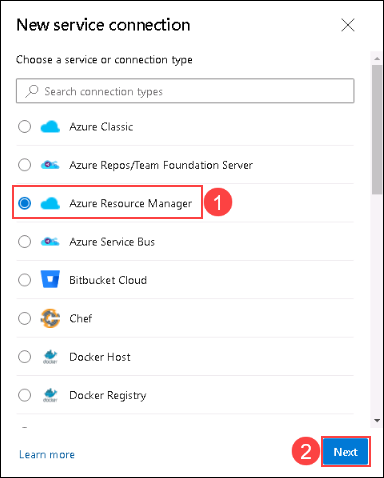

4. For the authentication method select **Service principal (automatic)** *(1)* and click **Next** *(2)*.

   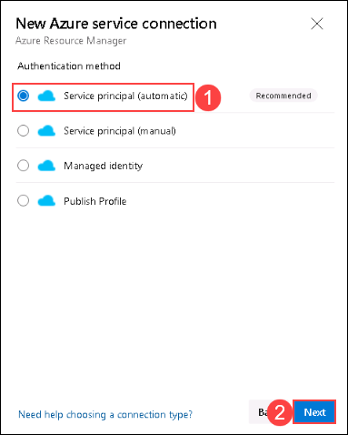

5. For the 'Scope level' select ```Management Group``` *(1)*, in the Management Group dropdown, select the target Management Group ```eszl``` *(2)*, in the 'Details' section apply a Service Connection name ```AzGovViz_SC``` *(3)*  and click on **Save** *(4)*.

   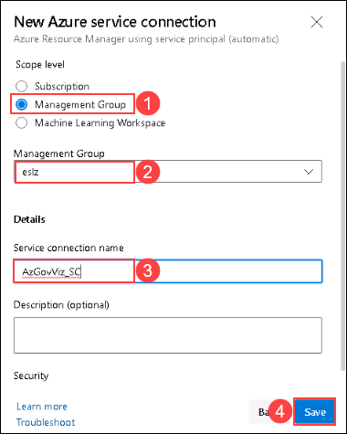

7. Now the Service Connection has been created.

### Task 4: Grant permissions in Azure

1. On the 'Service Connections' page click on **AzGovViz_SC** service principle.

   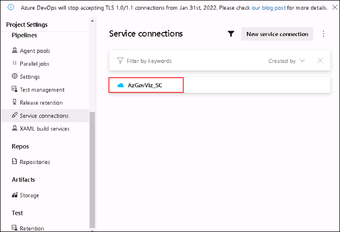

2. Under 'AzGovViz_SC' click on **Manage Service Principal**.

   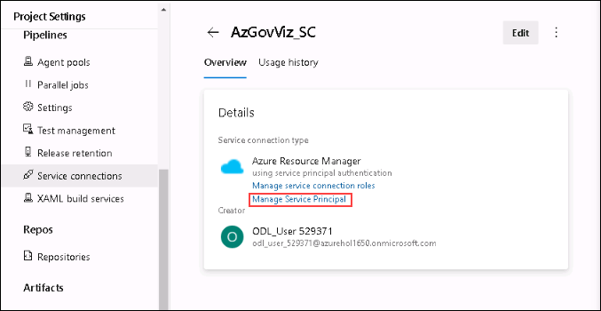

3. Now you will be redirected to the Service principle page on Azure Portal, copy the **Display name** of the service principle by clicking on the copy icon and save it in notepad for later use.

   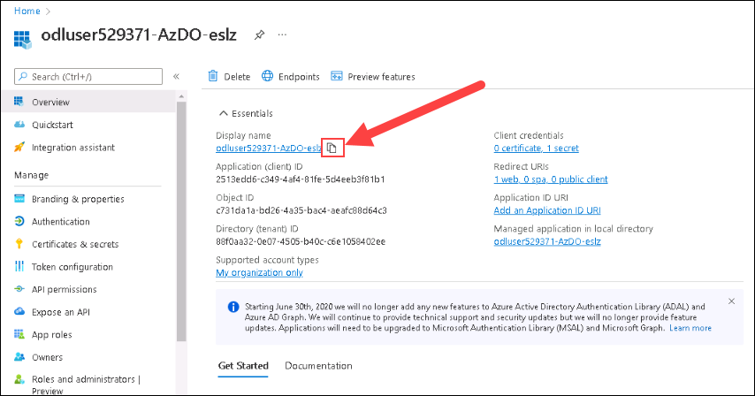

4. In Azure Portal search for **Management Groups** *(1)* and click on it from search **result** *(2)*.

   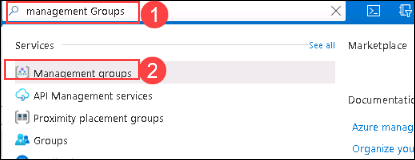

5. On the 'Management groups' page click on **eslz**.

   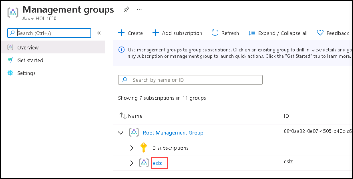

6. Under 'eslz Management group' page, click on **Access control (IAM)** *(1)* then click on **+ Add** *(2)* and select **Add role assignment** *(3)* from the drop down.

   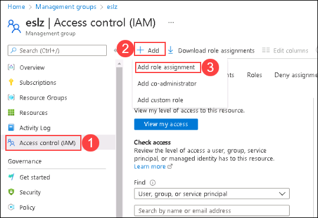

7. Now in 'Add role assignment' page, click on **Reader** *(1)* and then click on **Next** *(2)*.

   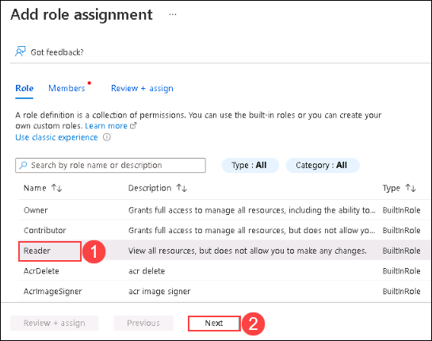

8. Now click on **+ Select members** *(1)*, then enter the display name of service principal we copied in step 3 *(2)* then click on the search result to select it and click on **Select** *(3)* button. Then Click on **Next** *(4)* and then **Review + assign**.

   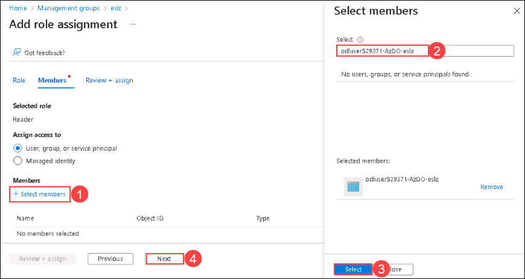

### Task 5: Grant permissions in AAD

In this task, we need to grant API permissions for the Service Principal´s Application that we created earlier.

1. We need to Grant API permissions for the Service Principal´s Application, in Azure portal search for Active Directory *(1)* and click on **Azure Active Directory** from the search results *(2)*.

   

2. Click on **App registrations** under Manage *(1)* and select the **odluserSuffix-AzDo-eslz** application *(2)*. Where Suffix is a unique numerical code.

   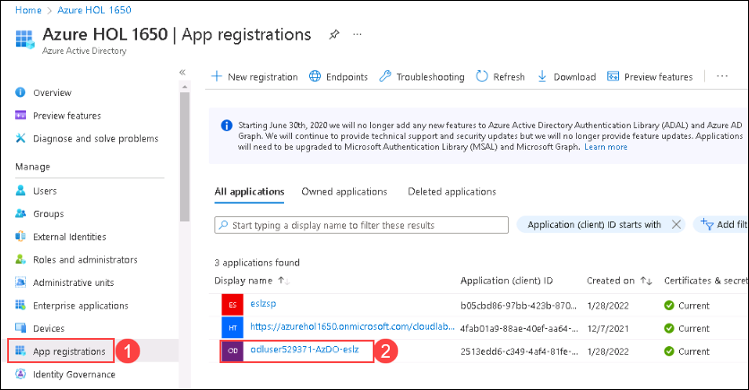

3. Now click on **API permissions** under 'Manage' and then click on **+ Add a permission**.

   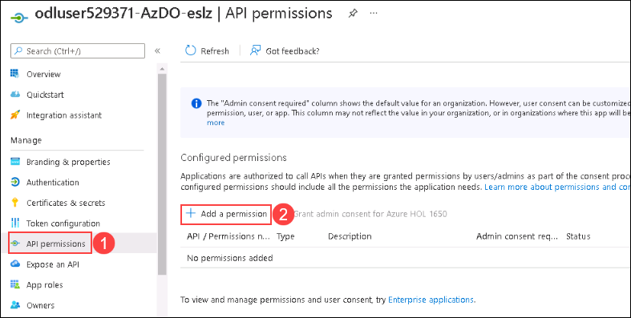

4. A side window **Request API permissions** will open, here click on **Microsoft Graph**

   

5. Under Microsoft Graph select **Application permissions** *(1)*, and expand the group of permissions and select the following set of permissions.

   - Application / Application.Read.All *(2)*
   - Group / Group.Read.All *(3)*
   - User / User.Read.All *(4)*
   - Once all the mentioned permissions are selected, click on *Add permissions** button at the bottom.

   


6. Now, click on **Grant Admin Consent** *(1)* and on the *Grant admin consent confirmation* click on **Yes** *(2)*

   

### Task 6: Grant permissions on AzGovViz AzDO repository

When the AzDO pipeline executes the AzGovViz script the outputs should be pushed back to the AzGovViz AzDO repository, in order to do this we need to grant the AzDO Project´s Build Service account with 'Contribute' permissions on the repository.
    
1. Return to Azure Devops and in AzDO click on **Project settings** *(1)*  (located on the bottom left), under '_Repos_' open the **Repositories** *(2)* page, then click on the **AzDO** Repository *(3)*.

   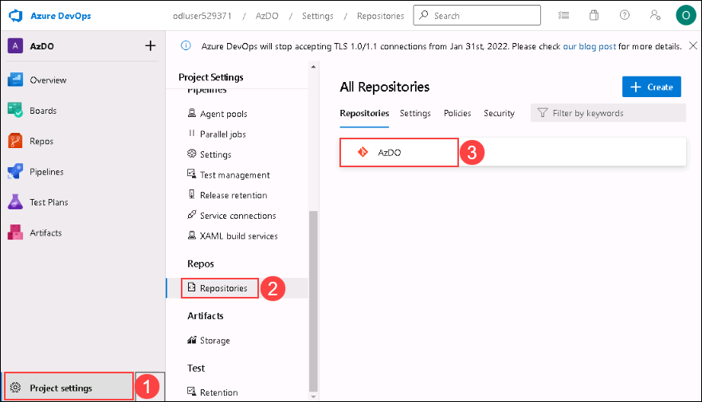


2. Select the  **Security** tab *(1)*, click on the **AzDo Build Service** account *(2)*, and then on the right side search for the Build Service account grant it with **Contribute** permissions by selecting **Allow** *(3)* (no 'Save' button is available. The configuration will be saved automatically).

   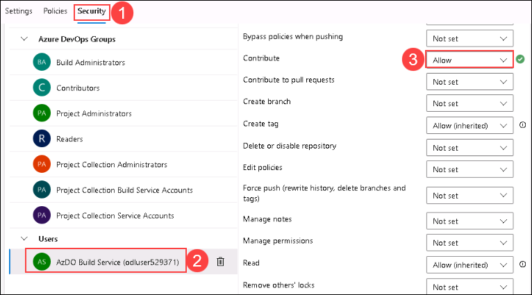


### Task 7: Edit AzDO YAML file

1. Now on the left hand side of the screen in Azure DevOps, click on '__Repos__' *(1)*, Expand the folder __.pipeline__ *(1)* click on __AzGovViz.yml__ *(2)* and click __Edit__ *(3)*.

    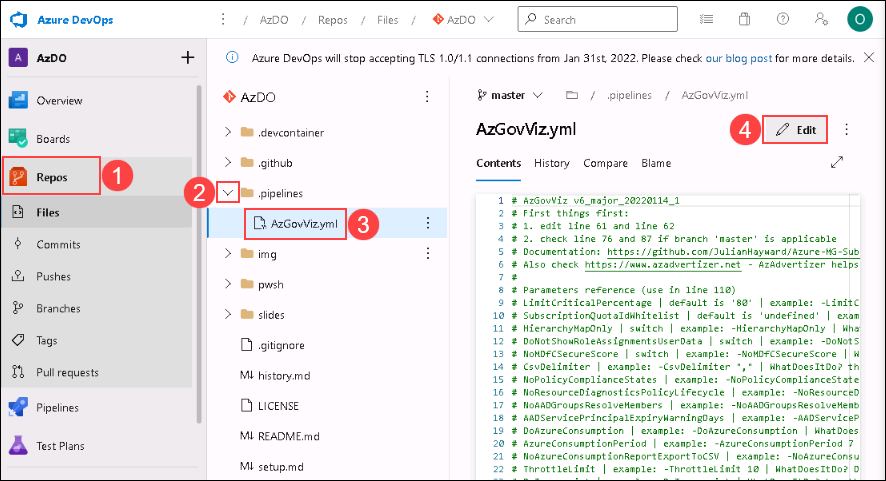

2. Under the variables section (line number 60).
    - Replace ```<YourServiceConnection>``` *(1)* with **AzGovViz_SC** .
    - Replace ```<YourManagementGroupId>``` *(2)* with **eslz**.

3. Click '__Commit__' *(3)*.

    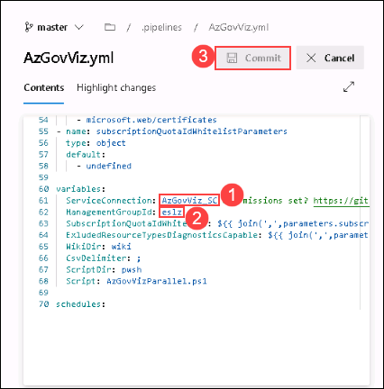

4. Under 'Commit' page click on **Commit** button.


### Task 8: Create AzDO Pipeline
   
1. In Azure DevOps, click on **Project Settings** *(1)* on the lower left corner, then under *Pipelines* click on **Parallel jobs** *(2)* then under *Microsoft-hosted* click on **Change** *(3)*.
   
    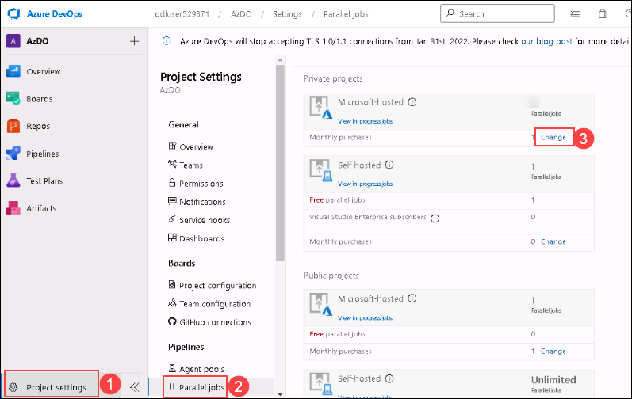

2. Now you will be redirected to *Billing* page, here click on **Set up billing**.

   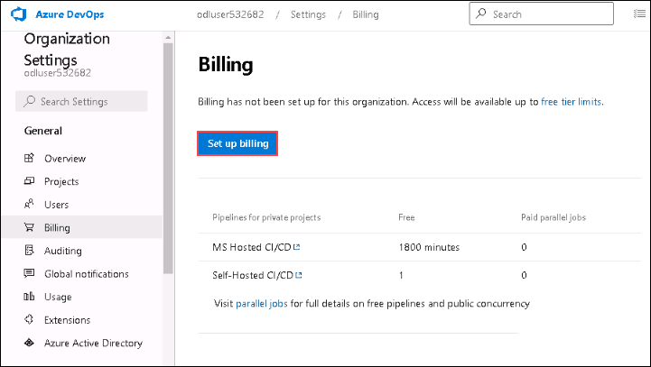

3. Now from the list of subscription, select **Sub 05 - Suffix** **subscription** and click on **Save** *(2)*.

   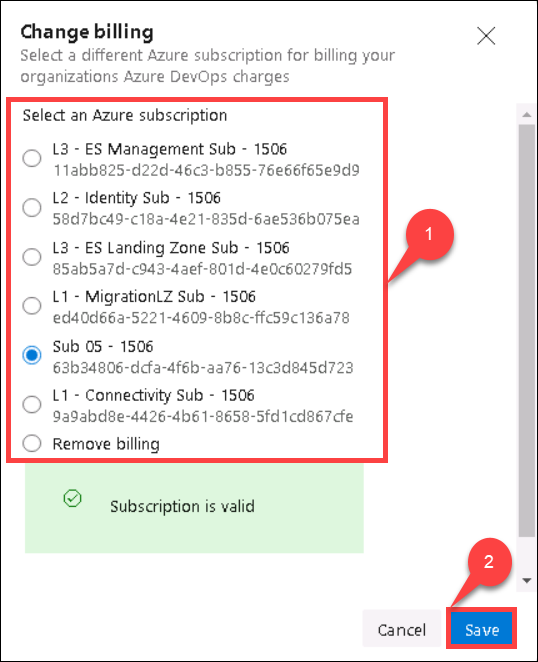

4. Now, you will be redirected to "Billing' page, here change the **MS Hosted CI/CD** to **1**. Then click on **Save** at bottom of the page.
   
    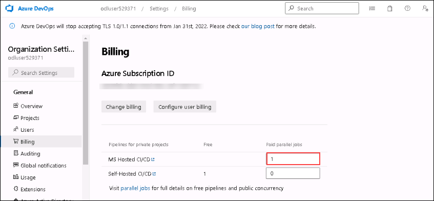
   
5. Return back to Azure DevOps, then click on '__Pipelines__' *(1)* and select **Create Pipeline** *(2)*.

    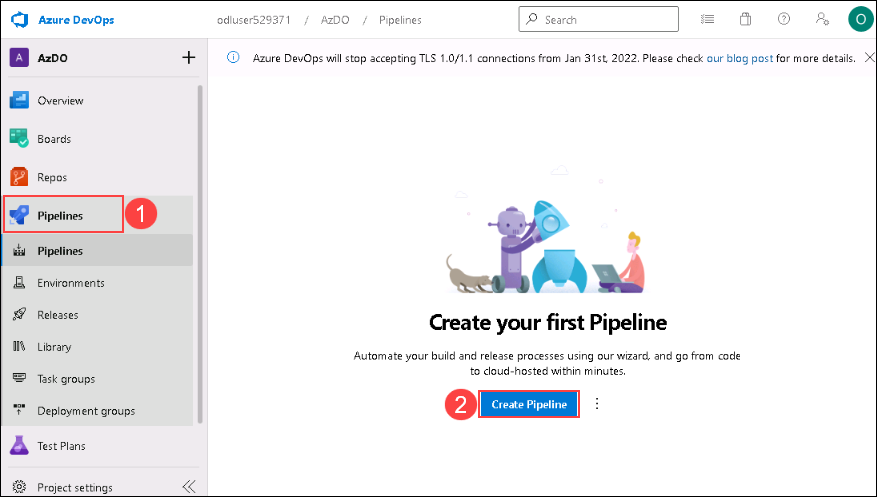

6. Under "Where is your code?' select '__Azure Repos Git__'.

    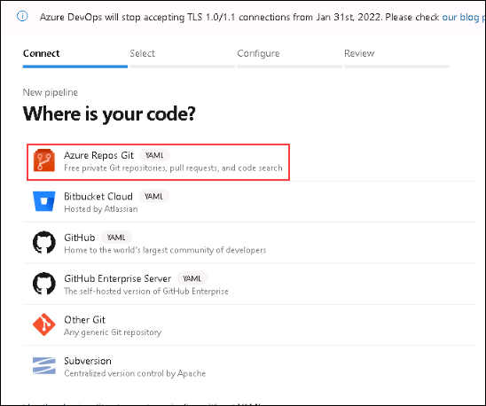

7. Under 'Select a repository', select **AzDo** repository.

    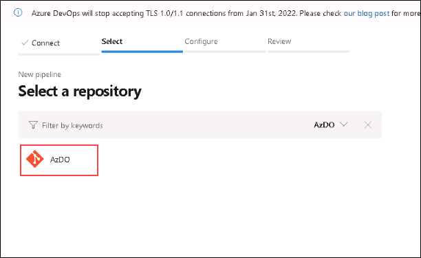


8. Under 'Configure your pipeline' click on '__Existing Azure Pipelines YAML file__'.

    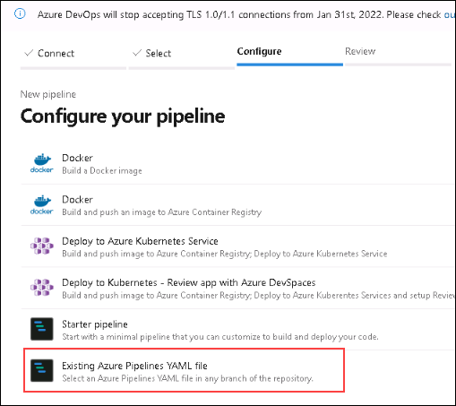

9. Under 'Select an existing YAML file', select *Path* as ```/pipeline/AzGovViz.yml``` *(1)* (the YAML file we edited earlier), and click on **Continue** *(2)*.

    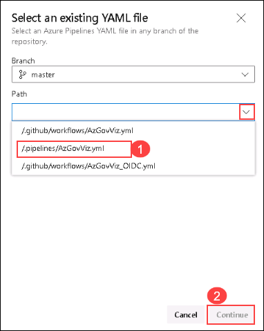


10. Now under 'Review your pipeline YAML' Click on the drop down next to *Run* *(1)* and click on __Save__ *(2)*.

    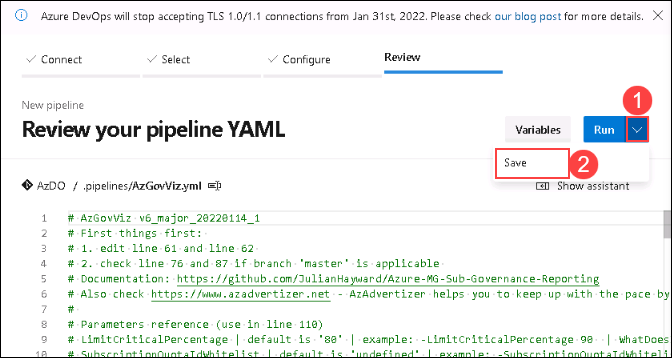


### Task 9: Run the AzDO Pipeline

1. Once the steps in the previous task are executed, you will be redirected to **AzDo** pipeline.

2. Click '__Run pipeline__'.

    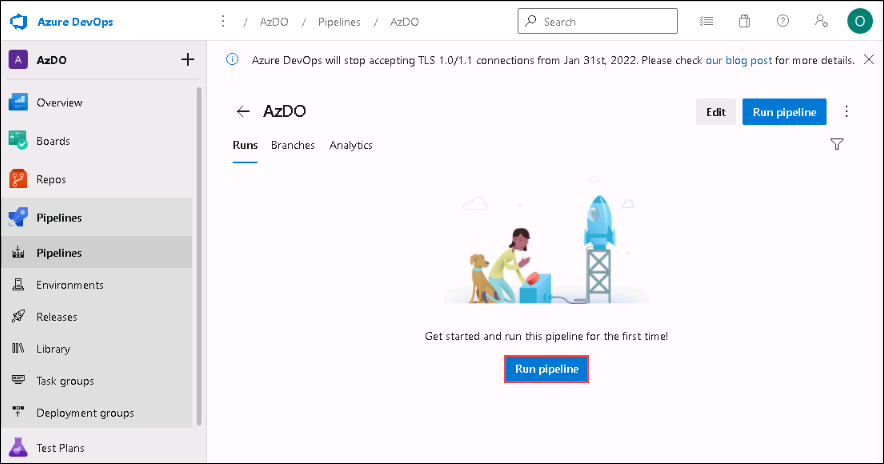

3. Under the 'Run Pipeline' parameters page, click on **Run**.

    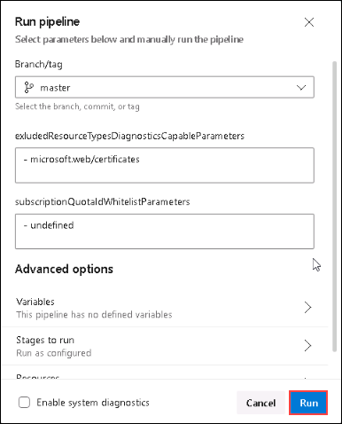

4. If you are prompted with a warning saying *This Pipeline needs permission to access a resource before this run can continue*, click on **View**

   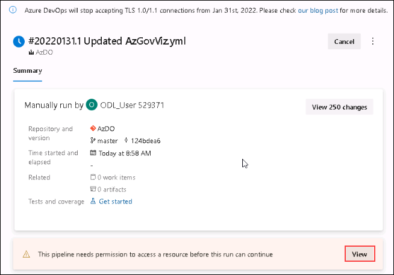

5. Under *Waiting for review** page, click on **Permit**.

   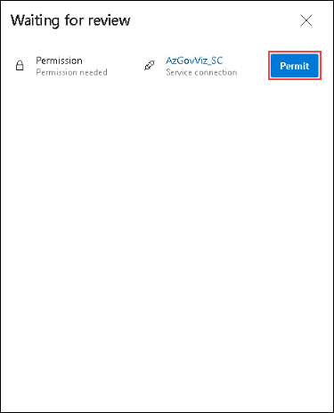

6. Now, under *Permit access* prompt, click on **Permit**.

   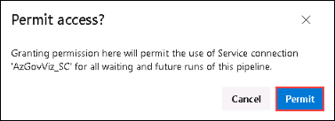

7. Now the pipeline should start running, it will take around 3 minutes for the pipeline run to complete.

8. Once Pipeline run is successful, the pipeline should look like the image below.

   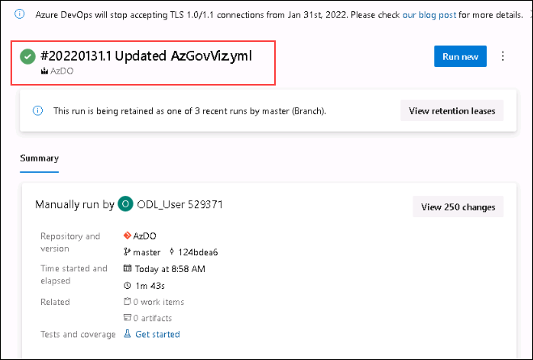

### Task 10: Create AzDO Wiki (WikiAsCode)

Once the pipeline has been executed successfully we can set up our Wiki (WikiAsCode)

1. Click on **Overview**.

    

2. Click on **Wiki** *(1)* and select **Publish code as wiki** *(2)*.

    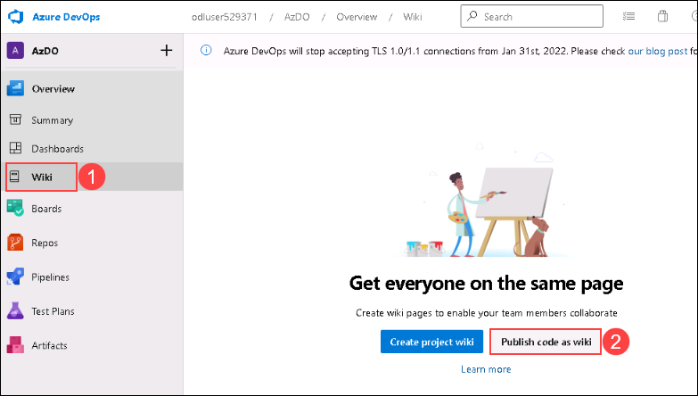

3. Under **Publish code as wiki** enter the following details and click on **Publish** *(5)*.

    - Repository: **AzDo** *(1)*.
    - Folder: Click on the ```...``` ellipsis *(2)*, and select **/wiki** folder *(3)*.
    - Wiki name: **AzGovViz wiki** *(4)*.

    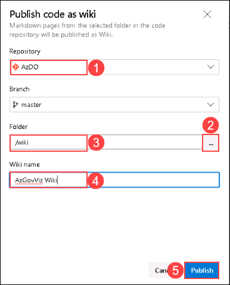

4. Once the Wiki is published, it will look like following.

    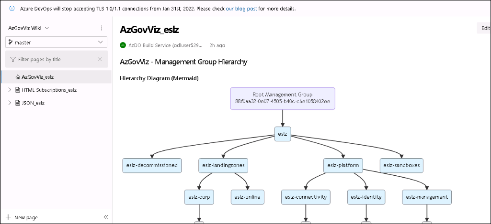

## Exercise 3: AzGovViz GitHub Codespaces

**Note**: Codespaces is available for organizations using GitHub Team or GitHub Enterprise Cloud. We have enabled a GitHub account for this task and its details can be found under **Environment Details** tab.
   
1. From the Environment details tab copy the GitHub account details and log into ```https://github.com/login```.

   >**Note:** If you are prompted to enter a verification code as shown in the screenshot below, Follow the steps below. . If not, skip to step 2.
   >
   >
   >
   >Use the github credentials to log into outlook by visiting following URL ```https://outlook.office.com/mail/``` and use the code received to Log in to GitHub.
   >
   >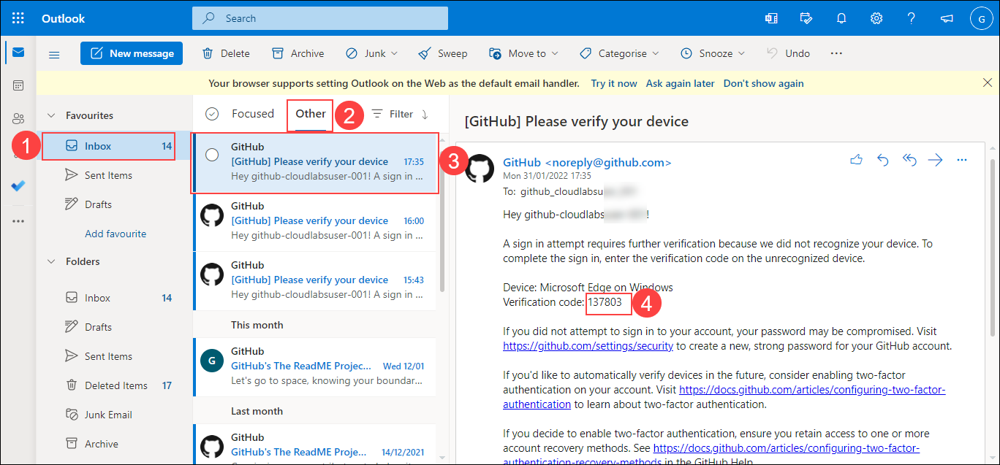
   >
   >

2. After logging in to GitHub, visit the following URL.

   ```
   https://github.com/JulianHayward/Azure-MG-Sub-Governance-Reporting
   ```

3. Fork the repository by clicking on the **Fork** button on the top right corner.

   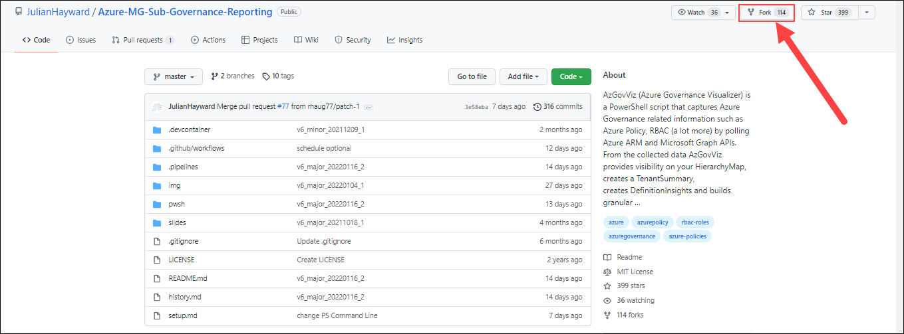

4. On the prompt, select the GitHub **github-cloudlabsuser** organisation to fork the repository.

   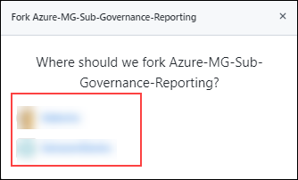


5. In the forked github repository click on **Code** *(1)*, then select the **Codespaces** tab *(2)* and then select **New Codespace**.

   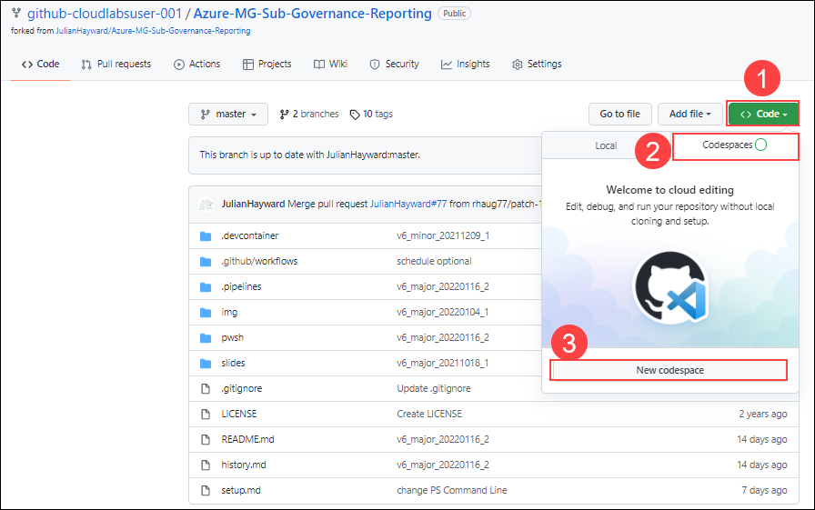

6. Now GitHub will start building the codespace.

   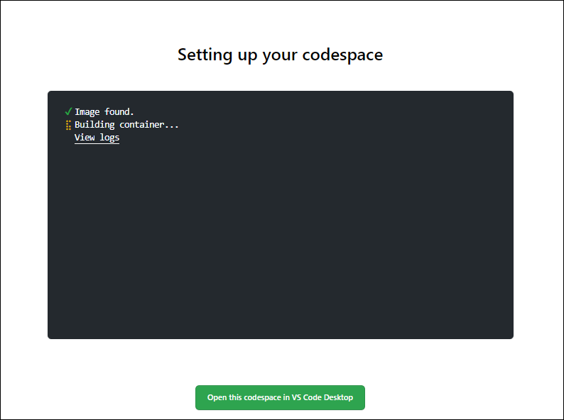

7. Once Codespace is published it will look like the image below.

   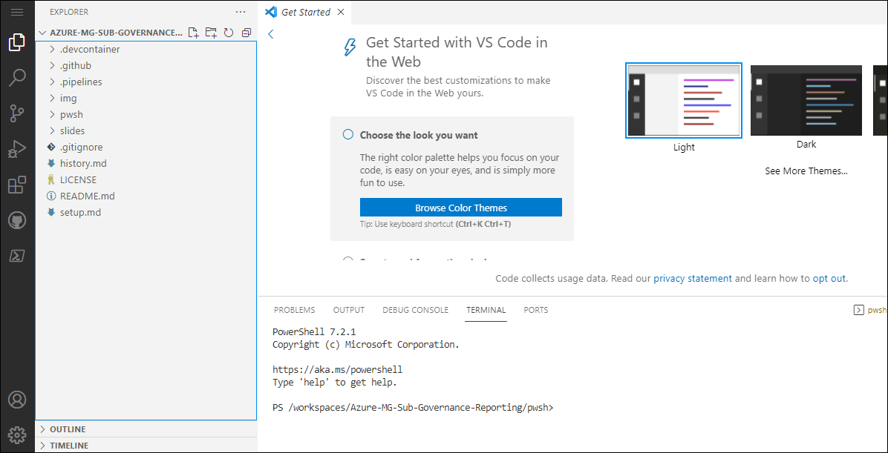

8. Run the following command in terminal to connect to your Azure account.
   >**Note:** Replace <TenantID> with  **<inject key="tenantId" />**

   ```
   Connect-AzAccount -TenantId <TenantId> -UseDeviceAuthentication
   ```

9. As per the warning, to complete the sign in, you need to visit the following URL in a new tab and enter the code given in the warning.


10. In a new browser tab, visit ```https://microsoft.com/devicelogin``` and enter the code mentioned in your powershell *(1)* then click on **Next** *(2)*.

    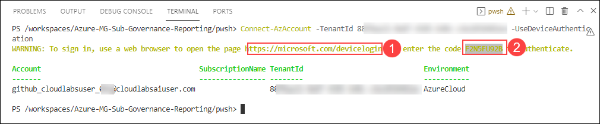

11. Now on **Pick an account** window select **+ Use another account** and enter your Azure Credentials mentioned below:

    

  - Username: **<inject key="AzureAdUserEmail" />**
  - Password: **<inject key="AzureAdUserPassword" />**


12. On the **Are you trying to sign in to Microsoft Azure PowerShell?** promt, click on **Continue**.

    

13. Once above steps are done, return to codespace and run the command below.

     ```
     ./AzGovVizParallel.ps1
     ```
14. You will be prompted *Please enter a selection*, here identify the serial number of ```eslz``` management group and enter that next to **Please enter a selection**, and hit Enter.

    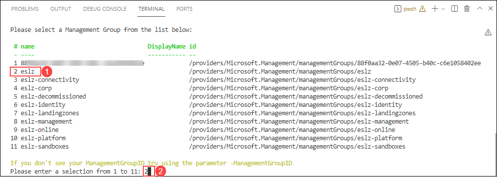

15. Once the script is executed, you terminal should look like following.

    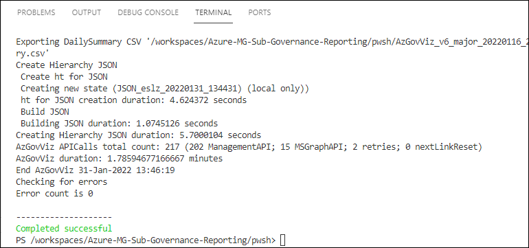

16. Now navigate to **/pwsh/AzGovViz_v6_major_20220116_2_20220131_134431_eslz.html** file to see the management group tree.

    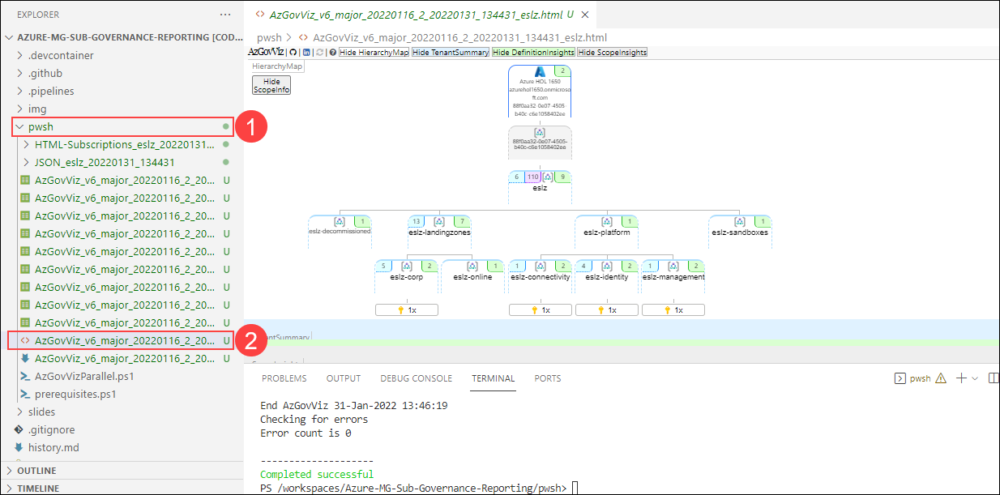  


