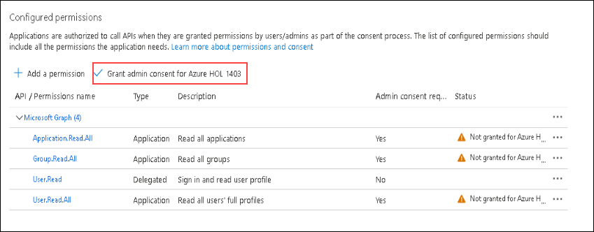

# Lab 02: AzGovViz - Azure Governance Visualizer - Setup

This guide will help you to setup and run AzGovViz
* Abbreviations:
    * Azure Active Directory - AAD
    * Azure DevOps - AzDO

## Table of contents
* [Featured: __AzGovViz GitHub Codespaces__](#azgovviz-github-codespaces)

* [__AzGovViz from Console__](#azgovviz-from-console)
    * Grant permissions in Azure
    * Execution options
      * Option 1 - Execute as a Tenant Member User
      * Option 2 - Execute as a Tenant Guest User
      * Option 3 - Execute as Service Principal
    * Clone the AzGovViz repository
    * Run AzGovViz

* [__AzGovViz in Azure DevOps (AzDO)__](#azgovviz-in-azure-devops)
    * Create AzDO Project
    * Import AzGovViz Github repository
    * Create AzDO Service Connection
      * Option 1 - Create Service Connection in AzDO
      * Option 2 - Create Service Connection´s Service Principal in the Azure Portal
    * Grant permissions in Azure
    * Grant permissions in AAD
    * Grant permissions on AzGovViz AzDO repository
    * Edit AzDO YAML file
    * Create AzDO Pipeline
    * Run the AzDO Pipeline
    * Create AzDO Wiki - WikiAsCode

# Exercise 1: AzGovViz from Console

## Task 1: Grant permissions in Azure

1. In your JumpVm click on start and open **Powershell**.

2. Run the following command in powershell to clone the GitHub repository.

``` 
Connect-AzAccount
$objectId = "<objectId of the identity that shall run AzGovViz>"
$role = "Reader"
$managementGroupId = "<managementGroupId>"

New-AzRoleAssignment `  
-ObjectId $objectId `  
-RoleDefinitionName $role `  
-Scope /providers/Microsoft.Management/managementGroups/$managementGroupId
```

## Task 2: Execute as Service Principal

A Service Principal by default has no read permissions on Users, Groups and Service Principals, therefore we need to grant additional permissions in AAD

1. We need to Grant API permissions for the Service Principal´s Application, in Azure portal search for Active Directory *(1)* and click on **Azure Active Direcectory** from the search results *(2)*.

   

2. Click on **App registrations** under Manage *(1)* and select the **eslzp** application *(2)* we created in lab 1.

   

3. Now click on **API permissions** under **Manage** and then click on **+ Add a permission**.

   

4. A side window **Request API permissions** will open, here click on **Microsoft Graph**

   

5. Under Microsoft Graph select **Application permissions** *(1)*, and expand the group of permissions and select the following set of permissions.

   - Application / Application.Read.All *(2)*
   - Group / Group.Read.All *(3)*
   - User / User.Read.All *(4)*
   - Once all the mentioned permissions are selected, click on *Add permissions** button at the bottom.

   

6. All the configured permissions can be previewed under **API permissions**.

   

## Exercise 2: Run AzGovViz from Console

### Task 1: Clone the AzGovViz repository

1. In your JumpVm click on start and open **Powershell**.

2. Run the following command in powershell to clone the GitHub repository.

``` 
Set-Location "c:\Git"  
git clone "https://github.com/JulianHayward/Azure-MG-Sub-Governance-Reporting.git"
```

### Task 2: Connecting to Azure as User

1. Run the following command in powershell to connect to your Azure account.
>**Note:** Replace <TenantID> with your Tenant Id which can be found in your Azure active directory.

```
Connect-AzAccount -TenantId <TenantId> -UseDeviceAuthentication
```

2. Now the powershell will ask you to go to ```https://microsoft.com/devicelogin``` *(1)* and enter the code mentioned in powershell *(2)*. Enter the code and click on sign in.

   


### Task 3: Connecting to Azure using Service Principal

1. In Azure portal go to **Active Directory** > **App registerations** > Click on the application **eslzsp** 

Have the '__Application (client) ID__' of the App registration OR '__Application ID__' of the Service Principal (Enterprise Application) and the secret of the App registration at hand

* PowerShell
```powershell 
$pscredential = Get-Credential    
Connect-AzAccount -ServicePrincipal -TenantId <TenantId> -Credential $pscredential
```
User: Enter '__Application (client) ID__' of the App registration OR '__Application ID__' of the Service Principal (Enterprise Application)  
Password for user \<Id\>: Enter App registration´s secret 

### Task 4: Run AzGovViz

1. Copy and paste the following command in powershell. Replace the <target management Group Id > with your Group ID.

```powershell
c:\Git\Azure-MG-Sub-Governance-Reporting\pwsh\AzGovVizParallel.ps1 -ManagementGroupId <target Management Group Id>
```

**Note:** if not using the `-OutputPath` parameter, all outputs will be created in the current directory. The following example will create the outputs in directory c:\AzGovViz-Output (directory must exist)

```powershell
c:\Git\Azure-MG-Sub-Governance-Reporting\pwsh\AzGovVizParallel.ps1 -ManagementGroupId <target Management Group Id> -OutPath "c:\AzGovViz-Output"
```

### Task 5: AzGovViz in Azure DevOps

### Task 5.1: Create AzDO Project

1. Select Azure DevOps logo Azure DevOps to open the Projects page.

2. Choose the organization, and then select New project. 

3. Provide the following details for the project and click on **Create**.
    - Project Name: **Project1**
    - Visiblity: **Private**


### Task 6: Import AzGovViz Github repository

### Task 6.1: Create AzDO Service Connection

For the pipeline to authenticate and connect to Azure we need to create an AzDO Service Connection which basically is a Service Principal (Application)  


1. Click on 'Project settings' (located on the bottom left)


2. Under 'Pipelines' click on 'Service connections'

3. Click on 'New service connection' and select the connection/service type 'Azure Resource Manager' and click 'Next'

4. For the authentication method select 'Service principal (automatic)' and click 'Next'

5. For the 'Scope level' select 'Management Group', in the Management Group dropdown select the target Management Group (here the Management Group´s display names will be shown), in the 'Details' section apply a Service Connection name and optional give it a description and click 'Save'

6. A new window will open, authenticate with your administrative account

7. Now the Service Connection has been created.

**Note:** In Azure on the target Management Group scope an 'Owner' RBAC Role assignment for the Service Connection´s Service Principal has been created automatically (we do however only require a 'Reader' RBAC Role assignment! we will take corrective action in the next steps)

## Task 6.2: Grant permissions in Azure

1. Copy and paste the following in powershell to create a '__Reader__' RBAC Role assignment on the target Management Group scope for the AzDO Service Connection´s Service Principal. Replace <objectId of the AzDO Service Connection´s Service Principal> and <managementGroupId> with values.

```powershell
$objectId = "<objectId of the AzDO Service Connection´s Service Principal>"
$role = "Reader"
$managementGroupId = "<managementGroupId>"

New-AzRoleAssignment `  
-ObjectId $objectId `  
-RoleDefinitionName $role `  
-Scope /providers/Microsoft.Management/managementGroups/$managementGroupId
```

### Task 7: Grant permissions in AAD

### Task 7.1: API permissions

In this task we need to grant API permissions for the Service Principal´s Application that we created earlier.

1. Navigate to 'Azure Active Directory'

2. Click on '__App registrations__'

3. Search for the Application that we created earlier and click on it

4. Under '__Manage__' click on '__API permissions__'
    * Click on '__Add a permissions__'
    * Click on '__Microsoft Graph__'
    * Click on '__Application permissions__'
    * Select the following set of permissions and click '__Add permissions__'
        * __Application / Application.Read.All__
        * __Group / Group.Read.All__
        * __User / User.Read.All__
    * Click on 'Add a permissions'

5. Back in the main '__API permissions__' menu you will find the 3 permissions with status 'Not granted for...'. Click on '__Grant admin consent for _TenantName___' and confirm by click on '__Yes__'

6. Now you will find the 3 permissions with status '__Granted for _TenantName___'

Permissions in Azure Active Directory for App registration:  


### Task 7.2: Grant permissions on AzGovViz AzDO repository

When the AzDO pipeline executes the AzGovViz script the outputs should be pushed back to the AzGovViz AzDO repository, in order to do this we need to grant the AzDO Project´s Build Service account with 'Contribute' permissions on the repository

### Grant permissions on the AzGovViz AzDO repository
    
1. In AzDO click on '__Project settings__' (located on the bottom left), under '__Repos__' open the '__Repositories__' page

2. Click on the AzGovViz AzDO Repository and select the tab '__Security__'

3. On the right side search for the Build Service account  
     __%Project name% Build Service (%Organization name%)__ and grant it with '__Contribute__' permissions by selecting '__Allow__' (no save button available)

## Edit AzDO YAML file

* Click on '__Repos__'
* Navigate to the AzGovViz Repository
* In the folder '__pipeline__' click on '__AzGovViz.yml__' and click '__Edit__'
* Under the variables section 
    * Enter the Service Connection name that you copied earlier (ServiceConnection)
    * Enter the Management Group Id (ManagementGroupId)
* Click '__Commit__'

## Create AzDO Pipeline

* Click on '__Pipelines__'
* Click on '__New pipeline__'
* Select '__Azure Repos Git__'
* Select the AzGovViz repository
* Click on '__Existing Azure Pipelines YAML file__'
* Under '__Path__' select '__/pipeline/AzGovViz.yml__' (the YAML file we edited earlier)
* Click ' __Save__'

## Run the AzDO Pipeline

* Click on '__Pipelines__'
* Select the AzGovViz pipeline
* Click '__Run pipeline__'

## Create AzDO Wiki (WikiAsCode)

Once the pipeline has executed successfully we can setup our Wiki (WikiAsCode)

* Click on '__Overview__'
* Click on '__Wiki__'
* Click on '__Publish code as wiki__'
* Select the AzGovViz repository
* Select the folder '__wiki__' and click '__OK__'
* Enter a name for the Wiki
* Click '__Publish__'

# AzGovViz GitHub Codespaces

Note: Codespaces is available for organizations using GitHub Team or GitHub Enterprise Cloud. [Quickstart for Codespaces](https://docs.github.com/en/codespaces/getting-started/quickstart)

  
  
  
  

